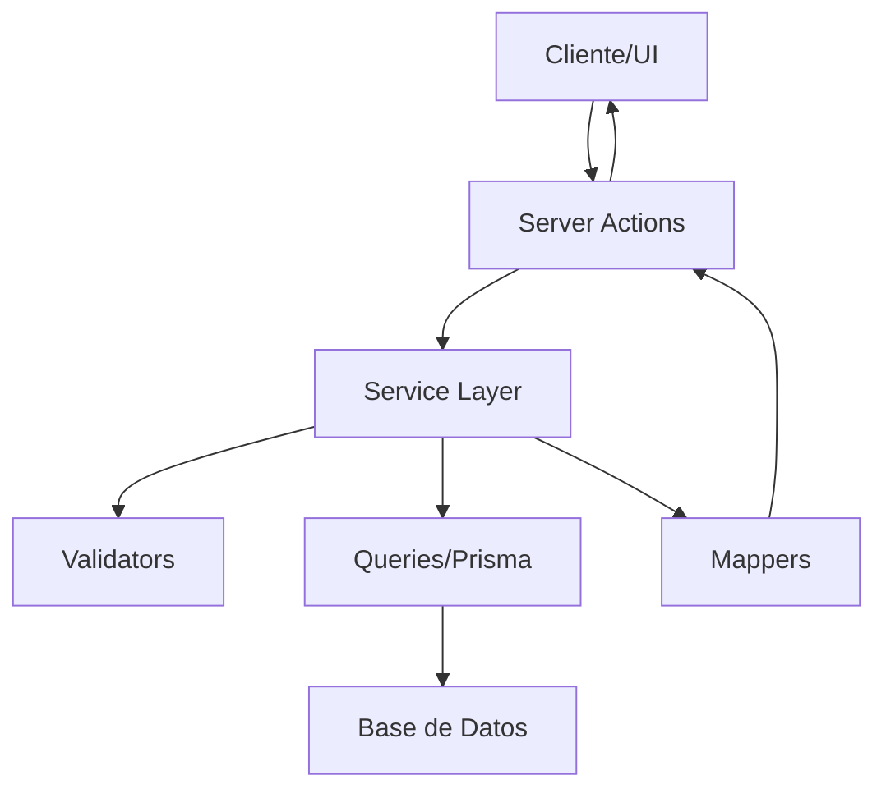

# 📊 AUDIT TRAIL MODULE - DOCUMENTACIÓN COMPLETA

## 📋 Índice

1. [🎯 Introducción](#-introducción)
2. [🏗️ Arquitectura del Módulo](#️-arquitectura-del-módulo)
3. [🚀 Instalación y Configuración](#-instalación-y-configuración)
4. [📊 Estructura de Datos](#-estructura-de-datos)
5. [🎛️ Server Actions (API)](#️-server-actions-api)
6. [🪝 Hooks de React](#-hooks-de-react)
7. [🎨 Componentes UI](#-componentes-ui)
8. [💡 Ejemplos de Uso](#-ejemplos-de-uso)
9. [🔧 Configuración Avanzada](#-configuración-avanzada)
10. [🐛 Troubleshooting](#-troubleshooting)

---

## 🎯 Introducción

El **Audit Trail Module** es un sistema completo de auditoría que registra automáticamente todas las acciones importantes del sistema, proporcionando:

- **Trazabilidad completa:** Quién hizo qué y cuándo
- **Diffs de cambios:** Comparación antes/después de modificaciones
- **Filtros avanzados:** Búsqueda por usuario, acción, recurso, fecha
- **Exportación de datos:** CSV y JSON para análisis externos
- **Dashboard visual:** Estadísticas y métricas en tiempo real
- **Gestión de retención:** Limpieza automática de eventos antiguos

### ✨ Características Principales

- 🔍 **Captura automática** de eventos del sistema
- 📊 **Dashboard interactivo** con estadísticas
- 🔎 **Filtros avanzados** y búsqueda de texto
- 📤 **Exportación** en múltiples formatos
- 🗑️ **Gestión de datos** con limpieza automática
- 🎨 **UI moderna** con React 19 y Tailwind CSS
- ⚡ **Performance optimizada** con caching inteligente

---

## 🏗️ Arquitectura del Módulo

El módulo sigue la **arquitectura hexagonal** con separación clara de responsabilidades:

```
src/features/audit/
├── 📁 server/           # Lógica del servidor
│   ├── actions.ts       # Server Actions (API para cliente)
│   ├── queries.ts       # Consultas de base de datos (solo SELECT)
│   ├── service.ts       # Lógica de negocio
│   ├── mappers.ts       # Transformaciones de datos
│   ├── validators.ts    # Validaciones de negocio
│   └── index.ts         # Barrel export
├── 📁 hooks/            # Hooks de React
│   ├── useAuditTrail.ts    # Hook principal
│   ├── useAuditStats.ts    # Hook de estadísticas
│   ├── useAuditFilters.ts  # Hook de filtros
│   ├── useAuditCapture.ts  # Hook de captura manual
│   └── index.ts            # Barrel export
├── 📁 ui/               # Interfaz de usuario
│   ├── components/      # Componentes reutilizables
│   │   ├── AuditEventCard.tsx
│   │   ├── AuditFilters.tsx
│   │   ├── AuditStats.tsx
│   │   ├── AuditEventsList.tsx
│   │   └── index.ts
│   └── routes/          # Pantallas del admin
│       ├── AuditDashboard.tsx
│       └── index.ts
├── types.ts             # Tipos TypeScript
├── constants.ts         # Constantes y configuración
├── schemas.ts           # Esquemas de validación Zod
├── utils.ts             # Utilidades y helpers
└── index.ts             # Barrel export principal
```

### 🔄 Flujo de Datos



---

## 🚀 Instalación y Configuración

### 1. **Feature Flag**

El módulo está controlado por un feature flag. Para habilitarlo:

```typescript
// src/features/feature-flags/config.ts
export const FEATURE_FLAGS = {
  // ... otros flags
  auditTrail: process.env.FEATURE_AUDIT_TRAIL === "true",
};
```

```bash
# .env.local
FEATURE_AUDIT_TRAIL=true
```

### 2. **Base de Datos**

Los modelos de Prisma ya están configurados:

```prisma
// src/core/database/prisma/models/audit.prisma
model AuditEvent {
  id           String   @id @default(cuid())
  action       String   // create, update, delete, login, etc.
  resource     String   // user, feature_flag, upload, etc.
  resourceId   String   // ID del recurso afectado
  resourceName String?  // Nombre legible del recurso
  userId       String   // Usuario que realizó la acción
  userName     String?  // Nombre del usuario
  userEmail    String   // Email del usuario
  userRole     String   // Rol del usuario
  severity     String   // low, medium, high, critical
  description  String?  // Descripción de la acción
  metadata     Json?    // Datos adicionales
  ipAddress    String?  // IP del usuario
  userAgent    String?  // User agent del navegador
  changes      AuditChange[] // Cambios relacionados
  createdAt    DateTime @default(now())
  updatedAt    DateTime @updatedAt

  @@map("audit_events")
}

model AuditChange {
  id         String     @id @default(cuid())
  eventId    String     // Relación con AuditEvent
  field      String     // Campo que cambió
  fieldLabel String?    // Etiqueta legible del campo
  oldValue   String?    // Valor anterior
  newValue   String?    // Valor nuevo
  type       String     // create, update, delete
  event      AuditEvent @relation(fields: [eventId], references: [id], onDelete: Cascade)

  @@map("audit_changes")
}
```

### 3. **Navegación**

El módulo se integra automáticamente en la navegación del admin:

```typescript
// src/core/navigation/constants.ts
{
  id: "audit-trail",
  href: "/audit",
  icon: Shield,
  label: "📊 Audit Trail",
  requiredRole: "admin",
  requiredFeature: "auditTrail"
}
```

---

## 📊 Estructura de Datos

### 🎯 **Tipos Principales**

```typescript
// Evento de auditoría principal
interface AuditEvent {
  id: string;
  action: AuditAction;
  resource: AuditResource;
  resourceId: string;
  resourceName?: string;
  userId: string;
  userName?: string;
  userEmail: string;
  userRole: string;
  severity: AuditSeverity;
  description?: string;
  metadata?: Record<string, unknown>;
  ipAddress?: string;
  userAgent?: string;
  changes: AuditChange[];
  createdAt: Date;
  updatedAt: Date;
}

// Cambio individual
interface AuditChange {
  id: string;
  eventId: string;
  field: string;
  fieldLabel?: string;
  oldValue?: unknown;
  newValue?: unknown;
  type: "create" | "update" | "delete";
}

// Filtros de búsqueda
interface AuditFilters {
  action?: AuditAction;
  resource?: AuditResource;
  userId?: string;
  severity?: AuditSeverity;
  resourceId?: string;
  ipAddress?: string;
  search?: string;
  dateFrom?: Date;
  dateTo?: Date;
  page?: number;
  limit?: number;
}

// Estadísticas
interface AuditStats {
  totalEvents: number;
  byAction: Record<AuditAction, number>;
  byResource: Record<AuditResource, number>;
  bySeverity: Record<AuditSeverity, number>;
  byUser: Array<{
    userId: string;
    userName: string | null;
    userEmail: string;
    eventCount: number;
  }>;
  recentEvents: AuditEvent[];
  dateRange: {
    from: Date;
    to: Date;
  };
}
```

### 🏷️ **Enums y Constantes**

```typescript
// Acciones disponibles
type AuditAction =
  | "create"
  | "update"
  | "delete"
  | "login"
  | "logout"
  | "register"
  | "upload"
  | "download"
  | "enable"
  | "disable"
  | "ban"
  | "unban"
  | "role_change"
  | "permission_change";

// Recursos del sistema
type AuditResource =
  | "user"
  | "feature_flag"
  | "upload"
  | "session"
  | "role"
  | "permission"
  | "setting"
  | "notification";

// Niveles de severidad
type AuditSeverity = "low" | "medium" | "high" | "critical";
```

---

## 🎛️ Server Actions (API)

### 📊 **Obtener Eventos**

```typescript
// Obtener eventos con filtros y paginación
const result = await getAuditEventsAction({
  action: "update",
  resource: "user",
  dateFrom: new Date("2024-01-01"),
  dateTo: new Date(),
  page: 1,
  limit: 20,
});

if (result.success) {
  console.log("Eventos:", result.data.events);
  console.log("Total:", result.data.pagination.total);
}
```

### 📈 **Obtener Estadísticas**

```typescript
// Estadísticas generales
const statsResult = await getAuditStatsAction();

// Estadísticas por rango de fechas
const customStatsResult = await getAuditStatsAction(
  new Date("2024-01-01"),
  new Date()
);

if (statsResult.success) {
  const stats = statsResult.data;
  console.log("Total eventos:", stats.totalEvents);
  console.log("Por acción:", stats.byAction);
  console.log("Por recurso:", stats.byResource);
}
```

### 📝 **Crear Evento Manual**

```typescript
// Crear evento de auditoría manualmente
const createResult = await createAuditEventAction({
  action: "update",
  resource: "user",
  resourceId: "user_123",
  resourceName: "Juan Pérez",
  severity: "medium",
  description: "Usuario actualizado manualmente",
  metadata: {
    previousEmail: "old@email.com",
    newEmail: "new@email.com",
  },
  changes: [
    {
      field: "email",
      fieldLabel: "Email",
      oldValue: "old@email.com",
      newValue: "new@email.com",
    },
  ],
});
```

### 🔍 **Búsqueda Avanzada**

```typescript
// Buscar eventos por texto
const searchResult = await searchAuditEventsAction("usuario eliminado", {
  action: "delete",
  severity: "high",
  dateFrom: new Date("2024-01-01"),
});
```

### 📤 **Exportar Datos**

```typescript
// Exportar a CSV
const csvResult = await exportAuditEventsAction(
  { action: "update", resource: "user" },
  "csv"
);

// Exportar a JSON
const jsonResult = await exportAuditEventsAction(
  { severity: "critical" },
  "json"
);
```

### 🗑️ **Gestión de Datos**

```typescript
// Eliminar eventos específicos
const deleteResult = await bulkDeleteEventsAction([
  "event_1",
  "event_2",
  "event_3",
]);

// Limpiar eventos antiguos (90 días por defecto)
const cleanupResult = await cleanupOldEventsAction(90);

console.log("Eventos eliminados:", cleanupResult.data?.deletedCount);
```

---

## 🪝 Hooks de React

### 🎯 **useAuditTrail - Hook Principal**

```typescript
import { useAuditTrail } from "@/features/audit";

function AuditComponent() {
  const {
    events, // Lista de eventos
    isLoading, // Estado de carga
    error, // Error si existe
    pagination, // Info de paginación
    loadEvents, // Cargar eventos
    refreshEvents, // Refrescar datos
    exportEvents, // Exportar datos
    deleteEvents, // Eliminar eventos
  } = useAuditTrail();

  // Cargar eventos con filtros
  const handleLoadEvents = () => {
    loadEvents({
      action: "update",
      resource: "user",
      page: 1,
      limit: 20,
    });
  };

  // Exportar eventos
  const handleExport = async () => {
    const result = await exportEvents({
      filters: { severity: "critical" },
      format: "csv",
    });

    if (result.success) {
      // Manejar descarga del archivo
    }
  };

  return (
    <div>
      {isLoading && <div>Cargando...</div>}
      {error && <div>Error: {error}</div>}

      <button onClick={handleLoadEvents}>Cargar Eventos</button>

      <button onClick={handleExport}>Exportar CSV</button>

      {events.map((event) => (
        <div key={event.id}>
          {event.action} - {event.resource}
        </div>
      ))}
    </div>
  );
}
```

### 📊 **useAuditStats - Estadísticas**

```typescript
import { useAuditStats } from "@/features/audit";

function StatsComponent() {
  const {
    stats, // Estadísticas
    isLoading, // Estado de carga
    error, // Error si existe
    refresh, // Refrescar estadísticas
    getActionCount, // Obtener conteo por acción
    getResourceCount, // Obtener conteo por recurso
    getSeverityCount, // Obtener conteo por severidad
  } = useAuditStats();

  // Obtener conteos específicos
  const updateCount = getActionCount("update");
  const userCount = getResourceCount("user");
  const criticalCount = getSeverityCount("critical");

  return (
    <div>
      <h2>Estadísticas de Auditoría</h2>

      <div>Total eventos: {stats?.totalEvents}</div>
      <div>Actualizaciones: {updateCount}</div>
      <div>Eventos de usuarios: {userCount}</div>
      <div>Eventos críticos: {criticalCount}</div>

      <button onClick={refresh}>Refrescar Estadísticas</button>
    </div>
  );
}
```

### 🔍 **useAuditFilters - Gestión de Filtros**

```typescript
import { useAuditFilters } from "@/features/audit";

function FiltersComponent() {
  const {
    filters, // Filtros actuales
    updateFilter, // Actualizar filtro individual
    resetFilters, // Resetear todos los filtros
    applyPreset, // Aplicar preset de filtros
    activeFilters, // Filtros activos (no vacíos)
    hasActiveFilters, // Si hay filtros activos
  } = useAuditFilters();

  // Actualizar filtros individuales
  const handleActionChange = (action: AuditAction) => {
    updateFilter("action", action);
  };

  const handleDateRangeChange = (from: Date, to: Date) => {
    updateFilter("dateFrom", from);
    updateFilter("dateTo", to);
  };

  // Aplicar presets comunes
  const applyTodayPreset = () => {
    applyPreset("today");
  };

  const applyWeekPreset = () => {
    applyPreset("week");
  };

  const applyCriticalPreset = () => {
    applyPreset("critical");
  };

  return (
    <div>
      <h3>Filtros de Auditoría</h3>

      {/* Filtro por acción */}
      <select
        value={filters.action || ""}
        onChange={(e) => handleActionChange(e.target.value as AuditAction)}
      >
        <option value="">Todas las acciones</option>
        <option value="create">Crear</option>
        <option value="update">Actualizar</option>
        <option value="delete">Eliminar</option>
      </select>

      {/* Presets rápidos */}
      <div>
        <button onClick={applyTodayPreset}>Hoy</button>
        <button onClick={applyWeekPreset}>Esta semana</button>
        <button onClick={applyCriticalPreset}>Solo críticos</button>
      </div>

      {/* Resetear filtros */}
      {hasActiveFilters && (
        <button onClick={resetFilters}>
          Limpiar filtros ({activeFilters.length})
        </button>
      )}
    </div>
  );
}
```

### 📝 **useAuditCapture - Captura Manual**

```typescript
import { useAuditCapture } from "@/features/audit";

function CaptureComponent() {
  const {
    captureEvent, // Capturar evento genérico
    logCreate, // Log de creación
    logUpdate, // Log de actualización
    logDelete, // Log de eliminación
    isCapturing, // Estado de captura
    error, // Error si existe
  } = useAuditCapture();

  // Capturar evento genérico
  const handleGenericCapture = async () => {
    const result = await captureEvent({
      action: "custom_action",
      resource: "custom_resource",
      resourceId: "resource_123",
      severity: "medium",
      description: "Acción personalizada ejecutada",
    });

    if (result.success) {
      console.log("Evento capturado:", result.data);
    }
  };

  // Logs específicos con helpers
  const handleUserCreated = async (user: User) => {
    await logCreate("user", user.id, user.name, {
      description: `Usuario ${user.name} creado`,
      metadata: { email: user.email, role: user.role },
    });
  };

  const handleUserUpdated = async (userId: string, changes: any) => {
    await logUpdate("user", userId, "Usuario actualizado", {
      changes: [
        {
          field: "email",
          fieldLabel: "Email",
          oldValue: changes.oldEmail,
          newValue: changes.newEmail,
        },
      ],
    });
  };

  const handleUserDeleted = async (userId: string, userName: string) => {
    await logDelete("user", userId, userName, {
      severity: "high",
      description: `Usuario ${userName} eliminado permanentemente`,
    });
  };

  return (
    <div>
      <button onClick={handleGenericCapture} disabled={isCapturing}>
        {isCapturing ? "Capturando..." : "Capturar Evento"}
      </button>

      {error && <div>Error: {error}</div>}
    </div>
  );
}
```

---

## 🎨 Componentes UI

### 📋 **AuditEventCard - Tarjeta de Evento**

```typescript
import { AuditEventCard } from "@/features/audit";

function EventsListComponent() {
  const { events } = useAuditTrail();

  return (
    <div className="space-y-4">
      {events.map((event) => (
        <AuditEventCard
          key={event.id}
          event={event}
          onViewDetails={(event) => {
            console.log("Ver detalles:", event);
          }}
          onViewChanges={(changes) => {
            console.log("Ver cambios:", changes);
          }}
          showChanges={true}
          compact={false}
        />
      ))}
    </div>
  );
}
```

### 🔍 **AuditFilters - Panel de Filtros**

```typescript
import { AuditFilters } from "@/features/audit";

function FilterPanelComponent() {
  const { filters, updateFilter, resetFilters } = useAuditFilters();

  return (
    <AuditFilters
      filters={filters}
      onFilterChange={updateFilter}
      onReset={resetFilters}
      showPresets={true}
      showDateRange={true}
      showSearch={true}
      compact={false}
    />
  );
}
```

### 📊 **AuditStats - Dashboard de Estadísticas**

```typescript
import { AuditStats } from "@/features/audit";

function StatsDashboardComponent() {
  const { stats, isLoading, refresh } = useAuditStats();

  return (
    <AuditStats
      stats={stats}
      isLoading={isLoading}
      onRefresh={refresh}
      showCharts={true}
      showTopUsers={true}
      showRecentEvents={true}
      autoRefresh={true}
      refreshInterval={30000} // 30 segundos
    />
  );
}
```

### 📋 **AuditEventsList - Lista Completa**

```typescript
import { AuditEventsList } from "@/features/audit";

function FullListComponent() {
  const auditTrail = useAuditTrail();
  const auditFilters = useAuditFilters();

  return (
    <AuditEventsList
      {...auditTrail}
      {...auditFilters}
      showFilters={true}
      showExport={true}
      showBulkActions={true}
      showPagination={true}
      pageSize={20}
      onEventSelect={(event) => {
        console.log("Evento seleccionado:", event);
      }}
      onBulkDelete={(eventIds) => {
        console.log("Eliminar eventos:", eventIds);
      }}
    />
  );
}
```

---

## 💡 Ejemplos de Uso

### 🎯 **Ejemplo 1: Dashboard Básico**

```typescript
"use client";

import {
  AuditStats,
  AuditEventsList,
  useAuditStats,
  useAuditTrail,
  useAuditFilters,
} from "@/features/audit";

export default function AuditDashboard() {
  const stats = useAuditStats();
  const trail = useAuditTrail();
  const filters = useAuditFilters();

  return (
    <div className="space-y-6">
      <h1 className="text-2xl font-bold">Audit Trail Dashboard</h1>

      {/* Estadísticas */}
      <AuditStats
        stats={stats.stats}
        isLoading={stats.isLoading}
        onRefresh={stats.refresh}
        showCharts={true}
      />

      {/* Lista de eventos */}
      <AuditEventsList
        {...trail}
        {...filters}
        showFilters={true}
        showExport={true}
        pageSize={20}
      />
    </div>
  );
}
```

### 🔍 **Ejemplo 2: Búsqueda Específica**

```typescript
"use client";

import { useAuditTrail, useAuditFilters } from "@/features/audit";
import { useEffect } from "react";

export default function UserAuditPage({ userId }: { userId: string }) {
  const { events, loadEvents, isLoading } = useAuditTrail();
  const { updateFilter, filters } = useAuditFilters();

  // Cargar eventos del usuario específico
  useEffect(() => {
    updateFilter("userId", userId);
    updateFilter("resource", "user");
    loadEvents(filters);
  }, [userId]);

  return (
    <div>
      <h2>Actividad del Usuario</h2>

      {isLoading && <div>Cargando actividad...</div>}

      <div className="space-y-2">
        {events.map((event) => (
          <div key={event.id} className="p-4 border rounded">
            <div className="font-semibold">
              {event.action} - {event.description}
            </div>
            <div className="text-sm text-gray-600">
              {event.createdAt.toLocaleString()}
            </div>
            {event.changes.length > 0 && (
              <div className="mt-2">
                <strong>Cambios:</strong>
                {event.changes.map((change) => (
                  <div key={change.id} className="ml-4">
                    {change.fieldLabel}: {change.oldValue} → {change.newValue}
                  </div>
                ))}
              </div>
            )}
          </div>
        ))}
      </div>
    </div>
  );
}
```

### 📊 **Ejemplo 3: Captura Automática**

```typescript
// En tu service o action existente
import { useAuditCapture } from "@/features/audit";

export function useUserManagement() {
  const { logCreate, logUpdate, logDelete } = useAuditCapture();

  const createUser = async (userData: CreateUserData) => {
    try {
      // Crear usuario
      const user = await createUserAction(userData);

      // Capturar evento de auditoría automáticamente
      await logCreate("user", user.id, user.name, {
        description: `Usuario ${user.name} creado`,
        severity: "medium",
        metadata: {
          email: user.email,
          role: user.role,
          createdBy: "admin_panel",
        },
      });

      return user;
    } catch (error) {
      console.error("Error creating user:", error);
      throw error;
    }
  };

  const updateUser = async (userId: string, updates: UpdateUserData) => {
    try {
      // Obtener datos anteriores
      const oldUser = await getUserById(userId);

      // Actualizar usuario
      const updatedUser = await updateUserAction(userId, updates);

      // Generar cambios para auditoría
      const changes = [];
      if (oldUser.email !== updatedUser.email) {
        changes.push({
          field: "email",
          fieldLabel: "Email",
          oldValue: oldUser.email,
          newValue: updatedUser.email,
        });
      }
      if (oldUser.role !== updatedUser.role) {
        changes.push({
          field: "role",
          fieldLabel: "Rol",
          oldValue: oldUser.role,
          newValue: updatedUser.role,
        });
      }

      // Capturar evento con cambios
      await logUpdate("user", userId, updatedUser.name, {
        description: `Usuario ${updatedUser.name} actualizado`,
        severity: changes.some((c) => c.field === "role") ? "high" : "medium",
        changes,
        metadata: {
          changedFields: changes.map((c) => c.field),
          updatedBy: "admin_panel",
        },
      });

      return updatedUser;
    } catch (error) {
      console.error("Error updating user:", error);
      throw error;
    }
  };

  return { createUser, updateUser };
}
```

### 📤 **Ejemplo 4: Exportación Personalizada**

```typescript
"use client";

import { useAuditTrail, useAuditFilters } from "@/features/audit";
import { useState } from "react";

export default function AuditExportPage() {
  const { exportEvents } = useAuditTrail();
  const { filters } = useAuditFilters();
  const [isExporting, setIsExporting] = useState(false);

  const handleExport = async (format: "csv" | "json") => {
    setIsExporting(true);

    try {
      const result = await exportEvents({
        filters: {
          ...filters,
          // Filtros específicos para exportación
          severity: "high",
          dateFrom: new Date("2024-01-01"),
          dateTo: new Date(),
        },
        format,
      });

      if (result.success) {
        // Crear y descargar archivo
        const blob = new Blob([result.data], {
          type: format === "csv" ? "text/csv" : "application/json",
        });

        const url = URL.createObjectURL(blob);
        const a = document.createElement("a");
        a.href = url;
        a.download = `audit-trail-${
          new Date().toISOString().split("T")[0]
        }.${format}`;
        document.body.appendChild(a);
        a.click();
        document.body.removeChild(a);
        URL.revokeObjectURL(url);

        console.log("Exportación completada");
      } else {
        console.error("Error en exportación:", result.error);
      }
    } catch (error) {
      console.error("Error exportando:", error);
    } finally {
      setIsExporting(false);
    }
  };

  return (
    <div className="space-y-4">
      <h2>Exportar Datos de Auditoría</h2>

      <div className="flex gap-4">
        <button
          onClick={() => handleExport("csv")}
          disabled={isExporting}
          className="px-4 py-2 bg-blue-600 text-white rounded hover:bg-blue-700 disabled:opacity-50"
        >
          {isExporting ? "Exportando..." : "Exportar CSV"}
        </button>

        <button
          onClick={() => handleExport("json")}
          disabled={isExporting}
          className="px-4 py-2 bg-green-600 text-white rounded hover:bg-green-700 disabled:opacity-50"
        >
          {isExporting ? "Exportando..." : "Exportar JSON"}
        </button>
      </div>

      <div className="text-sm text-gray-600">
        Se exportarán eventos de alta severidad desde enero 2024
      </div>
    </div>
  );
}
```

---

## 🔧 Configuración Avanzada

### ⚙️ **Configuración del Módulo**

```typescript
// src/features/audit/constants.ts
export const AUDIT_CONFIG = {
  // Paginación
  DEFAULT_PAGE_SIZE: 20,
  MAX_PAGE_SIZE: 100,

  // Exportación
  MAX_EXPORT_RECORDS: 10000,
  EXPORT_FORMATS: ["csv", "json"] as const,

  // Retención de datos
  DEFAULT_RETENTION_DAYS: 90,
  MAX_RETENTION_DAYS: 365,

  // Cache
  CACHE_TTL: {
    EVENTS: 300, // 5 minutos
    STATS: 600, // 10 minutos
    SEARCH: 180, // 3 minutos
  },

  // Severidad por defecto por acción
  DEFAULT_SEVERITY: {
    create: "medium",
    update: "medium",
    delete: "high",
    login: "low",
    logout: "low",
    role_change: "critical",
    permission_change: "critical",
  } as const,

  // Límites de búsqueda
  SEARCH_LIMITS: {
    MIN_QUERY_LENGTH: 3,
    MAX_RESULTS: 1000,
  },
};
```

### 🎨 **Personalización de UI**

```typescript
// Tema personalizado para componentes
export const AUDIT_THEME = {
  colors: {
    severity: {
      low: "bg-blue-100 text-blue-800",
      medium: "bg-yellow-100 text-yellow-800",
      high: "bg-orange-100 text-orange-800",
      critical: "bg-red-100 text-red-800",
    },
    actions: {
      create: "bg-green-100 text-green-800",
      update: "bg-blue-100 text-blue-800",
      delete: "bg-red-100 text-red-800",
      login: "bg-purple-100 text-purple-800",
    },
  },
  icons: {
    actions: {
      create: Plus,
      update: Edit,
      delete: Trash,
      login: LogIn,
      logout: LogOut,
    },
    severity: {
      low: Info,
      medium: AlertCircle,
      high: AlertTriangle,
      critical: AlertOctagon,
    },
  },
};
```

### 🔒 **Configuración de Permisos**

```typescript
// src/features/audit/server/validators.ts
export const AUDIT_PERMISSIONS = {
  // Quién puede ver eventos de auditoría
  VIEW_AUDIT: ["admin", "super_admin"],

  // Quién puede exportar datos
  EXPORT_AUDIT: ["admin", "super_admin"],

  // Quién puede eliminar eventos
  DELETE_AUDIT: ["super_admin"],

  // Quién puede hacer limpieza masiva
  CLEANUP_AUDIT: ["super_admin"],

  // Quién puede crear eventos manuales
  CREATE_AUDIT: ["admin", "super_admin"],
};
```

---

## 🐛 Troubleshooting

### ❓ **Problemas Comunes**

#### **1. El módulo no aparece en la navegación**

```bash
# Verificar feature flag
echo $FEATURE_AUDIT_TRAIL

# Verificar en base de datos
npx prisma studio
# Buscar en tabla feature_flags: key = "auditTrail", enabled = true
```

#### **2. Errores de base de datos**

```bash
# Regenerar cliente Prisma
npx prisma generate

# Aplicar migraciones
npx prisma db push

# Verificar modelos
npx prisma db pull
```

#### **3. Eventos no se capturan automáticamente**

```typescript
// Verificar que el service esté siendo usado correctamente
import { createAuditService } from "@/features/audit/server";

// En tu action/service:
const auditService = await createAuditService();
await auditService.logUserAction("update", "user", userId, userName);
```

#### **4. Performance lenta en consultas**

```sql
-- Agregar índices en base de datos
CREATE INDEX idx_audit_events_created_at ON audit_events(created_at);
CREATE INDEX idx_audit_events_user_id ON audit_events(user_id);
CREATE INDEX idx_audit_events_action ON audit_events(action);
CREATE INDEX idx_audit_events_resource ON audit_events(resource);
```

#### **5. Exportación falla**

```typescript
// Verificar límites de exportación
const result = await exportAuditEventsAction(
  {
    // Reducir scope de exportación
    dateFrom: new Date(Date.now() - 7 * 24 * 60 * 60 * 1000), // Solo 7 días
    limit: 1000, // Límite explícito
  },
  "csv"
);
```

### 🔧 **Comandos de Diagnóstico**

```bash
# Verificar configuración
npm run audit:check-config

# Limpiar cache
npm run audit:clear-cache

# Verificar permisos
npm run audit:check-permissions

# Estadísticas de base de datos
npm run audit:db-stats
```

### 📊 **Monitoreo y Métricas**

```typescript
// Agregar métricas personalizadas
export const auditMetrics = {
  async getHealthCheck() {
    const stats = await getAuditStatsAction();
    return {
      status: stats.success ? "healthy" : "error",
      totalEvents: stats.data?.totalEvents || 0,
      lastEvent: stats.data?.recentEvents[0]?.createdAt,
    };
  },

  async getPerformanceMetrics() {
    const start = Date.now();
    await getAuditEventsAction({ limit: 1 });
    const queryTime = Date.now() - start;

    return {
      avgQueryTime: queryTime,
      cacheHitRate: 0.85, // Implementar tracking real
    };
  },
};
```

---

## 🎉 **¡Listo para Usar!**

El módulo de Audit Trail está completamente configurado y listo para usar. Con esta documentación tienes todo lo necesario para:

- ✅ **Implementar** auditoría en tu aplicación
- ✅ **Personalizar** componentes y comportamiento
- ✅ **Integrar** con sistemas existentes
- ✅ **Monitorear** y mantener el sistema
- ✅ **Resolver** problemas comunes

Para más ejemplos y casos de uso específicos, consulta los archivos de ejemplo en `src/features/audit/examples/`.

---

**📚 Documentación creada:** $(date)  
**🔄 Última actualización:** $(date)  
**📧 Soporte:** Consulta el equipo de desarrollo
