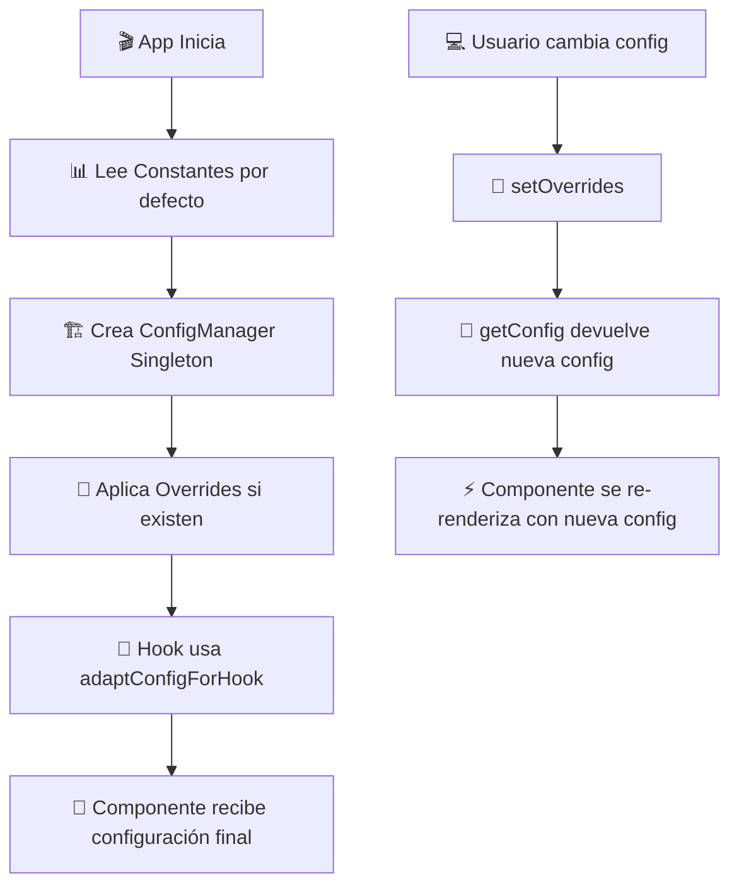

# 📚 **GUÍA COMPLETA DEL SISTEMA DE CONFIGURACIÓN**

## 🎯 **¿QUÉ ES EL SISTEMA DE CONFIGURACIÓN?**

El sistema de configuración es la **columna vertebral** de tu aplicación que te permite:

1. **Controlar el comportamiento** de la aplicación sin cambiar código
2. **Adaptar la aplicación** a diferentes entornos (desarrollo, producción, testing)
3. **Personalizar características** según las necesidades del usuario
4. **Cambiar configuraciones** en tiempo de ejecución sin reiniciar la aplicación
5. **Mantener consistencia** en toda la aplicación

---

## 🏗️ **ARQUITECTURA GENERAL**

```
🏢 TU APLICACIÓN
├── 👥 Users Module (CORE - Sin feature flags)
│   ├── ⚙️ UsersConfigManager (Singleton)
│   └── 🎯 Configuración siempre activa
└── 📁 File-Upload Module (FEATURE FLAGS - Experimental/Opcional)
    ├── ⚙️ FileUploadConfigManager (Singleton)
    └── 🔧 Configuración con feature flags
```

### **🔄 Flujo de Configuración**



---

## 🧩 **COMPONENTES DEL SISTEMA**

### **1. 📊 Constants (Valores por defecto)**

**Ubicación**: `src/[module]/constants/index.ts`

**Propósito**: Define todos los valores por defecto de la aplicación

```typescript
// ❌ MAL: Valores hardcodeados en el código
if (retries > 3) { // ¿De dónde sale el 3?

// ✅ BIEN: Valores centralizados en constants
if (retries > USERS_CORE_CONFIG.maxRetries) { // Claro y modificable
```

### **2. 🏗️ ConfigManager (Cerebro del sistema)**

**Ubicación**: `src/[module]/config/index.ts`

**Propósito**:

- **Gestiona** toda la configuración del módulo
- **Aplica overrides** dinámicamente
- **Valida** configuraciones
- **Proporciona métodos** para acceder a la config

### **3. 🎯 Interfaces (Contratos de configuración)**

**Propósito**: Define exactamente qué configuraciones están disponibles

```typescript
// Define QUÉ puedes configurar
interface UsersModuleConfig {
  performance: { debounceMs: number }; // ✅ Solo números
  settings: { autoRefresh: boolean }; // ✅ Solo booleanos
}
```

### **4. 🔄 Adapters (Conectores)**

**Propósito**: Convierte configuración del usuario en configuración del sistema

---

## 🎯 **PATRONES DE DISEÑO UTILIZADOS**

### **🔧 1. Singleton Pattern**

**¿Por qué Singleton?**

- **Una sola instancia** de configuración en toda la app
- **Consistencia** - todos usan la misma configuración
- **Eficiencia** - no crear múltiples instances
- **Estado centralizado** - cambios afectan toda la app

```typescript
// ❌ PROBLEMA SIN SINGLETON
const config1 = new ConfigManager(); // Instancia 1
const config2 = new ConfigManager(); // Instancia 2 (diferente)
config1.setDebounce(500);
config2.getDebounce(); // ❌ Todavía 300!

// ✅ SOLUCIÓN CON SINGLETON
const config1 = ConfigManager.getInstance(); // Instancia única
const config2 = ConfigManager.getInstance(); // MISMA instancia
config1.setDebounce(500);
config2.getDebounce(); // ✅ 500! Consistente
```

### **🎭 2. Adapter Pattern**

**¿Por qué Adapter?**

- **Compatibilidad** entre diferentes formatos de configuración
- **Flexibilidad** para usuarios del hook
- **Transformación** de datos automática

```typescript
// El usuario del hook pasa esto:
const userConfig = { maxFileSize: "50MB", allowedTypes: ["image/*"] };

// El adapter lo convierte automáticamente a esto:
const systemConfig = {
  ui: { maxFileSize: 52428800 }, // Convierte "50MB" a bytes
  files: { allowedMimeTypes: ["image/jpeg", "image/png"] }, // Expande "image/*"
};
```

### **🏭 3. Factory Pattern (En desarrollo)**

Para crear configuraciones específicas por ambiente:

```typescript
ConfigFactory.createFor("development"); // Config optimizada para dev
ConfigFactory.createFor("production"); // Config optimizada para prod
```

---

## 💡 **MÉTODOS CLAVE Y SU PROPÓSITO**

### **🏗️ Constructor Privado**

```typescript
private constructor() {
  this.config = this.deepClone(DEFAULT_CORE_CONFIG);
}
```

**¿Por qué privado?**

- **Previene** crear múltiples instances
- **Fuerza** usar `getInstance()` (Singleton)
- **Garantiza** inicialización correcta

### **🧬 deepClone() - Clonación Profunda**

```typescript
private deepClone<T>(obj: T): T {
  // Maneja null/undefined/primitivos
  if (obj === null || typeof obj !== "object") {
    return obj;
  }

  // Maneja fechas
  if (obj instanceof Date) {
    return new Date(obj.getTime()) as unknown as T;
  }

  // Maneja expresiones regulares
  if (obj instanceof RegExp) {
    return new RegExp(obj.source, obj.flags) as unknown as T;
  }

  // Maneja arrays
  if (Array.isArray(obj)) {
    return obj.map((item) => this.deepClone(item)) as unknown as T;
  }

  // Maneja objetos (recursivamente)
  const cloned = {} as T;
  for (const key in obj) {
    if (Object.prototype.hasOwnProperty.call(obj, key)) {
      cloned[key] = this.deepClone(obj[key]);
    }
  }
  return cloned;
}
```

**¿Por qué deepClone y no JSON.parse(JSON.stringify())?**

❌ **JSON.stringify tiene problemas:**

```typescript
const config = {
  pattern: /email@domain\.com/, // ❌ Se pierde el RegExp
  date: new Date(), // ❌ Se convierte a string
  func: () => "hello", // ❌ Se pierde la función
  undefined: undefined, // ❌ Se elimina la propiedad
};

const bad = JSON.parse(JSON.stringify(config));
console.log(bad.pattern instanceof RegExp); // ❌ false
```

✅ **deepClone maneja correctamente:**

```typescript
const good = this.deepClone(config);
console.log(good.pattern instanceof RegExp); // ✅ true
console.log(good.date instanceof Date); // ✅ true
```

### **🔄 mergeConfigs() - Fusión Inteligente**

```typescript
private mergeConfigs<T extends Record<string, unknown>>(
  base: T,
  override: Partial<T>
): T {
  const result = this.deepClone(base);

  for (const key in override) {
    const baseValue = result[key];
    const overrideValue = override[key];

    // Ignora valores null/undefined
    if (overrideValue === null || overrideValue === undefined) {
      continue;
    }

    // Si ambos son objetos, merge recursivo
    if (
      typeof baseValue === "object" &&
      typeof overrideValue === "object" &&
      !Array.isArray(baseValue) &&
      !Array.isArray(overrideValue)
    ) {
      result[key] = this.mergeConfigs(baseValue, overrideValue);
    } else {
      // Reemplaza valor directamente
      result[key] = overrideValue;
    }
  }

  return result;
}
```

**Ejemplo de fusión:**

```typescript
// Base config
const base = {
  performance: { debounceMs: 300, maxRetries: 3 },
  ui: { itemsPerPage: 20 },
};

// Override config
const override = {
  performance: { debounceMs: 500 }, // Solo cambia debounceMs
  security: { enabled: true }, // Añade nueva propiedad
};

// Resultado fusionado:
const merged = {
  performance: {
    debounceMs: 500, // ✅ Override aplicado
    maxRetries: 3, // ✅ Valor base mantenido
  },
  ui: { itemsPerPage: 20 }, // ✅ Sin cambios
  security: { enabled: true }, // ✅ Nueva propiedad añadida
};
```

---

## 🎯 **TIPOS DE MÓDULOS**

### **🏗️ CORE MODULE (Users)**

**Características:**

- **Sin feature flags** - Todo siempre activo
- **Funcionalidades críticas** del sistema
- **No se puede deshabilitar**
- **Configuración simplificada**

```typescript
// ❌ NO tiene esto:
features: {
  enabled: boolean;
  experimental: boolean;
}

// ✅ SÍ tiene esto:
settings: {
  optimisticUpdates: true,  // Siempre activo
  autoRefresh: true         // Siempre activo
}
```

### **🔧 FEATURE FLAG MODULE (File-Upload)**

**Características:**

- **Con feature flags** - Puede habilitarse/deshabilitarse
- **Funcionalidades experimentales** u opcionales
- **A/B testing** posible
- **Rollout gradual** de características

```typescript
// ✅ SÍ tiene esto:
features: {
  optimisticUI: boolean,      // ✅ Puede deshabilitarse
  advancedLogging: boolean,   // ✅ Puede deshabilitarse
  compressionEnabled: boolean // ✅ Experimental
}
```

---

## 🎯 **CONFIGURACIONES DISPONIBLES**

### **⚡ Performance (Rendimiento)**

```typescript
performance: {
  debounceMs: 300,          // Milisegundos para debounce de búsquedas
  maxRetries: 3,            // Intentos máximos para operaciones fallidas
  cacheTimeout: 600000,     // Tiempo de vida del cache (10 minutos)
  maxConcurrentUploads: 3,  // Uploads simultáneos (solo file-upload)
}
```

**¿Cómo afecta a tu aplicación?**

- **debounceMs más bajo** → Búsquedas más rápidas pero más carga en server
- **debounceMs más alto** → Menos carga en server pero búsquedas más lentas
- **maxRetries más alto** → Más tolerante a fallos pero más lento
- **cacheTimeout más largo** → Menos requests pero datos menos frescos

### **📊 UI/UX (Interfaz de Usuario)**

```typescript
ui: {
  itemsPerPage: 20,         // Elementos por página en listas
  maxFileSize: 52428800,    // Tamaño máximo de archivo (50MB)
  progressUpdateInterval: 100, // Frecuencia de actualización de progreso
}
```

**¿Cómo afecta a tu aplicación?**

- **itemsPerPage más alto** → Menos paginación pero más carga inicial
- **maxFileSize más alto** → Permite archivos más grandes pero más memoria
- **progressUpdateInterval más bajo** → Progreso más fluido pero más CPU

### **🛡️ Security (Seguridad)**

```typescript
security: {
  maxLoginAttempts: 5,      // Intentos de login antes de bloqueo
  sessionTimeout: 7200000,  // Tiempo de sesión (2 horas)
  enableCSRF: true,         // Protección CSRF
}
```

**¿Cómo afecta a tu aplicación?**

- **maxLoginAttempts más bajo** → Más seguro pero menos tolerante
- **sessionTimeout más corto** → Más seguro pero menos conveniente
- **CSRF habilitado** → Más seguro pero más headers en requests

### **🔧 Settings (Configuraciones Generales)**

```typescript
settings: {
  optimisticUpdates: true,  // UI se actualiza antes de confirmar server
  autoRefresh: true,        // Refresco automático de datos
  advancedLogging: false,   // Logging detallado (solo desarrollo)
}
```

**¿Cómo afecta a tu aplicación?**

- **optimisticUpdates = true** → UI más rápida pero puede mostrar estados incorrectos temporalmente
- **autoRefresh = true** → Datos más frescos pero más consumo de batería/red
- **advancedLogging = true** → Más información para debugging pero más lento

---

## 🔄 **CICLO DE VIDA DE LA CONFIGURACIÓN**

### **1. 🎬 Inicialización de la App**

```typescript
// 1. Se crean las constantes
const USERS_CORE_CONFIG = { debounceMs: 300, ... };

// 2. Se crea la configuración por defecto
const DEFAULT_CORE_CONFIG = {
  performance: {
    debounceMs: USERS_CORE_CONFIG.debounceMs, // 300
  }
};

// 3. Se inicializa el ConfigManager
const config = UsersConfigManager.getInstance();
console.log(config.getPerformanceSetting("debounceMs")); // 300
```

### **2. 🔄 Uso en Hook**

```typescript
// El usuario del hook puede pasar configuración personalizada
const { users } = useUsers({
  performance: { debounceMs: 500 }, // Override
});

// Internamente, adaptConfigForHook procesa esto:
function adaptConfigForHook(userConfig) {
  const manager = UsersConfigManager.getInstance();
  manager.setOverrides(userConfig); // Aplica los overrides
  const finalConfig = manager.getConfig(); // Obtiene config final
  manager.resetToDefaults(); // Limpia overrides para otros usos
  return finalConfig;
}
```

### **3. 🎯 Uso en Componente**

```typescript
const Component = () => {
  const { users, config } = useUsers({
    ui: { itemsPerPage: 50 }, // Quiero más elementos por página
  });

  // El componente usa la configuración fusionada:
  // config.ui.itemsPerPage = 50 (override aplicado)
  // config.performance.debounceMs = 300 (valor por defecto)
  // config.settings.autoRefresh = true (valor por defecto)
};
```

### **4. ⚙️ Cambio Dinámico de Configuración**

```typescript
// En cualquier momento, puedes cambiar la configuración global:
const configManager = UsersConfigManager.getInstance();

// Cambiar a modo desarrollo
configManager.enableDevMode();
// Ahora TODOS los hooks y componentes usarán logging avanzado

// Cambiar a modo alta performance
configManager.enableHighPerformanceMode();
// Ahora TODOS los componentes mostrarán más elementos por página
```

---

## 🎯 **EJEMPLO PRÁCTICO COMPLETO**

```typescript
// 🎬 ESCENARIO: Tu aplicación de gestión de usuarios

// 1. CONFIGURACIÓN INICIAL (constants/index.ts)
export const USERS_CORE_CONFIG = {
  itemsPerPage: 20, // Mostrar 20 usuarios por página
  debounceMs: 300, // Esperar 300ms antes de buscar
  maxLoginAttempts: 5, // 5 intentos antes de bloquear
  autoRefresh: true, // Refresco automático cada X tiempo
};

// 2. CONFIGURACIÓN POR DEFECTO (config/index.ts)
const DEFAULT_CORE_CONFIG = {
  ui: {
    itemsPerPage: 20, // De constants
    maxUsersPerBatch: 50,
  },
  performance: {
    debounceMs: 300, // De constants
    cacheTimeout: 600000,
  },
  security: {
    maxLoginAttempts: 5, // De constants - NO se puede override
  },
};

// 3. USO EN COMPONENTE
const UsersListPage = () => {
  // Componente para admins - quieren ver más usuarios
  const { users, isLoading } = useUsers({
    ui: { itemsPerPage: 100 }, // Override para admins
  });

  return (
    <div>
      {/* Mostrará 100 usuarios por página para admins */}
      {users.map((user) => (
        <UserCard key={user.id} user={user} />
      ))}
    </div>
  );
};

const RegularUsersListPage = () => {
  // Componente para usuarios normales
  const { users } = useUsers(); // Sin overrides

  return (
    <div>
      {/* Mostrará 20 usuarios por página (por defecto) */}
      {users.map((user) => (
        <UserCard key={user.id} user={user} />
      ))}
    </div>
  );
};

// 4. CAMBIO GLOBAL DE CONFIGURACIÓN
const AdminSettings = () => {
  const handleEnableDevMode = () => {
    const config = UsersConfigManager.getInstance();
    config.enableDevMode();
    // Ahora TODA la aplicación tendrá logging avanzado
  };

  const handleHighPerformanceMode = () => {
    const config = UsersConfigManager.getInstance();
    config.enableHighPerformanceMode();
    // Ahora TODA la aplicación usará 50 items por página,
    // cache de 30 minutos, debounce de 150ms, etc.
  };
};
```

---

## 🚨 **ERRORES COMUNES Y SOLUCIONES**

### **❌ Error 1: Modificar configuración directamente**

```typescript
// ❌ MAL: Modifica la referencia original
const config = usersConfig.getConfig();
config.performance.debounceMs = 500; // ¡Modifica el original!

// ✅ BIEN: Usar setOverrides
usersConfig.setOverrides({
  performance: { debounceMs: 500 },
});
```

### **❌ Error 2: No usar deepClone**

```typescript
// ❌ MAL: Referencias compartidas
const config = DEFAULT_CONFIG; // Misma referencia
config.performance.debounceMs = 500; // ¡Modifica el default!

// ✅ BIEN: deepClone crea copias independientes
const config = this.deepClone(DEFAULT_CONFIG);
config.performance.debounceMs = 500; // Solo modifica la copia
```

### **❌ Error 3: No resetear overrides**

```typescript
// ❌ MAL: Los overrides se acumulan
usersConfig.setOverrides({ ui: { itemsPerPage: 100 } });
// ... más tarde en otro componente ...
usersConfig.setOverrides({ performance: { debounceMs: 500 } });
// Ahora tiene AMBOS overrides cuando tal vez no los quería

// ✅ BIEN: Resetear cuando sea necesario
usersConfig.resetToDefaults();
usersConfig.setOverrides({ performance: { debounceMs: 500 } });
```

---

## 💡 **MEJORES PRÁCTICAS**

### **✅ DO (Hacer)**

1. **Usar getInstance()** siempre para obtener el ConfigManager
2. **Usar setOverrides()** para cambios temporales
3. **Usar resetToDefaults()** para limpiar overrides
4. **Usar adaptConfigForHook()** en hooks para configuración específica
5. **Definir todas las configuraciones** en las interfaces TypeScript
6. **Usar constantes** en lugar de valores hardcodeados
7. **Documentar** qué hace cada configuración

### **❌ DON'T (No hacer)**

1. **No crear** múltiples instances del ConfigManager
2. **No modificar** directamente el objeto devuelto por getConfig()
3. **No usar** JSON.stringify/parse para clonar objetos complejos
4. **No hardcodear** valores de configuración en el código
5. **No omitir** validación de configuraciones críticas
6. **No usar** configuraciones para lógica de negocio crítica sin fallbacks
7. **No olvidar** resetear overrides cuando no sean necesarios

---

## 🔧 **HERRAMIENTAS DE DEBUGGING**

### **📊 getConfigSummary()**

```typescript
const summary = usersConfig.getConfigSummary();
console.log(summary);
// {
//   performanceTracking: true,
//   optimisticUpdates: true,
//   itemsPerPage: 20,
//   cacheTimeout: 600000,
//   advancedLogging: false
// }
```

### **🔍 validateConfig()**

```typescript
const isValid = fileUploadConfig.validateConfig();
if (!isValid) {
  console.error("❌ Configuración inválida detectada");
}
```

### **🎯 configUtils helpers**

```typescript
// Accessors rápidos para configuraciones comunes
const itemsPerPage = configUtils.getItemsPerPage(); // 20
const isLoggingEnabled = configUtils.isAdvancedLoggingEnabled(); // false
const cacheTimeout = configUtils.getCacheTimeout(); // 600000

// Modos predefinidos
configUtils.enableDevMode(); // Configuración para desarrollo
configUtils.enableProdMode(); // Configuración para producción
configUtils.enableHighPerformance(); // Configuración de alta performance
```

---

## 🏆 **BENEFICIOS DEL SISTEMA**

### **🎯 Para Desarrolladores:**

- **Consistencia** en toda la aplicación
- **Flexibilidad** para personalizar comportamiento
- **Debugging** más fácil con configuraciones centralizadas
- **Testing** más simple con configuraciones controladas

### **👥 Para Usuarios Finales:**

- **Personalización** de la experiencia
- **Performance** optimizada según necesidades
- **Funcionalidades** habilitadas/deshabilitadas dinámicamente
- **Experiencia** consistente

### **🏢 Para la Empresa:**

- **A/B Testing** de características
- **Rollout gradual** de funcionalidades
- **Configuración** por cliente/entorno
- **Monitoreo** y analytics configurables

---

## 🚀 **PRÓXIMOS PASOS**

Ahora que entiendes el sistema, puedes:

1. **Modificar configuraciones** según tus necesidades
2. **Crear nuevos módulos** siguiendo los mismos patrones
3. **Añadir validaciones** específicas para tu caso de uso
4. **Implementar configuraciones** dinámicas desde base de datos
5. **Crear interfaces** de administración para cambiar configuraciones

¿Quieres que profundice en algún aspecto específico o que creemos documentación adicional para alguna funcionalidad particular?
