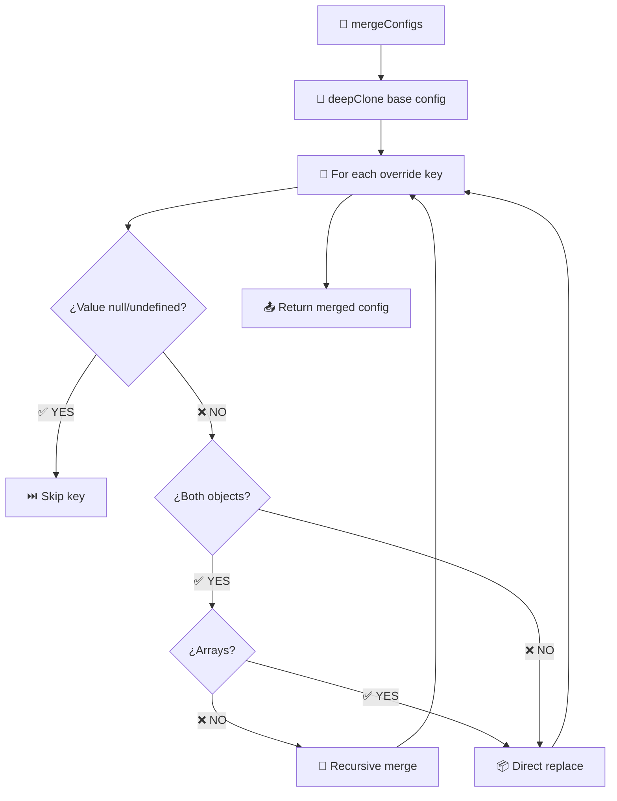
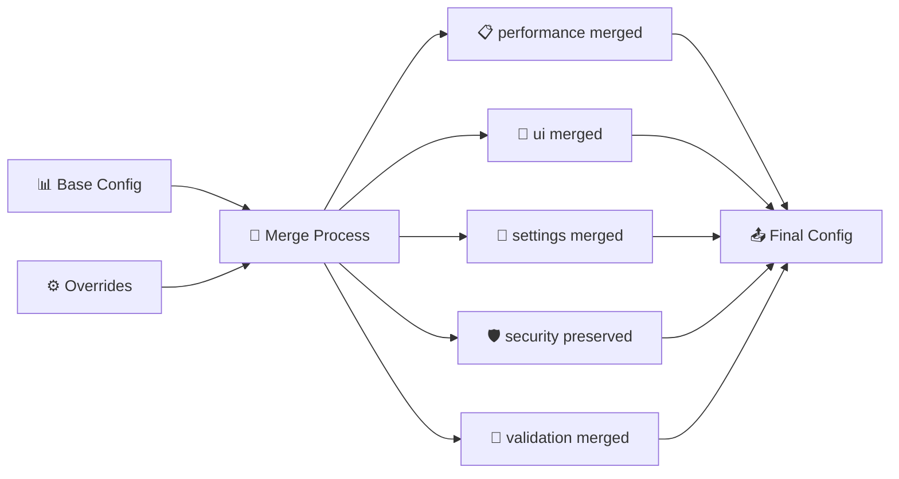

# 🔧 **MÉTODOS DEL CONFIG MANAGER - EXPLICACIÓN DETALLADA**

## 📖 **ÍNDICE DE MÉTODOS**

- [🏗️ Constructor y Singleton](#-constructor-y-singleton)
- [🧬 deepClone()](#-deepclone---clonación-profunda)
- [🔄 mergeConfigs()](#-mergeconfigs---fusión-inteligente)
- [⚙️ setOverrides()](#-setoverrides---aplicar-cambios)
- [🎯 getConfig()](#-getconfig---obtener-configuración-final)
- [🔍 Getters Específicos](#-getters-específicos)
- [🌍 Métodos de Ambiente](#-métodos-de-ambiente)
- [🛠️ Utilidades](#-utilidades)

---

## 🏗️ **CONSTRUCTOR Y SINGLETON**

### **🔐 Constructor Privado**

```typescript
private constructor() {
  this.config = this.deepClone(DEFAULT_CORE_CONFIG);
}
```

**¿Por qué es privado?**

1. **Previene múltiples instancias**
2. **Fuerza el uso del patrón Singleton**
3. **Garantiza inicialización correcta**
4. **Evita configuraciones inconsistentes**

**Flujo de inicialización:**

```mermaid
graph TD
    A[🎬 new ConfigManager()] --> B{¿Es privado?}
    B -->|❌ NO| C[💥 Error: Constructor is private]
    B -->|✅ SÍ| D[🧬 this.deepClone(DEFAULT_CONFIG)]
    D --> E[📊 this.config = clonedConfig]
    E --> F[🎯 Instancia lista]
```

### **🏭 getInstance() - Patrón Singleton**

```typescript
public static getInstance(): UsersConfigManager {
  if (!UsersConfigManager.instance) {
    UsersConfigManager.instance = new UsersConfigManager();
  }
  return UsersConfigManager.instance;
}
```

**¿Cómo funciona internamente?**

```typescript
// Primera llamada:
const config1 = UsersConfigManager.getInstance();
// 🔍 Checks: instance === undefined
// 🏗️ Creates: new UsersConfigManager()
// 💾 Stores: instance = newInstance
// 📤 Returns: newInstance

// Segunda llamada:
const config2 = UsersConfigManager.getInstance();
// 🔍 Checks: instance !== undefined
// ⚡ Skips: new UsersConfigManager()
// 📤 Returns: existing instance

console.log(config1 === config2); // ✅ true - Misma instancia
```

**Ejemplo práctico de por qué es importante:**

```typescript
// ❌ SIN SINGLETON (problemático):
class BadConfig {
  constructor() {
    this.debounceMs = 300;
  }
}

const config1 = new BadConfig();
const config2 = new BadConfig();

config1.debounceMs = 500; // Cambia solo config1
console.log(config2.debounceMs); // ❌ 300 (inconsistente)

// ✅ CON SINGLETON (correcto):
const config1 = ConfigManager.getInstance();
const config2 = ConfigManager.getInstance();

config1.setOverrides({ performance: { debounceMs: 500 } });
console.log(config2.getPerformanceSetting("debounceMs")); // ✅ 500 (consistente)
```

---

## 🧬 **deepClone() - Clonación Profunda**

```typescript
private deepClone<T>(obj: T): T {
  // 1. Maneja primitivos y null
  if (obj === null || typeof obj !== "object") {
    return obj;
  }

  // 2. Maneja fechas específicamente
  if (obj instanceof Date) {
    return new Date(obj.getTime()) as unknown as T;
  }

  // 3. Maneja expresiones regulares
  if (obj instanceof RegExp) {
    return new RegExp(obj.source, obj.flags) as unknown as T;
  }

  // 4. Maneja arrays recursivamente
  if (Array.isArray(obj)) {
    return obj.map((item) => this.deepClone(item)) as unknown as T;
  }

  // 5. Maneja objetos recursivamente
  const cloned = {} as T;
  for (const key in obj) {
    if (Object.prototype.hasOwnProperty.call(obj, key)) {
      cloned[key] = this.deepClone(obj[key]);
    }
  }
  return cloned;
}
```

### **🎯 ¿Por qué necesitamos deepClone?**

**Problema con referencias compartidas:**

```typescript
// ❌ PROBLEMA: Referencias compartidas
const original = {
  performance: { debounceMs: 300, maxRetries: 3 },
  ui: { itemsPerPage: 20 },
};

const shallow = { ...original }; // Clonación superficial
shallow.performance.debounceMs = 500;

console.log(original.performance.debounceMs); // ❌ 500! Se modificó el original
```

**Solución con deepClone:**

```typescript
// ✅ SOLUCIÓN: Clonación profunda
const cloned = this.deepClone(original);
cloned.performance.debounceMs = 500;

console.log(original.performance.debounceMs); // ✅ 300! Original intacto
```

### **🔬 Análisis paso a paso**

**Ejemplo complejo:**

```typescript
const complexConfig = {
  performance: { debounceMs: 300 }, // Objeto anidado
  allowedTypes: ["image/jpeg", "image/png"], // Array
  createdAt: new Date("2024-01-01"), // Date object
  emailPattern: /^[^@]+@[^@]+\.[^@]+$/, // RegExp
  enabled: true, // Primitivo
  nested: {
    // Objeto anidado profundo
    deep: {
      value: "test",
    },
  },
};

// Proceso de clonación:
```

**Paso 1: Verificar tipo**

```typescript
// obj = { performance: {...}, allowedTypes: [...], ... }
// typeof obj = "object" ✅
// obj !== null ✅
// No es Date, RegExp, o Array ✅
// → Proceder con clonación de objeto
```

**Paso 2: Crear objeto vacío**

```typescript
const cloned = {} as ConfigType;
```

**Paso 3: Iterar propiedades**

```typescript
// key = "performance"
// obj[key] = { debounceMs: 300 }
// → Llamada recursiva: this.deepClone({ debounceMs: 300 })

// key = "allowedTypes"
// obj[key] = ["image/jpeg", "image/png"]
// Array.isArray() = true ✅
// → obj.map(item => this.deepClone(item))

// key = "createdAt"
// obj[key] = new Date("2024-01-01")
// instanceof Date = true ✅
// → new Date(obj.getTime())

// key = "emailPattern"
// obj[key] = /^[^@]+@[^@]+\.[^@]+$/
// instanceof RegExp = true ✅
// → new RegExp(obj.source, obj.flags)

// key = "enabled"
// obj[key] = true
// typeof obj[key] = "boolean" (primitivo)
// → return true directamente
```

### **⚡ Performance vs Seguridad**

**Alternativas y por qué no las usamos:**

**❌ JSON.stringify/parse (rápido pero limitado):**

```typescript
const jsonClone = JSON.parse(JSON.stringify(obj));
// Problemas:
// - Pierde funciones: func: () => {} → undefined
// - Pierde Dates: new Date() → string
// - Pierde RegExp: /pattern/ → {}
// - Pierde undefined: { a: undefined } → {}
```

**❌ Shallow clone (muy rápido pero insuficiente):**

```typescript
const shallow = { ...obj };
// Problema: Solo clona el primer nivel
shallow.nested.value = "changed"; // ❌ Modifica el original
```

**✅ DeepClone custom (balance perfecto):**

```typescript
const deep = this.deepClone(obj);
// Ventajas:
// - Preserva todos los tipos de datos
// - Clonación realmente profunda
// - Control total sobre el proceso
// - Optimizable para casos específicos
```

---

## 🔄 **mergeConfigs() - Fusión Inteligente**

```typescript
private mergeConfigs<T extends Record<string, unknown>>(
  base: T,
  override: Partial<T>
): T {
  const result = this.deepClone(base);

  for (const key in override) {
    const typedKey = key as keyof T;
    const baseValue = result[typedKey];
    const overrideValue = override[key];

    // Ignora valores null/undefined
    if (overrideValue === null || overrideValue === undefined) {
      continue;
    }

    // Decide si hacer merge recursivo o reemplazo directo
    if (
      typeof baseValue === "object" &&
      typeof overrideValue === "object" &&
      !Array.isArray(baseValue) &&
      !Array.isArray(overrideValue) &&
      baseValue !== null &&
      overrideValue !== null
    ) {
      // Merge recursivo para objetos
      result[typedKey] = this.mergeConfigs(
        baseValue as Record<string, unknown>,
        overrideValue as Record<string, unknown>
      ) as T[keyof T];
    } else {
      // Reemplazo directo para primitivos y arrays
      result[typedKey] = overrideValue as T[keyof T];
    }
  }

  return result;
}
```

### **🎯 Lógica de decisión**

**Diagrama de flujo:**



### **📊 Ejemplos de fusión**

**Ejemplo 1: Merge de objetos anidados**

```typescript
const base = {
  performance: {
    debounceMs: 300,
    maxRetries: 3,
    cacheTimeout: 600000
  },
  ui: {
    itemsPerPage: 20,
    showAnimations: true
  }
};

const override = {
  performance: {
    debounceMs: 500  // Solo cambia esta propiedad
  }
};

const result = mergeConfigs(base, override);
// Resultado:
{
  performance: {
    debounceMs: 500,      // ✅ Overridden
    maxRetries: 3,        // ✅ Preserved
    cacheTimeout: 600000  // ✅ Preserved
  },
  ui: {
    itemsPerPage: 20,     // ✅ Preserved
    showAnimations: true  // ✅ Preserved
  }
}
```

**Ejemplo 2: Reemplazo de arrays**

```typescript
const base = {
  allowedTypes: ["image/jpeg", "image/png"],
  settings: { enabled: true }
};

const override = {
  allowedTypes: ["application/pdf"] // Nuevo array completo
};

const result = mergeConfigs(base, override);
// Resultado:
{
  allowedTypes: ["application/pdf"], // ✅ Array reemplazado completamente
  settings: { enabled: true }        // ✅ Preserved
}
```

**Ejemplo 3: Manejo de valores null/undefined**

```typescript
const base = {
  performance: { debounceMs: 300 },
  ui: { itemsPerPage: 20 }
};

const override = {
  performance: { debounceMs: null },    // ❌ Será ignorado
  ui: undefined,                        // ❌ Será ignorado
  security: { enabled: true }           // ✅ Será añadido
};

const result = mergeConfigs(base, override);
// Resultado:
{
  performance: { debounceMs: 300 },     // ✅ Original preserved (null ignorado)
  ui: { itemsPerPage: 20 },            // ✅ Original preserved (undefined ignorado)
  security: { enabled: true }          // ✅ New property added
}
```

### **🔍 Análisis de condiciones**

**¿Cuándo hace merge recursivo?**

```typescript
typeof baseValue === "object" && // Base es objeto
  typeof overrideValue === "object" && // Override es objeto
  !Array.isArray(baseValue) && // Base NO es array
  !Array.isArray(overrideValue) && // Override NO es array
  baseValue !== null && // Base no es null
  overrideValue !== null; // Override no es null
```

**Casos que hacen merge recursivo:**

```typescript
// ✅ Ambos objetos simples
base: {
  performance: {
    debounceMs: 300;
  }
}
override: {
  performance: {
    maxRetries: 5;
  }
}

// ✅ Objetos anidados
base: {
  ui: {
    settings: {
      theme: "dark";
    }
  }
}
override: {
  ui: {
    settings: {
      animations: true;
    }
  }
}
```

**Casos que hacen reemplazo directo:**

```typescript
// ❌ Uno es array
base: {
  types: ["image"];
}
override: {
  types: ["pdf"];
} // Array se reemplaza completamente

// ❌ Uno es primitivo
base: {
  enabled: true;
}
override: {
  enabled: false;
} // Boolean se reemplaza

// ❌ Uno es null
base: {
  config: {
    value: 1;
  }
}
override: {
  config: null;
} // null se ignora

// ❌ Date objects
base: {
  createdAt: new Date("2024-01-01");
}
override: {
  createdAt: new Date("2024-01-02");
} // Date se reemplaza
```

---

## ⚙️ **setOverrides() - Aplicar Cambios**

```typescript
public setOverrides(
  overrides: Partial<Omit<UsersModuleConfig, "security">>
): void {
  const safeOverrides = this.deepClone(overrides);
  this.overrides = safeOverrides as Partial<UsersModuleConfig>;
}
```

### **🛡️ Seguridad y Restricciones**

**¿Por qué `Omit<UsersModuleConfig, "security">`?**

```typescript
// ❌ NO permitido: Cambiar configuraciones de seguridad
usersConfig.setOverrides({
  security: {
    maxLoginAttempts: 999, // ❌ Demasiado permisivo
    sessionTimeout: 0, // ❌ Sin timeout (peligroso)
  },
});

// ✅ SÍ permitido: Cambiar configuraciones no críticas
usersConfig.setOverrides({
  performance: { debounceMs: 500 },
  ui: { itemsPerPage: 50 },
  settings: { advancedLogging: true },
});
```

### **🔄 Proceso interno**

**Paso a paso:**

```typescript
// 1. Usuario llama setOverrides
const userOverrides = {
  performance: { debounceMs: 500 },
  ui: { itemsPerPage: 50 },
};

usersConfig.setOverrides(userOverrides);

// 2. Internamente se ejecuta:
const safeOverrides = this.deepClone(userOverrides);
// safeOverrides = {
//   performance: { debounceMs: 500 },
//   ui: { itemsPerPage: 50 }
// }

// 3. Se almacenan los overrides
this.overrides = safeOverrides;

// 4. Próxima llamada a getConfig() usará estos overrides
```

**¿Por qué deepClone en setOverrides?**

```typescript
// ❌ Sin deepClone (problemático):
const userConfig = { performance: { debounceMs: 500 } };
configManager.setOverrides(userConfig);

// Usuario modifica su config original:
userConfig.performance.debounceMs = 1000;

// ❌ Los overrides también cambian (referencia compartida):
console.log(configManager.overrides.performance.debounceMs); // 1000

// ✅ Con deepClone (correcto):
const safeOverrides = this.deepClone(userConfig);
this.overrides = safeOverrides;

// Usuario modifica su config:
userConfig.performance.debounceMs = 1000;

// ✅ Los overrides NO cambian (copias independientes):
console.log(configManager.overrides.performance.debounceMs); // 500
```

---

## 🎯 **getConfig() - Obtener Configuración Final**

```typescript
public getConfig(): UsersModuleConfig {
  return {
    ...this.config,
    ...this.overrides,
    performance: {
      ...this.config.performance,
      ...(this.overrides.performance || {}),
    },
    ui: {
      ...this.config.ui,
      ...(this.overrides.ui || {}),
    },
    settings: {
      ...this.config.settings,
      ...(this.overrides.settings || {}),
    },
    security: this.config.security, // Security never overrideable
    validation: {
      ...this.config.validation,
      ...(this.overrides.validation || {}),
    },
  };
}
```

### **🔄 Proceso de fusión**

**Visualización del proceso:**



**Ejemplo paso a paso:**

```typescript
// Estado inicial:
this.config = {
  performance: { debounceMs: 300, maxRetries: 3 },
  ui: { itemsPerPage: 20, showAnimations: true },
  settings: { advancedLogging: false },
  security: { maxLoginAttempts: 5 },
  validation: { email: { minLength: 5 } }
};

this.overrides = {
  performance: { debounceMs: 500 },
  ui: { itemsPerPage: 50 },
  settings: { advancedLogging: true }
};

// getConfig() ejecuta:

// 1. performance merge:
performance: {
  ...this.config.performance,     // { debounceMs: 300, maxRetries: 3 }
  ...this.overrides.performance   // { debounceMs: 500 }
}
// Resultado: { debounceMs: 500, maxRetries: 3 }

// 2. ui merge:
ui: {
  ...this.config.ui,         // { itemsPerPage: 20, showAnimations: true }
  ...this.overrides.ui       // { itemsPerPage: 50 }
}
// Resultado: { itemsPerPage: 50, showAnimations: true }

// 3. settings merge:
settings: {
  ...this.config.settings,      // { advancedLogging: false }
  ...this.overrides.settings    // { advancedLogging: true }
}
// Resultado: { advancedLogging: true }

// 4. security preserved:
security: this.config.security  // { maxLoginAttempts: 5 } (sin cambios)

// 5. validation merge:
validation: {
  ...this.config.validation,      // { email: { minLength: 5 } }
  ...this.overrides.validation    // undefined (sin overrides)
}
// Resultado: { email: { minLength: 5 } }
```

### **🛡️ Protección de Security**

**¿Por qué security nunca se override?**

```typescript
security: this.config.security, // ✅ Siempre usa la configuración original
```

**Ejemplo de intento de override:**

```typescript
// Usuario malicioso intenta:
configManager.setOverrides({
  // ❌ TypeScript previene esto:
  security: { maxLoginAttempts: 999 }, // Compile-time error
});

// Incluso si logra bypassear TypeScript:
configManager.overrides = {
  security: { maxLoginAttempts: 999 },
} as any;

// ✅ getConfig() IGNORA el override:
const finalConfig = configManager.getConfig();
console.log(finalConfig.security.maxLoginAttempts); // 5 (valor original)
```

---

## 🔍 **GETTERS ESPECÍFICOS**

### **⚡ getPerformanceSetting()**

```typescript
public getPerformanceSetting<
  K extends keyof UsersModuleConfig["performance"]
>(key: K): UsersModuleConfig["performance"][K] {
  return this.getConfig().performance[key];
}
```

**¿Cómo funciona internamente?**

```typescript
// Usuario llama:
const debounceMs = configManager.getPerformanceSetting("debounceMs");

// Internamente:
// 1. Llama getConfig() (fusiona base + overrides)
// 2. Accede a .performance
// 3. Accede a ["debounceMs"]
// 4. Retorna el valor (type-safe gracias a generics)
```

**Ventajas sobre acceso directo:**

```typescript
// ❌ Acceso directo (problemático):
const config = configManager.getConfig();
const debounceMs = config.performance.debounceMs;
// Problemas:
// - Más verbose
// - Sin type checking específico
// - Posible acceso a config incompleto

// ✅ Getter específico (recomendado):
const debounceMs = configManager.getPerformanceSetting("debounceMs");
// Ventajas:
// - Type-safe
// - Más limpio
// - API clara
// - Auto-complete en IDE
```

### **🔧 isSettingEnabled()**

```typescript
public isSettingEnabled<K extends keyof UsersModuleConfig["settings"]>(
  key: K
): boolean {
  return this.getConfig().settings[key] as boolean;
}
```

**Ejemplo de uso:**

```typescript
// En lugar de:
if (configManager.getConfig().settings.optimisticUpdates) {
  // Hacer algo
}

// Puedes hacer:
if (configManager.isSettingEnabled("optimisticUpdates")) {
  // Hacer algo
}
```

---

## 🌍 **MÉTODOS DE AMBIENTE**

### **🔧 enableDevMode()**

```typescript
public enableDevMode(): void {
  this.setOverrides({
    settings: {
      ...this.config.settings,
      advancedLogging: true,        // ✅ Logging detallado
      performanceTracking: true,    // ✅ Métricas de performance
    },
    performance: {
      ...this.config.performance,
      cacheTimeout: 60 * 1000,      // ✅ Cache corto (1 minuto)
    },
  });
}
```

**¿Qué configuración aplica?**

- **Logging detallado** → Para debugging
- **Performance tracking** → Para optimizar
- **Cache corto** → Para ver cambios inmediatos

### **🚀 enableProductionMode()**

```typescript
public enableProductionMode(): void {
  this.setOverrides({
    settings: {
      ...this.config.settings,
      advancedLogging: false,       // ❌ Sin logging detallado
      performanceTracking: true,    // ✅ Pero sí métricas
    },
    performance: {
      ...this.config.performance,
      cacheTimeout: 15 * 60 * 1000, // ✅ Cache largo (15 minutos)
    },
  });
}
```

**¿Qué configuración aplica?**

- **Sin logging detallado** → Para mejor performance
- **Performance tracking** → Para monitoreo
- **Cache largo** → Para menos requests

### **⚡ enableHighPerformanceMode()**

```typescript
public enableHighPerformanceMode(): void {
  this.setOverrides({
    performance: {
      ...this.config.performance,
      cacheTimeout: 30 * 60 * 1000, // 30 minutos
      debounceMs: 150,              // Más rápido
      maxRetries: 2,                // Menos reintentos
    },
    ui: {
      ...this.config.ui,
      itemsPerPage: 50,             // Más elementos
      updateInterval: 200,          // Updates más frecuentes
    },
  });
}
```

**¿Qué configuración aplica?**

- **Cache muy largo** → Menos requests
- **Debounce rápido** → Búsquedas más ágiles
- **Menos reintentos** → Falla más rápido
- **Más elementos por página** → Menos paginación

---

## 🛠️ **UTILIDADES**

### **🔄 resetToDefaults()**

```typescript
public resetToDefaults(): void {
  this.overrides = {};
}
```

**¿Cuándo usar?**

- Limpiar configuración temporal
- Resetear después de testing
- Volver a configuración base

**Ejemplo:**

```typescript
// Configuración temporal para un componente específico
configManager.setOverrides({ ui: { itemsPerPage: 100 } });

// Usar configuración...

// Limpiar cuando termines
configManager.resetToDefaults();
```

### **📊 getConfigSummary()**

```typescript
public getConfigSummary(): Record<string, unknown> {
  const config = this.getConfig();
  return {
    performanceTracking: config.settings.performanceTracking,
    optimisticUpdates: config.settings.optimisticUpdates,
    autoRefresh: config.settings.autoRefresh,
    itemsPerPage: config.ui.itemsPerPage,
    cacheTimeout: config.performance.cacheTimeout,
    advancedLogging: config.settings.advancedLogging,
  };
}
```

**¿Para qué sirve?**

- **Debugging** → Ver configuración actual rápidamente
- **Logging** → Registrar configuración en logs
- **UI** → Mostrar configuración en admin panel

**Ejemplo de output:**

```typescript
{
  performanceTracking: true,
  optimisticUpdates: true,
  autoRefresh: true,
  itemsPerPage: 50,
  cacheTimeout: 900000,
  advancedLogging: false
}
```

---

## 🔄 **FLUJO COMPLETO DE CONFIGURACIÓN**

### **Ejemplo end-to-end:**

```typescript
// 1. 🎬 Inicialización
const config = UsersConfigManager.getInstance();

// 2. 📊 Estado inicial
console.log(config.getPerformanceSetting("debounceMs")); // 300

// 3. ⚙️ Aplicar overrides
config.setOverrides({
  performance: { debounceMs: 500 },
  ui: { itemsPerPage: 50 },
});

// 4. 🎯 Obtener configuración fusionada
const finalConfig = config.getConfig();
console.log(finalConfig.performance.debounceMs); // 500
console.log(finalConfig.performance.maxRetries); // 3 (preservado)
console.log(finalConfig.ui.itemsPerPage); // 50

// 5. 🌍 Cambiar modo
config.enableDevMode();

// 6. 📋 Ver resumen
console.log(config.getConfigSummary());
// {
//   performanceTracking: true,
//   advancedLogging: true,    // ✅ Cambió por enableDevMode
//   cacheTimeout: 60000,      // ✅ Cambió por enableDevMode
//   itemsPerPage: 50,         // ✅ Preservado de overrides anteriores
//   ...
// }

// 7. 🔄 Reset
config.resetToDefaults();
console.log(config.getPerformanceSetting("debounceMs")); // 300 (vuelta al default)
```

---

## 💡 **DEBUGGING DE CONFIGURACIONES**

### **🔍 Herramientas útiles**

```typescript
// Ver configuración actual completa
console.log("📊 Current config:", configManager.getConfig());

// Ver solo overrides activos
console.log("⚙️ Active overrides:", configManager.overrides);

// Ver configuración base (sin overrides)
console.log("📋 Base config:", configManager.config);

// Ver resumen ejecutivo
console.log("🎯 Config summary:", configManager.getConfigSummary());

// Verificar configuraciones específicas
console.log("⚡ Debounce:", configManager.getPerformanceSetting("debounceMs"));
console.log("📄 Items per page:", configManager.getUISetting("itemsPerPage"));
console.log(
  "🔧 Optimistic updates:",
  configManager.isSettingEnabled("optimisticUpdates")
);
```

### **🚨 Debugging common issues**

```typescript
// ❌ Problema: Configuración no se aplica
const config = configManager.getConfig();
config.performance.debounceMs = 500; // ❌ Modifica referencia directa

// ✅ Solución: Usar setOverrides
configManager.setOverrides({
  performance: { debounceMs: 500 },
});

// ❌ Problema: Overrides se acumulan
configManager.setOverrides({ ui: { itemsPerPage: 100 } });
configManager.setOverrides({ performance: { debounceMs: 500 } });
// Ahora tiene AMBOS overrides

// ✅ Solución: Reset explícito cuando sea necesario
configManager.resetToDefaults();
configManager.setOverrides({ performance: { debounceMs: 500 } });
```

---

¿Te gustaría que profundice en algún método específico o que añada más ejemplos de casos de uso complejos?
