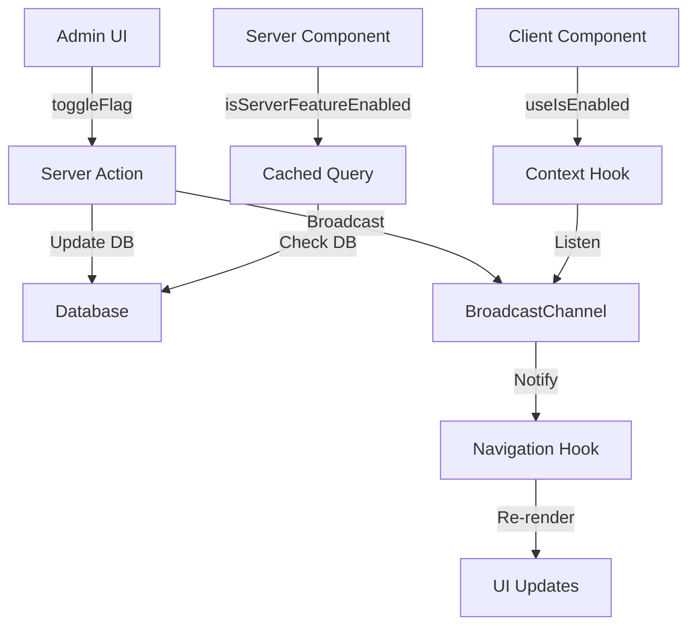

# 🎛️ Feature Flags System - Documentación Completa

> **Sistema consolidado, limpio y funcional para gestión de feature flags en tiempo real**

## 📋 **Índice**

1. [🎯 Visión General](#-visión-general)
2. [🏗️ Arquitectura](#️-arquitectura)
3. [🚀 Inicio Rápido](#-inicio-rápido)
4. [📚 Guías Detalladas](#-guías-detalladas)
5. [🔧 API Reference](#-api-reference)
6. [🛠️ Troubleshooting](#️-troubleshooting)

---

## 🎯 **Visión General**

El sistema de Feature Flags permite **activar/desactivar funcionalidades** de la aplicación en tiempo real sin necesidad de deployments.

### **✅ Características Principales:**

- **🔄 Tiempo Real** - Cambios instantáneos con broadcast entre pestañas
- **🎨 Admin UI** - Interfaz visual para gestionar flags
- **⚡ Performance** - Caching con `unstable_cache` de Next.js 15
- **🔒 Seguridad** - Validación de permisos de admin
- **📱 Reactivo** - Navigation se actualiza automáticamente
- **🧪 Flexible** - Soporte para flags estáticos y dinámicos

### **🎯 Casos de Uso:**

- ✅ Activar/desactivar módulos completos (`fileUpload`, `userManagement`)
- ✅ A/B Testing y experimentos
- ✅ Rollouts graduales de funcionalidades
- ✅ Kill switches para emergencias
- ✅ Funcionalidades por roles/permisos

---

## 🏗️ **Arquitectura**

### **📁 Estructura del Sistema:**

```
src/core/feature-flags/           # 🎯 SISTEMA CONSOLIDADO
├── config.ts                     # Configuración estática y categorías
├── types.ts                      # Tipos TypeScript compartidos
├── server.ts                     # Utilidades server-side + caching
├── actions.ts                    # Server Actions para mutations
├── hooks.ts                      # Hooks client-side + broadcast
└── index.ts                      # Barrel exports

src/features/admin/feature-flags/ # 🎨 ADMIN UI (SIMPLE)
├── page.tsx                      # Página de administración
└── components/
    └── FeatureFlagCard.tsx       # Componente de card

docs/Feature-flags/               # 📚 DOCUMENTACIÓN
├── README.md                     # Este archivo
├── EXAMPLES.md                   # Ejemplos completos
├── MODULE_GUIDE.md               # Guía para agregar módulos
├── API_REFERENCE.md              # Referencia completa
└── TROUBLESHOOTING.md            # Solución de problemas
```

### **🔄 Flujo de Datos:**



### **⚡ Caching Strategy:**

- **Server-side**: `unstable_cache` con tag `feature-flags`
- **Client-side**: React Context con broadcast sync
- **Invalidation**: Manual via `revalidateTag`

---

## 🚀 **Inicio Rápido**

### **1. Configurar un Feature Flag**

```typescript
// src/core/feature-flags/config.ts
export const FEATURE_FLAGS = {
  // Flags existentes...
  myNewModule: true, // 🆕 Agregar aquí
} as const;

export const FEATURE_CATEGORIES = {
  // Categorías existentes...
  experimental: {
    name: "Experimental",
    description: "Funcionalidades en prueba",
    color: "yellow",
  },
} as const;
```

### **2. Usar en Navigation**

```typescript
// src/core/navigation/constants.ts
export const NAVIGATION_REGISTRY: NavigationItem[] = [
  {
    id: "my-module",
    label: "Mi Módulo",
    href: "/my-module",
    icon: Package,
    requiredFeature: "myNewModule", // 🎯 Feature flag
    requiredRole: "admin",
    category: "feature",
    order: 50,
  },
];
```

### **3. Usar en Server Component**

```typescript
// src/app/(admin)/my-module/page.tsx
import { isServerFeatureEnabled } from "@/core/feature-flags/server";
import { notFound } from "next/navigation";

export default async function MyModulePage() {
  const enabled = await isServerFeatureEnabled("myNewModule");
  if (!enabled) notFound();

  return <MyModuleContent />;
}
```

### **4. Usar en Client Component**

```typescript
// src/components/MyComponent.tsx
"use client";
import { useIsEnabled } from "@/core/feature-flags";

export function MyComponent() {
  const isEnabled = useIsEnabled();

  if (!isEnabled("myNewModule")) {
    return null; // O componente alternativo
  }

  return <div>Mi funcionalidad habilitada!</div>;
}
```

---

## 📚 **Guías Detalladas**

### **📖 Documentos Disponibles:**

1. **[EXAMPLES.md](./EXAMPLES.md)** - Ejemplos completos paso a paso
2. **[MODULE_GUIDE.md](./MODULE_GUIDE.md)** - Cómo agregar nuevos módulos
3. **[API_REFERENCE.md](./API_REFERENCE.md)** - Referencia completa de API
4. **[TROUBLESHOOTING.md](./TROUBLESHOOTING.md)** - Solución de problemas

---

## 🔧 **API Reference Rápida**

### **🪝 Client Hooks:**

```typescript
// Hook principal
const { flags, isEnabled, toggleFlag } = useFeatureFlags();

// Hook simple para verificación
const isEnabled = useIsEnabled();
const enabled = isEnabled("myFlag");

// Hook para toggle
const toggleFlag = useToggleFlag();
await toggleFlag("myFlag");
```

### **⚙️ Server Utilities:**

```typescript
// Verificar flag en server
const enabled = await isServerFeatureEnabled("myFlag");

// Obtener todos los flags con metadata
const flags = await getFeatureFlagsWithMetadata();

// Invalidar cache
await invalidateFeatureFlagsCache();
```

### **🎬 Server Actions:**

```typescript
// Obtener flags
const result = await getFeatureFlagsAction();

// Toggle flag
const result = await toggleFeatureFlagAction("myFlag");

// Batch update
const result = await batchUpdateFeatureFlagsAction([
  { key: "flag1", enabled: true },
  { key: "flag2", enabled: false },
]);
```

---

## 🛠️ **Troubleshooting Rápido**

### **❌ Problemas Comunes:**

| Problema                   | Solución                                                  |
| -------------------------- | --------------------------------------------------------- |
| Navigation no se actualiza | Verificar que `FeatureFlagsProvider` esté en `layout.tsx` |
| Flag no aparece en admin   | Agregar a `FEATURE_FLAGS` en `config.ts`                  |
| Error de tipos             | Verificar que el flag esté en el tipo `FeatureFlag`       |
| Broadcast no funciona      | Verificar que `useFeatureFlagsBroadcast` esté importado   |

### **🔍 Debug Mode:**

```typescript
// Activar debug en navigation
const { navigationItems } = useNavigation({
  userRole: "admin",
  isAuthenticated: true,
  debugMode: true, // 🐛 Ver logs en consola
});
```

---

## 🎯 **Próximos Pasos**

1. **Leer [MODULE_GUIDE.md](./MODULE_GUIDE.md)** para agregar tu primer módulo
2. **Revisar [EXAMPLES.md](./EXAMPLES.md)** para casos de uso específicos
3. **Consultar [API_REFERENCE.md](./API_REFERENCE.md)** para detalles técnicos

---

## 📞 **Soporte**

- 📚 **Documentación**: `docs/Feature-flags/`
- 🐛 **Issues**: Revisar `TROUBLESHOOTING.md`
- 💡 **Ejemplos**: Ver `EXAMPLES.md`

---

_Última actualización: Enero 2025 - Sistema consolidado v2.0_
