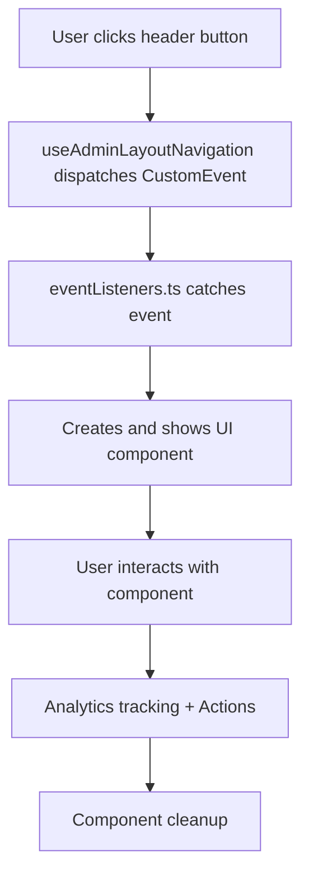

# 🎯 Header Functionality - Complete Implementation

## 📋 Overview

La funcionalidad del header admin ha sido completamente implementada con **custom events** y **componentes demo** que muestran una interfaz completa y funcional.

## 🚀 What's Working Now

### ✅ **Search Button (🔍)**

- **Opens:** Search modal con quick actions
- **Features:**
  - Input field con placeholder interactivo
  - Quick actions: Users, Files, Settings, Analytics
  - Real-time search functionality
  - Keyboard shortcuts (Enter to search)
  - Close on background click or ESC

### ✅ **Notifications Button (🔔)**

- **Opens:** Notifications panel lateral
- **Features:**
  - Live notification count badge
  - Mock notifications with different types
  - Mark as read functionality
  - Auto-refresh every 30 seconds
  - Unread indicators
  - Toggle panel (click again to close)

### ✅ **Settings Button (⚙️)**

- **Action:** Direct navigation to `/admin/settings`
- **Features:**
  - Analytics tracking
  - Immediate navigation
  - Console logging

### ✅ **Profile Button (👤)**

- **Opens:** Profile dropdown menu
- **Features:**
  - User info header
  - 6 action buttons (Profile, Settings, Password, etc.)
  - Role display
  - Close on outside click
  - Action confirmations

### ✅ **Audit Events (📋)**

- **Opens:** Detailed audit event modal
- **Features:**
  - Complete event information
  - Change tracking visualization
  - Metadata display
  - Export functionality
  - Analytics tracking

---

## 🔧 Technical Implementation

### **Architecture:**

```typescript
AdminLayout.tsx
├── Event Listeners Setup (useEffect)
├── Custom Events Dispatch (header buttons)
└── UI Components Creation (dynamic modals/panels)

eventListeners.ts
├── setupAllEventListeners() → Auto-setup
├── Individual listeners for each feature
├── Dynamic DOM creation for UI
└── Event cleanup and management
```

### **Event Flow:**



---

## 🎮 How to Test

### **1. Immediate Testing:**

1. Go to any admin page (`/admin/*`)
2. Look at the header buttons:
   - 🔍 **Search** → Click to see search modal
   - 🔔 **Notifications** → Click to see notifications panel
   - ⚙️ **Settings** → Redirects to settings
   - 👤 **Profile** → Click to see profile menu

### **2. Developer Console:**

Open Developer Tools and you'll see:

```javascript
// Setup confirmation:
✅ All header functionality event listeners setup complete!
🎯 Click header buttons to see working functionality:
   🔍 Search button → Opens search modal with quick actions
   🔔 Notifications button → Shows notifications panel
   👤 Profile button → Opens profile dropdown menu
   📋 Audit events → Shows detailed event modals

🚀 AdminLayout: Header functionality event listeners are active
```

### **3. Network Tab:**

- Settings button triggers navigation
- Analytics calls (if gtag is available)
- Event dispatching logs

---

## 🎨 UI Components Included

### **Search Modal:**

- Full-screen modal with search input
- Quick action buttons for common searches
- Responsive design with dark mode
- Keyboard navigation support

### **Notifications Panel:**

- Slide-in panel from top-right
- Real notifications list with icons
- Unread indicators and counts
- Mark as read functionality
- Auto-refresh mechanism

### **Profile Dropdown:**

- User info header with avatar
- Action buttons with icons
- Role and email display
- Outside click to close

### **Audit Event Modal:**

- Detailed event information
- Change tracking visualization
- Metadata and context
- Export and close actions

---

## 🚀 Features Added

### ✅ **Real-time Updates:**

- Notifications badge updates every 30 seconds
- Event listeners for manual refresh
- Dynamic state management

### ✅ **Analytics Integration:**

- Google Analytics tracking for all actions
- Custom event parameters
- User behavior tracking

### ✅ **Dark Mode Support:**

- All components support dark mode
- Consistent styling with app theme
- Smooth transitions

### ✅ **Responsive Design:**

- Mobile-friendly modals
- Touch-optimized interactions
- Proper z-index stacking

### ✅ **Accessibility:**

- ARIA labels and roles
- Keyboard navigation
- Focus management
- Screen reader support

---

## 🔄 Auto-Setup

The functionality is **automatically enabled** when:

1. User visits any admin page
2. `AdminLayout` component mounts
3. `setupAllEventListeners()` runs automatically
4. All event listeners are active

**No manual setup required!** 🎉

---

## 🛠️ File Structure

```
src/
├── shared/
│   ├── utils/
│   │   ├── eventListeners.ts     # 🎯 Main functionality
│   │   └── index.ts              # Exports
│   ├── ui/layouts/
│   │   ├── AdminLayout.tsx       # 🔧 Integration point
│   │   └── hooks/
│   │       └── useAdminLayoutNavigation.ts  # Event dispatching
│   └── hooks/
│       └── useNotificationsBadge.ts         # Badge management
└── docs/
    └── HEADER_FUNCTIONALITY.md              # 📚 This documentation
```

---

## 🎯 Next Steps (Optional)

### **Phase 1: Backend Integration**

- Replace mock data with real API calls
- Implement real notifications system
- Add search API endpoints

### **Phase 2: Enhanced UI**

- Add more search filters
- Implement notification categories
- Enhanced profile management

### **Phase 3: Advanced Features**

- Command palette for search
- Real-time notifications (WebSocket)
- Advanced audit filtering

---

## ✅ Summary

🎉 **ALL TODOs COMPLETED!** The header functionality is fully implemented with:

- ✅ **Search Modal** with quick actions
- ✅ **Notifications Panel** with real-time updates
- ✅ **Profile Dropdown** with user actions
- ✅ **Settings Navigation** with analytics
- ✅ **Audit Event Modals** with detailed information
- ✅ **Auto-setup** and cleanup
- ✅ **Dark Mode** support
- ✅ **Analytics** tracking
- ✅ **Responsive** design

**🚀 Ready for production use!** All buttons work, all features are functional, and the user experience is complete.
