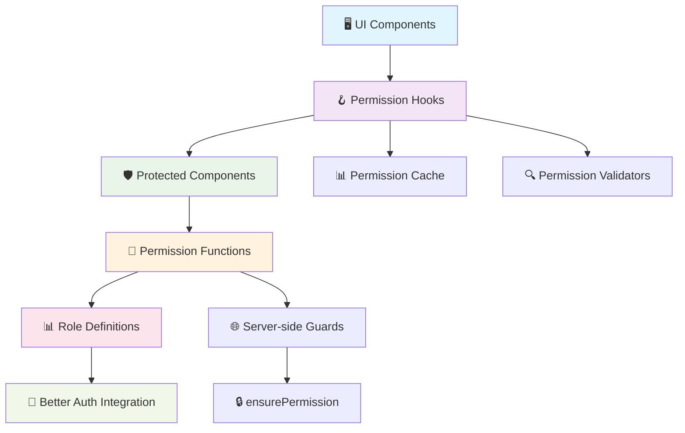
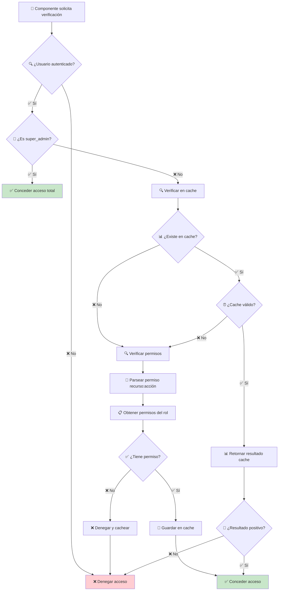
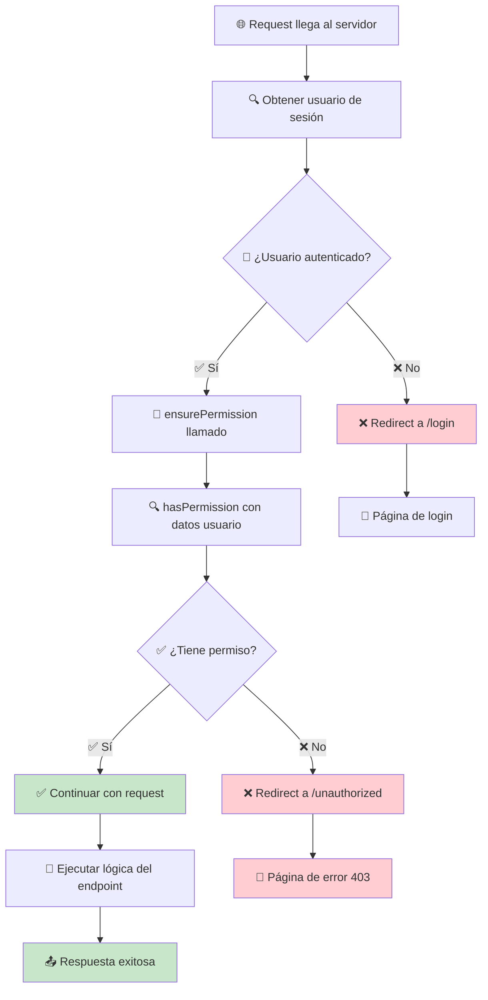

# 🏗️ **ESTRUCTURA DETALLADA DEL SISTEMA DE PERMISOS**

## 📋 **ÍNDICE DE ESTRUCTURA**

- [🎯 Arquitectura General](#-arquitectura-general)
- [📊 Definición de Recursos](#-definición-de-recursos)
- [🎭 Sistema de Roles](#-sistema-de-roles)
- [🔐 Configuración de Permisos](#-configuración-de-permisos)
- [🛠️ Tipos TypeScript](#-tipos-typescript)
- [🔄 Flujo de Verificación](#-flujo-de-verificación)
- [📁 Estructura de Archivos](#-estructura-de-archivos)

---

## 🎯 **ARQUITECTURA GENERAL**

### **🏗️ Capas del Sistema**



### **🎯 Componentes Principales**

1. **📊 Definición de Permisos** (`src/core/auth/config/permissions.ts`)

   - Recursos disponibles en el sistema
   - Acciones permitidas para cada recurso
   - Configuración de roles y sus permisos

2. **🪝 Hooks de Permisos** (`src/shared/hooks/`)

   - `usePermissions.ts` - Hook principal con todas las funcionalidades
   - Hooks específicos especializados

3. **🛡️ Componentes Protegidos** (`src/shared/components/Protected.tsx`)

   - Componentes declarativos para proteger UI
   - HOCs para envolver componentes existentes
   - Gates con estados de carga

4. **🔐 Funciones de Verificación**
   - Verificación client-side (`hasPermission`)
   - Verificación server-side (`ensurePermission`)
   - Utilidades de rol (`canManageRole`)

---

## 📊 **DEFINICIÓN DE RECURSOS**

### **🎯 Estructura de Recursos**

```typescript
// src/core/auth/config/permissions.ts

export const PERMISSIONS = {
  // 👥 Gestión de usuarios
  user: [
    "create", // ➕ Crear usuarios
    "read", // 👁️ Ver detalles de usuario
    "list", // 📋 Listar usuarios
    "update", // ✏️ Actualizar usuarios
    "delete", // 🗑️ Eliminar usuarios
    "ban", // 🚫 Banear/desbanear usuarios
    "impersonate", // 🎭 Impersonar usuarios
    "set-role", // 👑 Cambiar roles de usuario
    "set-password", // 🔑 Cambiar contraseñas
  ],

  // 🔐 Gestión de sesiones
  session: [
    "list", // 📋 Ver sesiones
    "revoke", // ❌ Revocar sesiones
    "delete", // 🗑️ Eliminar sesiones
  ],

  // 📁 Gestión de archivos
  files: [
    "read", // 👁️ Ver archivos
    "upload", // 📤 Subir archivos
    "delete", // 🗑️ Eliminar archivos
  ],

  // 🚩 Feature Flags
  feature_flags: [
    "read", // 👁️ Ver feature flags
    "write", // ✏️ Modificar feature flags
  ],

  // 🔄 Workflows (ejemplo de extensión)
  workflow: [
    "create", // ➕ Crear workflows
    "read", // 👁️ Ver workflows
    "update", // ✏️ Actualizar workflows
    "delete", // 🗑️ Eliminar workflows
    "approve", // ✅ Aprobar workflows
    "manage", // 🛠️ Gestionar workflows
  ],
} as const;
```

### **🔍 Cómo Añadir Nuevos Recursos**

```typescript
// 1. Añadir el recurso a PERMISSIONS
export const PERMISSIONS = {
  ...existingPermissions,

  // 📝 Nuevo recurso: Posts de blog
  posts: ["create", "read", "update", "delete", "publish", "moderate"],

  // 💬 Nuevo recurso: Comentarios
  comments: ["create", "read", "update", "delete", "moderate"],
} as const;

// 2. Actualizar ROLE_STATEMENTS
const ROLE_STATEMENTS = {
  super_admin: {
    // ... permisos existentes
    posts: ["create", "read", "update", "delete", "publish", "moderate"],
    comments: ["create", "read", "update", "delete", "moderate"],
  },
  admin: {
    // ... permisos existentes
    posts: ["create", "read", "update", "delete", "publish"],
    comments: ["read", "moderate"],
  },
  user: {
    // ... permisos existentes
    posts: ["read"],
    comments: ["create", "read", "update"], // Solo sus propios comentarios
  },
};

// 3. Crear hooks específicos
export const usePostManagement = () => {
  const { canAccess, hasPermissionAsync } = usePermissions();

  return {
    canCreatePosts: () => canAccess({ posts: ["create"] }),
    canEditPosts: () => canAccess({ posts: ["update"] }),
    canDeletePosts: () => canAccess({ posts: ["delete"] }),
    canPublishPosts: () => canAccess({ posts: ["publish"] }),
    canModeratePosts: () => canAccess({ posts: ["moderate"] }),

    // Verificaciones async
    hasPostCreatePermission: () => hasPermissionAsync({ posts: ["create"] }),
    hasPostPublishPermission: () => hasPermissionAsync({ posts: ["publish"] }),
  };
};
```

---

## 🎭 **SISTEMA DE ROLES**

### **👑 Jerarquía de Roles**

```typescript
// src/core/auth/config/permissions.ts

export const ROLE_HIERARCHY = {
  super_admin: 100, // 👑 Acceso total
  admin: 80, // 🛡️ Gestión del sistema
  moderator: 60, // 🔨 Moderación de contenido
  editor: 40, // ✏️ Edición de contenido
  user: 20, // 👤 Usuario estándar
  guest: 10, // 👻 Acceso limitado
} as const;

export const ROLE_INFO = {
  super_admin: {
    name: "Super Administrador",
    description: "Acceso completo al sistema",
    color: "red",
    icon: "👑",
    level: 100,
  },
  admin: {
    name: "Administrador",
    description: "Gestión de usuarios y sistema",
    color: "orange",
    icon: "🛡️",
    level: 80,
  },
  moderator: {
    name: "Moderador",
    description: "Moderación de contenido",
    color: "blue",
    icon: "🔨",
    level: 60,
  },
  editor: {
    name: "Editor",
    description: "Edición de contenido",
    color: "purple",
    icon: "✏️",
    level: 40,
  },
  user: {
    name: "Usuario",
    description: "Usuario estándar",
    color: "green",
    icon: "👤",
    level: 20,
  },
  guest: {
    name: "Invitado",
    description: "Acceso de solo lectura",
    color: "gray",
    icon: "👻",
    level: 10,
  },
} as const;
```

### **📋 Matriz de Permisos por Rol**

| Recurso   | Acción      | Super Admin | Admin | Moderator | Editor | User | Guest |
| --------- | ----------- | ----------- | ----- | --------- | ------ | ---- | ----- |
| **user**  | create      | ✅          | ✅    | ❌        | ❌     | ❌   | ❌    |
| **user**  | read        | ✅          | ✅    | ✅        | ❌     | ❌   | ❌    |
| **user**  | update      | ✅          | ✅    | ❌        | ❌     | ❌   | ❌    |
| **user**  | delete      | ✅          | ✅    | ❌        | ❌     | ❌   | ❌    |
| **user**  | ban         | ✅          | ✅    | ✅        | ❌     | ❌   | ❌    |
| **user**  | impersonate | ✅          | ❌    | ❌        | ❌     | ❌   | ❌    |
| **posts** | create      | ✅          | ✅    | ✅        | ✅     | ✅   | ❌    |
| **posts** | read        | ✅          | ✅    | ✅        | ✅     | ✅   | ✅    |
| **posts** | update      | ✅          | ✅    | ✅        | ✅     | 🔸\* | ❌    |
| **posts** | delete      | ✅          | ✅    | ✅        | ❌     | 🔸\* | ❌    |
| **posts** | publish     | ✅          | ✅    | ❌        | ✅     | ❌   | ❌    |
| **posts** | moderate    | ✅          | ✅    | ✅        | ❌     | ❌   | ❌    |
| **files** | upload      | ✅          | ✅    | ✅        | ✅     | ✅   | ❌    |
| **files** | delete      | ✅          | ✅    | ❌        | ❌     | 🔸\* | ❌    |

\*_🔸_ Solo sus propios recursos\*

---

## 🔐 **CONFIGURACIÓN DE PERMISOS**

### **🎯 ROLE_STATEMENTS - Configuración Central**

```typescript
// src/core/auth/config/permissions.ts

const ROLE_STATEMENTS = {
  super_admin: {
    // 👥 Control total de usuarios
    user: [
      "create",
      "read",
      "list",
      "update",
      "delete",
      "ban",
      "impersonate",
      "set-role",
      "set-password",
    ],

    // 🔐 Control total de sesiones
    session: ["list", "revoke", "delete"],

    // 📁 Control total de archivos
    files: ["read", "upload", "delete"],

    // 🚩 Control total de feature flags
    feature_flags: ["read", "write"],

    // 📝 Control total de posts
    posts: ["create", "read", "update", "delete", "publish", "moderate"],

    // 💬 Control total de comentarios
    comments: ["create", "read", "update", "delete", "moderate"],
  },

  admin: {
    // 👥 Gestión de usuarios (sin impersonar)
    user: [
      "create",
      "read",
      "list",
      "update",
      "delete",
      "ban",
      "set-role",
      "set-password",
    ],

    // 🔐 Gestión de sesiones
    session: ["list", "revoke", "delete"],

    // 📁 Gestión básica de archivos
    files: ["read", "upload"],

    // 🚩 Solo lectura de feature flags
    feature_flags: ["read"],

    // 📝 Gestión completa de posts
    posts: ["create", "read", "update", "delete", "publish"],

    // 💬 Solo moderación de comentarios
    comments: ["read", "moderate"],
  },

  moderator: {
    // 👥 Solo banear usuarios
    user: ["read", "list", "ban"],

    // 📝 Moderación de posts
    posts: ["create", "read", "update", "moderate"],

    // 💬 Moderación completa de comentarios
    comments: ["create", "read", "update", "delete", "moderate"],

    // 📁 Subir archivos
    files: ["read", "upload"],
  },

  editor: {
    // 📝 Gestión de contenido
    posts: ["create", "read", "update", "publish"],

    // 💬 Gestión básica de comentarios
    comments: ["create", "read", "update"],

    // 📁 Gestión de archivos
    files: ["read", "upload"],
  },

  user: {
    // 🔐 Solo sus sesiones
    session: ["list", "revoke", "delete"],

    // 📝 Crear y leer posts
    posts: ["create", "read"],

    // 💬 Gestión básica de comentarios
    comments: ["create", "read", "update"],

    // 📁 Solo lectura de archivos
    files: ["read"],
  },

  guest: {
    // 📝 Solo lectura de posts
    posts: ["read"],

    // 💬 Solo lectura de comentarios
    comments: ["read"],
  },
} satisfies {
  [role: string]: Partial<{ [R in Resource]: readonly ActionOf<R>[] }>;
};
```

### **🔧 Utilidades de Configuración**

```typescript
// src/core/auth/config/permissions.ts

// 🎯 Obtener nivel de rol
export function getRoleLevel(role: keyof typeof ROLE_HIERARCHY): number {
  return ROLE_HIERARCHY[role] || 0;
}

// 👑 Verificar si puede gestionar otro rol
export function canManageRole(
  managerRole: keyof typeof ROLE_HIERARCHY,
  targetRole: keyof typeof ROLE_HIERARCHY
): boolean {
  return getRoleLevel(managerRole) > getRoleLevel(targetRole);
}

// 📋 Obtener roles que puede asignar
export function getAssignableRoles(
  currentUserRole: keyof typeof ROLE_HIERARCHY
): Array<keyof typeof ROLE_HIERARCHY> {
  const currentLevel = getRoleLevel(currentUserRole);
  return Object.entries(ROLE_HIERARCHY)
    .filter(([, level]) => level < currentLevel)
    .map(([role]) => role as keyof typeof ROLE_HIERARCHY);
}

// 🔍 Obtener información de rol
export function getRoleInfo(role: keyof typeof ROLE_INFO) {
  return ROLE_INFO[role] || ROLE_INFO.user;
}

// 📊 Obtener todos los permisos de un rol
export function getRolePermissions(role: keyof typeof ROLE_STATEMENTS) {
  return ROLE_STATEMENTS[role] || {};
}

// 🎯 Comparar roles
export function compareRoles(
  role1: keyof typeof ROLE_HIERARCHY,
  role2: keyof typeof ROLE_HIERARCHY
): number {
  return getRoleLevel(role1) - getRoleLevel(role2);
}
```

---

## 🛠️ **TIPOS TYPESCRIPT**

### **🎯 Tipos Principales**

```typescript
// src/core/auth/config/permissions.ts

// 📊 Tipos derivados automáticamente
export type Resource = keyof typeof PERMISSIONS;
export type ActionOf<R extends Resource> = (typeof PERMISSIONS)[R][number];

// 🎯 Permiso específico en formato "recurso:acción"
export type AnyPermission = {
  [R in Resource]: `${R}:${ActionOf<R>}`;
}[Resource];

// 👑 Tipos de roles
export const ROLES = [
  "super_admin",
  "admin",
  "moderator",
  "editor",
  "user",
  "guest",
] as const;
export type RoleName = (typeof ROLES)[number];

// 🔐 Tipo para permisos en hooks
export type Permission = Record<string, string[]>;

// 👤 Tipo de usuario con permisos
export type UserWithPermissions = {
  id: string;
  role?: string | null;
  permissions?: string[] | readonly string[];
  email?: string;
  name?: string;
};

// 📋 Resultado de verificación de permisos
export type PermissionCheckResult = {
  hasAccess: boolean;
  reason?: string;
  missingPermissions?: AnyPermission[];
};

// 🎯 Contexto de verificación
export type PermissionContext = {
  user: UserWithPermissions;
  resource: Resource;
  action: string;
  target?: any; // Recurso específico siendo accedido
};
```

### **🔧 Tipos para Hooks**

```typescript
// src/shared/hooks/usePermissions.ts

// 📊 Configuración del hook
interface PermissionHookConfig {
  cacheEnabled: boolean;
  cacheTimeout: number;
  logPermissions: boolean;
  enableDebug: boolean;
}

// 📈 Estadísticas de permisos
interface PermissionStats {
  totalChecks: number;
  lastCheck: Date | null;
  cacheSize: number;
  currentRole: RoleName;
  currentLevel: number;
  isAuthenticated: boolean;
}

// 🎯 Resultado de validación múltiple
interface ValidationResult {
  name: string;
  hasAccess: boolean;
  required: boolean;
  permissions: Permission;
}

interface MultiPermissionValidation {
  results: ValidationResult[];
  allRequired: boolean;
  someOptional: boolean;
  canProceed: boolean;
}
```

### **🛡️ Tipos para Componentes**

```typescript
// src/shared/components/Protected.tsx

// 🎯 Props base para protección
interface BaseProtectedProps {
  fallback?: React.ReactNode;
  children: React.ReactNode;
  showFallback?: boolean;
}

// 🔐 Protección por permisos
interface PermissionProtectedProps extends BaseProtectedProps {
  permissions: Permission;
  requireAll?: boolean;
}

// 👑 Protección por roles
interface RoleProtectedProps extends BaseProtectedProps {
  roles: RoleName[];
  requireAll?: boolean;
}

// 📊 Protección por nivel
interface LevelProtectedProps extends BaseProtectedProps {
  minLevel: number;
}

// 🎯 Protección personalizada
interface CustomProtectedProps extends BaseProtectedProps {
  condition: () => boolean;
}
```

---

## 🔄 **FLUJO DE VERIFICACIÓN**

### **🎯 Flujo Client-Side**



### **🌐 Flujo Server-Side**



### **🎯 Ejemplo de Verificación Completa**

```typescript
// Flujo completo: UI → Hook → Cache → Verificación → Resultado

// 1. 🖥️ Componente solicita verificación
const UserActions = () => {
  const { canAccess } = usePermissions();

  // 2. 🔍 Hook verifica permisos
  const canDeleteUsers = canAccess({ user: ["delete"] });

  return (
    <div>
      {/* 3. 🎯 Renderizado condicional basado en resultado */}
      {canDeleteUsers && <button onClick={handleDelete}>🗑️ Eliminar</button>}
    </div>
  );
};

// Detrás de escenas en canAccess():
function canAccess(permissions: Permission): boolean {
  // 1. 🔍 Verificar autenticación
  if (!user?.role) return false;

  // 2. 👑 Super admin bypass
  if (user.role === "super_admin") return true;

  // 3. 🔄 Para cada recurso:acción
  for (const [resource, actions] of Object.entries(permissions)) {
    for (const action of actions) {
      const permission = `${resource}:${action}` as AnyPermission;

      // 4. 📊 Verificar cache
      const cacheKey = `${user.id}-${permission}`;
      const cached = permissionCache.get(cacheKey);

      if (cached && Date.now() - cached.timestamp < cacheTimeout) {
        if (!cached.result) return false;
        continue;
      }

      // 5. 🔍 Verificar permiso real
      const hasAccess = hasPermission(user, permission);

      // 6. 💾 Cachear resultado
      permissionCache.set(cacheKey, {
        result: hasAccess,
        timestamp: Date.now(),
      });

      if (!hasAccess) return false;
    }
  }

  return true;
}
```

---

## 📁 **ESTRUCTURA DE ARCHIVOS**

### **🗂️ Organización del Sistema**

```
src/
├── core/
│   └── auth/
│       ├── config/
│       │   └── permissions.ts           # 🎯 Configuración central
│       ├── server/
│       │   └── auth.ts                  # 🌐 Utilidades servidor
│       └── auth-client.ts               # 🔐 Cliente Better Auth
│
├── shared/
│   ├── hooks/
│   │   ├── useAuth.ts                   # 🔐 Hook de autenticación
│   │   └── usePermissions.ts            # 🔐 Hook principal permisos
│   │
│   └── components/
│       └── Protected.tsx                # 🛡️ Componentes protección
│
├── features/
│   └── admin/
│       └── users/
│           ├── hooks/
│           │   └── useUsers.ts          # 👥 Hook específico usuarios
│           └── components/
│               ├── UsersList.tsx        # 📋 Lista con permisos
│               └── UserActions.tsx      # 🎯 Acciones con permisos
│
└── app/
    ├── (auth)/
    │   ├── login/                       # 🔐 Página login
    │   └── unauthorized/                # 🚫 Página sin permisos
    │
    └── (protected)/
        └── admin/                       # 🛡️ Páginas protegidas
            ├── users/
            ├── files/
            └── dashboard/
```

### **🎯 Archivos Clave y Su Propósito**

#### **📊 Core Configuration**

```typescript
// src/core/auth/config/permissions.ts
- PERMISSIONS: Define recursos y acciones
- ROLE_STATEMENTS: Permisos por rol
- ROLE_HIERARCHY: Niveles de autoridad
- ROLE_INFO: Metadatos de roles
- Utilities: hasPermission, canManageRole, etc.
```

#### **🪝 Permission Hooks**

```typescript
// src/shared/hooks/usePermissions.ts
- usePermissions: Hook principal con todas las funcionalidades
- usePermissionValidator: Validación múltiple
- useUserManagement: Gestión usuarios avanzada
- useFileManagement: Gestión archivos
- useSessionManagement: Gestión sesiones
```

#### **🛡️ Protected Components**

```typescript
// src/shared/components/Protected.tsx
- Protected: Protección por permisos
- RoleProtected: Protección por roles
- LevelProtected: Protección por nivel
- AdminOnly/SuperAdminOnly: Shortcuts
- PermissionGate: Con loading states
- HOCs: withPermissions, withRoles, etc.
```

#### **🌐 Server Guards**

```typescript
// app/actions/users.ts (ejemplo)
- ensurePermission: Guard para server actions
- getCurrentUser: Obtener usuario actual
- Verificación antes de operaciones críticas
```

### **🔧 Configuración de Imports**

```typescript
// tsconfig.json - Path mapping
{
  "compilerOptions": {
    "paths": {
      "@/core/auth/*": ["./src/core/auth/*"],
      "@/shared/hooks/*": ["./src/shared/hooks/*"],
      "@/shared/components/*": ["./src/shared/components/*"]
    }
  }
}

// Imports típicos en componentes
import { usePermissions } from "@/shared/hooks/usePermissions";
import { Protected, AdminOnly } from "@/shared/components/Protected";
import { hasPermission, ensurePermission } from "@/core/auth/config/permissions";
```

---

## 🎯 **EXTENSIBILIDAD DEL SISTEMA**

### **➕ Añadir Nuevos Recursos**

1. **Actualizar PERMISSIONS**
2. **Modificar ROLE_STATEMENTS**
3. **Crear hooks específicos**
4. **Añadir componentes protegidos**
5. **Implementar guards de servidor**

### **👑 Añadir Nuevos Roles**

1. **Actualizar ROLES array**
2. **Añadir a ROLE_HIERARCHY**
3. **Definir en ROLE_INFO**
4. **Configurar en ROLE_STATEMENTS**
5. **Actualizar tipos TypeScript**

### **🔧 Personalizar Verificaciones**

```typescript
// Custom permission logic
const useCustomPermissions = () => {
  const base = usePermissions();

  const canEditOwnContent = (content: any) => {
    return (
      content.authorId === base.user?.id ||
      base.canAccess({ content: ["update"] })
    );
  };

  return { ...base, canEditOwnContent };
};
```

---

## 📊 **RESUMEN DE LA ESTRUCTURA**

### **🎯 Componentes Principales**

1. **📊 Configuración Central** - Define qué permisos existen
2. **🎭 Sistema de Roles** - Organiza usuarios por nivel de acceso
3. **🔍 Funciones de Verificación** - Determinan si se tiene acceso
4. **🪝 Hooks React** - Integran permisos en componentes
5. **🛡️ Componentes Protegidos** - Protegen UI declarativamente
6. **🌐 Guards de Servidor** - Protegen APIs y páginas

### **✅ Beneficios de esta Estructura**

- **🎯 Centralizada** - Un lugar para toda la configuración
- **🔧 Tipada** - TypeScript previene errores
- **📊 Escalable** - Fácil añadir recursos y roles
- **🚀 Performante** - Cache inteligente de verificaciones
- **🧪 Testeable** - Cada capa se puede probar independientemente
- **🛠️ Mantenible** - Código claro y bien organizado

Con esta estructura tienes un sistema robusto, escalable y fácil de entender! 🎉
