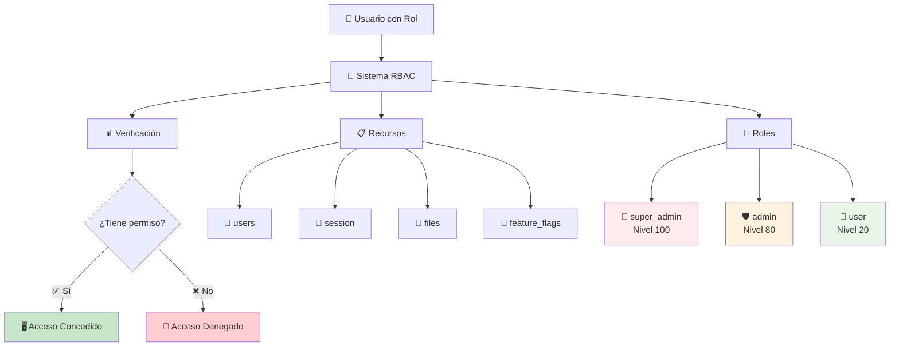

# 🎯 **GUÍA MAESTRA DEL SISTEMA DE PERMISOS**

## 📋 **ÍNDICE COMPLETO DE DOCUMENTACIÓN**

Esta guía maestra te dirige a toda la documentación del sistema de permisos. El sistema está diseñado para ser **profesional, fácil de usar y completamente documentado**.

---

## 📚 **ESTRUCTURA DE LA DOCUMENTACIÓN**

### **🏠 1. Punto de Entrada Principal**

- **[🔐 README Principal](./PERMISSIONS_README.md)**
  - Overview completo del sistema
  - Rutas de aprendizaje personalizadas
  - Implementación rápida
  - Troubleshooting común

### **📖 2. Documentación Fundamental**

- **[📋 Guía Completa del Sistema](./PERMISSIONS_SYSTEM_COMPLETE_GUIDE.md)**
  - ¿Qué es el sistema RBAC?
  - Roles y sus capacidades
  - Recursos y acciones disponibles
  - Cómo usar permisos en componentes
  - Protección de APIs y server actions
  - Casos de uso avanzados

### **🏗️ 3. Arquitectura y Estructura**

- **[🔧 Estructura Detallada](./PERMISSIONS_STRUCTURE_DETAILED.md)**
  - Arquitectura completa del sistema
  - Definición de recursos y acciones
  - Sistema de roles y jerarquías
  - Tipos TypeScript y flujos
  - Organización de archivos

### **💡 4. Implementación Práctica**

- **[🧪 Ejemplos Prácticos](./PERMISSIONS_PRACTICAL_EXAMPLES.md)**
  - 9 ejemplos completos con código
  - Casos reales de implementación
  - Gestión de usuarios, archivos, dashboard
  - Workflows complejos
  - Testing comprehensivo

### **⚡ 5. Referencia de Desarrollo**

- **[📋 Referencia Rápida](./PERMISSIONS_QUICK_REFERENCE.md)**
  - Cheat sheet de APIs
  - Snippets listos para usar
  - Troubleshooting común
  - Checklist de implementación

---

## 🎯 **FLUJO DE APRENDIZAJE RECOMENDADO**

### **🚀 Para Implementar Rápidamente (15-30 min)**

1. **[🔐 README Principal](./PERMISSIONS_README.md)** - Conceptos básicos e implementación rápida
2. **[📋 Referencia Rápida](./PERMISSIONS_QUICK_REFERENCE.md)** - Snippets específicos
3. **Implementar** - Usar en tu código
4. **[🧪 Ejemplos](./PERMISSIONS_PRACTICAL_EXAMPLES.md)** - Consultar casos específicos

### **📚 Para Entender Completamente (1-2 horas)**

1. **[📋 Guía Completa](./PERMISSIONS_SYSTEM_COMPLETE_GUIDE.md)** - Fundamentos sólidos
2. **[🔧 Estructura](./PERMISSIONS_STRUCTURE_DETAILED.md)** - Arquitectura profunda
3. **[🧪 Ejemplos](./PERMISSIONS_PRACTICAL_EXAMPLES.md)** - Casos avanzados
4. **[📋 Referencia](./PERMISSIONS_QUICK_REFERENCE.md)** - Para desarrollo diario

### **🔧 Para Extender el Sistema (2-3 horas)**

1. **[🔧 Estructura](./PERMISSIONS_STRUCTURE_DETAILED.md)** - Comprende la arquitectura
2. **[🧪 Ejemplos](./PERMISSIONS_PRACTICAL_EXAMPLES.md)** - Patterns de extensión
3. **[📋 Guía Completa](./PERMISSIONS_SYSTEM_COMPLETE_GUIDE.md)** - Casos especiales
4. **Implementar** - Crear nuevos recursos/roles

---

## 🎭 **SISTEMA DE PERMISOS - OVERVIEW VISUAL**



---

## 🛠️ **COMPONENTES DEL SISTEMA**

### **🎯 Core Components**

| Componente                 | Archivo                               | Propósito                                   |
| -------------------------- | ------------------------------------- | ------------------------------------------- |
| **Configuración**          | `src/core/auth/config/permissions.ts` | Define recursos, acciones y roles           |
| **Hook Principal**         | `src/shared/hooks/usePermissions.ts`  | Hook completo con todas las funcionalidades |
| **Componentes Protegidos** | `src/shared/components/Protected.tsx` | Protección declarativa UI                   |

### **🎭 Roles Implementados**

| Rol             | Nivel | Icono | Descripción      | Capacidades                    |
| --------------- | ----- | ----- | ---------------- | ------------------------------ |
| **super_admin** | 100   | 👑    | Acceso total     | TODO sin restricciones         |
| **admin**       | 80    | 🛡️    | Gestión sistema  | Usuarios, archivos, sesiones   |
| **user**        | 20    | 👤    | Usuario estándar | Sus sesiones, lectura archivos |

### **📊 Recursos Disponibles**

| Recurso           | Acciones                                                       | Super Admin | Admin | User     |
| ----------------- | -------------------------------------------------------------- | ----------- | ----- | -------- |
| **user**          | create, read, list, update, delete, ban, impersonate, set-role | ✅          | ✅\*  | ❌       |
| **session**       | list, revoke, delete                                           | ✅          | ✅    | ✅\*\*   |
| **files**         | read, upload, delete                                           | ✅          | ✅\*  | ✅\*\*\* |
| **feature_flags** | read, write                                                    | ✅          | 👁️    | ❌       |

_\*Admin no puede impersonar_  
_\*\*User solo sus propias sesiones_  
_\*\*\*User solo lectura_

---

## 🚀 **QUICK START - IMPLEMENTACIÓN EN 5 MINUTOS**

### **1. 🔍 Verificar Permisos**

```typescript
import { usePermissions } from "@/shared/hooks/usePermissions";

const MyComponent = () => {
  const { canAccess, isAdmin } = usePermissions();

  return (
    <div>
      {canAccess({ user: ["create"] }) && <CreateButton />}
      {isAdmin() && <AdminPanel />}
    </div>
  );
};
```

### **2. 🛡️ Proteger UI Declarativamente**

```typescript
import { Protected, AdminOnly } from "@/shared/components/Protected";

<Protected permissions={{ user: ["delete"] }}>
  <DeleteButton />
</Protected>

<AdminOnly>
  <AdminDashboard />
</AdminOnly>
```

### **3. 🌐 Proteger Server Actions**

```typescript
import { ensurePermission } from "@/core/auth/config/permissions";

export async function createUserAction(formData: FormData) {
  await ensurePermission(user, "user:create");
  // ✅ Solo ejecuta si tiene permiso
}
```

---

## 🎯 **CASOS DE USO PRINCIPALES**

### **👥 Gestión de Usuarios**

- Crear, editar, eliminar usuarios
- Banear/desbanear usuarios
- Cambiar roles (respetando jerarquía)
- Impersonar usuarios (solo super_admin)

### **📁 Gestión de Archivos**

- Ver archivos del sistema
- Subir nuevos archivos
- Eliminar archivos (solo super_admin)

### **🔐 Gestión de Sesiones**

- Ver sesiones activas
- Revocar sesiones específicas
- Eliminar historial de sesiones

### **🚩 Feature Flags**

- Ver configuración de features
- Modificar flags (solo super_admin)

---

## 📝 **PATTERNS DE IMPLEMENTACIÓN**

### **🎯 Pattern 1: Verificación Simple**

```typescript
const { canAccess } = usePermissions();

{
  canAccess({ user: ["create"] }) && <CreateForm />;
}
```

### **🛡️ Pattern 2: Protección Declarativa**

```typescript
<Protected permissions={{ user: ["create"] }}>
  <CreateForm />
</Protected>
```

### **👑 Pattern 3: Protección por Rol**

```typescript
<AdminOnly fallback={<NoAccess />}>
  <AdminFeatures />
</AdminOnly>
```

### **🔄 Pattern 4: Verificación Asíncrona**

```typescript
const { hasPermissionAsync } = usePermissions();

const handleAction = async () => {
  const canProceed = await hasPermissionAsync({ user: ["create"] });
  if (canProceed) {
    // ✅ Proceder
  }
};
```

### **🎯 Pattern 5: Verificación Contextual**

```typescript
const { canManageUserRole } = usePermissions();

// Solo mostrar si puede cambiar este rol específico
{
  canManageUserRole(targetUser.role) && <RoleSelector />;
}
```

---

## 🧪 **TESTING DEL SISTEMA**

### **🔬 Mock de Usuario**

```typescript
const createMockUser = (role: string) => ({
  id: "test-123",
  role,
  email: "test@test.com",
});
```

### **🧪 Test de Permisos**

```typescript
const { result } = renderHook(() => usePermissions(), {
  wrapper: ({ children }) => (
    <AuthProvider value={{ user: createMockUser("admin") }}>
      {children}
    </AuthProvider>
  ),
});

expect(result.current.canAccess({ user: ["create"] })).toBe(true);
```

---

## 🔧 **EXTENSIBILIDAD**

### **➕ Añadir Nuevo Recurso**

```typescript
// 1. Actualizar PERMISSIONS
export const PERMISSIONS = {
  // ... existentes
  posts: ["create", "read", "update", "delete", "publish"],
};

// 2. Actualizar ROLE_STATEMENTS
const ROLE_STATEMENTS = {
  admin: {
    // ... existentes
    posts: ["create", "read", "update", "delete", "publish"],
  },
};

// 3. Crear hook específico
export const usePostManagement = () => {
  const { canAccess } = usePermissions();
  return {
    canCreatePosts: () => canAccess({ posts: ["create"] }),
    canPublishPosts: () => canAccess({ posts: ["publish"] }),
  };
};
```

### **👑 Añadir Nuevo Rol**

```typescript
// 1. Actualizar ROLES
export const ROLES = [...existingRoles, "moderator"];

// 2. Actualizar ROLE_HIERARCHY
export const ROLE_HIERARCHY = {
  // ... existentes
  moderator: 60,
};

// 3. Añadir a ROLE_STATEMENTS
const ROLE_STATEMENTS = {
  // ... existentes
  moderator: {
    posts: ["read", "moderate"],
    comments: ["create", "read", "moderate"],
  },
};
```

---

## 🚨 **TROUBLESHOOTING RÁPIDO**

### **❌ Problema: Permisos no se actualizan**

```typescript
const { refreshPermissions } = usePermissions();
refreshPermissions(); // 🔄 Refrescar manualmente
```

### **❌ Problema: Performance lenta**

```typescript
// ✅ Usar hook específico
const { canCreateUsers } = useUserManagement();
// En lugar de: canAccess({ user: ["create"] })
```

### **❌ Problema: Componente no se re-renderiza**

```typescript
// ✅ Verificar dependencias
const canDelete = useMemo(() => canAccess({ user: ["delete"] }), [canAccess]);
```

---

## 💡 **MEJORES PRÁCTICAS**

### **✅ Do's (Hacer)**

1. **🔐 Verificar siempre en servidor**

   ```typescript
   await ensurePermission(user, "user:create");
   ```

2. **🖥️ Ocultar UI en lugar de deshabilitar**

   ```typescript
   {
     canAccess({ user: ["delete"] }) && <DeleteButton />;
   }
   ```

3. **📋 Usar hooks específicos**
   ```typescript
   const { canCreateUsers } = useUserManagement();
   ```

### **❌ Don'ts (No hacer)**

1. **❌ Solo verificación client-side**

   ```typescript
   // MAL - Sin verificación servidor
   if (canAccess({ user: ["delete"] })) {
     await deleteUser(id);
   }
   ```

2. **❌ Hardcodear roles**

   ```typescript
   // MAL - Roles hardcodeados
   if (user.role === "admin") return <AdminPanel />;

   // BIEN - Verificar permisos
   if (canAccess({ admin: ["panel"] })) return <AdminPanel />;
   ```

---

## 📊 **MÉTRICAS Y MONITORING**

### **📈 Estadísticas de Uso**

```typescript
const { getPermissionStats } = usePermissions();
const stats = getPermissionStats();

console.log(`
📊 Permission Stats:
- Total checks: ${stats.totalChecks}
- Cache size: ${stats.cacheSize}
- Current role: ${stats.currentRole}
- Current level: ${stats.currentLevel}
`);
```

### **🧹 Gestión de Cache**

```typescript
const { clearPermissionCache } = usePermissions();

// Limpiar cache cuando sea necesario
clearPermissionCache();
```

---

## 🔗 **PRÓXIMOS PASOS**

### **📚 Para Nuevos Desarrolladores**

1. Lee el **[README Principal](./PERMISSIONS_README.md)**
2. Implementa tu primer componente protegido
3. Consulta **[Ejemplos Prácticos](./PERMISSIONS_PRACTICAL_EXAMPLES.md)**

### **🚀 Para Desarrollo Avanzado**

1. Estudia **[Estructura Detallada](./PERMISSIONS_STRUCTURE_DETAILED.md)**
2. Implementa nuevos recursos/roles
3. Contribuye con mejoras al sistema

### **⚡ Para Uso Diario**

1. Bookmarkea **[Referencia Rápida](./PERMISSIONS_QUICK_REFERENCE.md)**
2. Usa snippets predefinidos
3. Consulta troubleshooting cuando necesario

---

## 🎯 **RESUMEN EJECUTIVO**

Este sistema de permisos te proporciona:

- **🔐 Seguridad robusta** - Verificación doble (cliente + servidor)
- **🎯 Control granular** - Permisos específicos por acción
- **📊 Escalabilidad** - Fácil añadir recursos y roles
- **🧪 Testeable** - Hooks y componentes independientes
- **📖 Documentado** - Guías completas y ejemplos
- **⚡ Performante** - Cache inteligente y optimizaciones
- **🛠️ Mantenible** - Código declarativo y patterns claros

**¡Con esta documentación tienes todo lo necesario para dominar completamente el sistema de permisos!** 🚀

---

## 📞 **SOPORTE Y COMUNIDAD**

- **📖 Documentación**: Consulta todas las guías disponibles
- **🧪 Ejemplos**: Revisa implementaciones reales
- **❓ Preguntas**: Usa la [Referencia Rápida](./PERMISSIONS_QUICK_REFERENCE.md)
- **🐛 Issues**: Reporta problemas con contexto completo

**¡Feliz codificación con permisos! 🎉**
