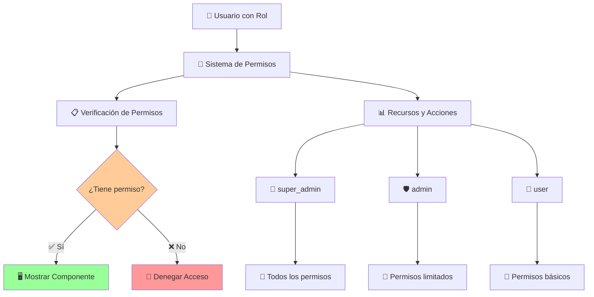

# 🔐 **GUÍA COMPLETA DEL SISTEMA DE PERMISOS Y ROLES**

## 📋 **¿QUÉ ES EL SISTEMA DE PERMISOS?**

El sistema de permisos es una implementación **RBAC (Role-Based Access Control)** que te permite controlar:

- **🎯 QUÉ puede hacer cada usuario** (acciones permitidas)
- **🖥️ QUÉ partes de la UI puede ver** (componentes condicionales)
- **🌐 A QUÉ endpoints puede acceder** (protección de APIs)
- **📊 QUÉ datos puede manipular** (autorización granular)

---

## 🏗️ **ARQUITECTURA DEL SISTEMA**



---

## 👥 **ROLES DISPONIBLES**

### **👑 Super Admin (Nivel 100)**

- **Descripción**: Acceso completo al sistema
- **Icono**: 👑
- **Color**: Rojo
- **Puede hacer**: TODO sin restricciones

```typescript
// Permisos completos
super_admin: {
  user: ["create", "read", "list", "update", "delete", "ban", "impersonate", "set-role", "set-password"],
  session: ["list", "revoke", "delete"],
  files: ["read", "upload", "delete"],
  feature_flags: ["read", "write"]
}
```

### **🛡️ Admin (Nivel 80)**

- **Descripción**: Gestión de usuarios y sistema
- **Icono**: 🛡️
- **Color**: Naranja
- **Puede hacer**: Gestionar usuarios (excepto impersonar)

```typescript
// Permisos de administración
admin: {
  user: ["create", "read", "list", "update", "delete", "ban", "set-role", "set-password"],
  session: ["list", "revoke", "delete"],
  files: ["read", "upload"],
  feature_flags: ["read"]
}
```

### **👤 User (Nivel 20)**

- **Descripción**: Usuario estándar
- **Icono**: 👤
- **Color**: Verde
- **Puede hacer**: Gestionar sus propias sesiones y ver archivos

```typescript
// Permisos básicos
user: {
  session: ["list", "revoke", "delete"],
  files: ["read"]
}
```

---

## 📊 **RECURSOS Y ACCIONES**

### **👥 Recurso: `user`**

| Acción         | Descripción             | Super Admin | Admin | User |
| -------------- | ----------------------- | ----------- | ----- | ---- |
| `create`       | Crear usuarios          | ✅          | ✅    | ❌   |
| `read`         | Ver detalles de usuario | ✅          | ✅    | ❌   |
| `list`         | Listar usuarios         | ✅          | ✅    | ❌   |
| `update`       | Actualizar usuarios     | ✅          | ✅    | ❌   |
| `delete`       | Eliminar usuarios       | ✅          | ✅    | ❌   |
| `ban`          | Banear usuarios         | ✅          | ✅    | ❌   |
| `impersonate`  | Impersonar usuarios     | ✅          | ❌    | ❌   |
| `set-role`     | Cambiar roles           | ✅          | ✅    | ❌   |
| `set-password` | Cambiar contraseñas     | ✅          | ✅    | ❌   |

### **🔐 Recurso: `session`**

| Acción   | Descripción       | Super Admin | Admin | User |
| -------- | ----------------- | ----------- | ----- | ---- |
| `list`   | Ver sesiones      | ✅          | ✅    | ✅   |
| `revoke` | Revocar sesiones  | ✅          | ✅    | ✅   |
| `delete` | Eliminar sesiones | ✅          | ✅    | ✅   |

### **📁 Recurso: `files`**

| Acción   | Descripción       | Super Admin | Admin | User |
| -------- | ----------------- | ----------- | ----- | ---- |
| `read`   | Ver archivos      | ✅          | ✅    | ✅   |
| `upload` | Subir archivos    | ✅          | ✅    | ❌   |
| `delete` | Eliminar archivos | ✅          | ❌    | ❌   |

---

## 🎯 **CÓMO USAR PERMISOS EN TUS COMPONENTES**

### **📖 Ejemplo Básico: Verificar Permiso**

```typescript
// components/users/UserActions.tsx
import { usePermissions } from "@/shared/hooks/usePermissions";

const UserActions = () => {
  const { canAccess, currentRole } = usePermissions();

  // 🔍 Verificar si puede crear usuarios
  const canCreateUsers = canAccess({ user: ["create"] });

  // 🔍 Verificar si puede banear usuarios
  const canBanUsers = canAccess({ user: ["ban"] });

  return (
    <div className="user-actions">
      {/* ✅ Solo mostrar si tiene permiso */}
      {canCreateUsers && (
        <button className="btn btn-primary">➕ Crear Usuario</button>
      )}

      {/* ✅ Solo mostrar si tiene permiso */}
      {canBanUsers && (
        <button className="btn btn-danger">🚫 Banear Usuario</button>
      )}

      {/* 📋 Mostrar rol actual */}
      <div className="current-role">
        Rol actual: <span className={`role-${currentRole}`}>{currentRole}</span>
      </div>
    </div>
  );
};
```

### **📖 Ejemplo Avanzado: Múltiples Permisos**

```typescript
// components/admin/AdminDashboard.tsx
import {
  usePermissions,
  useUserManagement,
} from "@/shared/hooks/usePermissions";

const AdminDashboard = () => {
  const { canAccess, isAdmin, isSuperAdmin } = usePermissions();
  const { canCreateUsers, canDeleteUsers, canSetUserRoles, canViewSessions } =
    useUserManagement();

  // 🔍 Verificar acceso a múltiples recursos
  const canManageSystem = canAccess({
    user: ["create", "update", "delete"],
    session: ["list", "revoke"],
  });

  return (
    <div className="admin-dashboard">
      <h1>Panel de Administración</h1>

      {/* 🎯 Solo admins pueden ver esto */}
      {isAdmin() && (
        <div className="admin-section">
          <h2>🛡️ Herramientas de Admin</h2>

          {/* 👥 Gestión de usuarios */}
          {canCreateUsers() && (
            <div className="user-management">
              <button>➕ Crear Usuario</button>
            </div>
          )}

          {canDeleteUsers() && (
            <div className="user-management">
              <button>🗑️ Eliminar Usuarios</button>
            </div>
          )}

          {canSetUserRoles() && (
            <div className="role-management">
              <button>👑 Gestionar Roles</button>
            </div>
          )}
        </div>
      )}

      {/* 🎯 Solo super admins pueden ver esto */}
      {isSuperAdmin() && (
        <div className="super-admin-section">
          <h2>👑 Super Admin Tools</h2>
          <button>🔧 Configuración del Sistema</button>
          <button>📊 Analytics Avanzados</button>
          <button>🔄 Impersonar Usuario</button>
        </div>
      )}

      {/* 📊 Sessions - Todos los admins */}
      {canViewSessions() && (
        <div className="sessions-section">
          <h2>🔐 Gestión de Sesiones</h2>
          <SessionsList />
        </div>
      )}

      {/* 🚫 Sin permisos */}
      {!isAdmin() && (
        <div className="no-access">
          <h2>🚫 Acceso Denegado</h2>
          <p>No tienes permisos para ver esta página.</p>
        </div>
      )}
    </div>
  );
};
```

---

## 🔧 **JERARQUÍA DE ROLES**

### **🎯 Cómo Funciona la Jerarquía**

```typescript
// Niveles de jerarquía
ROLE_HIERARCHY = {
  super_admin: 100, // Puede gestionar todo
  admin: 80, // Puede gestionar users
  user: 20, // No puede gestionar otros roles
};
```

### **📋 Reglas de Gestión**

```typescript
// components/users/UserRoleSelector.tsx
import { usePermissions } from "@/shared/hooks/usePermissions";

const UserRoleSelector = ({ targetUser }) => {
  const { canManageUserRole, getManageableRoles } = usePermissions();

  // 🔍 Verificar si puede cambiar el rol de este usuario
  const canChangeRole = canManageUserRole(targetUser.role);

  // 📋 Obtener roles que puede asignar
  const assignableRoles = getManageableRoles();

  if (!canChangeRole) {
    return <span>No puedes cambiar este rol</span>;
  }

  return (
    <select>
      {assignableRoles.map((role) => (
        <option key={role} value={role}>
          {role}
        </option>
      ))}
    </select>
  );
};
```

### **📊 Matriz de Gestión de Roles**

| Tu Rol          | Puede Gestionar | No Puede Gestionar |
| --------------- | --------------- | ------------------ |
| **super_admin** | admin, user     | -                  |
| **admin**       | user            | super_admin        |
| **user**        | -               | super_admin, admin |

---

## 🖥️ **PROTEGER PARTES DE LA UI**

### **🎯 Método 1: Condicionales Simples**

```typescript
// components/UserCard.tsx
const UserCard = ({ user }) => {
  const { canAccess } = usePermissions();

  return (
    <div className="user-card">
      <div className="user-info">
        <h3>{user.name}</h3>
        <p>{user.email}</p>
      </div>

      <div className="user-actions">
        {/* ✅ Solo mostrar si puede editar */}
        {canAccess({ user: ["update"] }) && <button>✏️ Editar</button>}

        {/* ✅ Solo mostrar si puede banear */}
        {canAccess({ user: ["ban"] }) && <button>🚫 Banear</button>}

        {/* ✅ Solo mostrar si puede eliminar */}
        {canAccess({ user: ["delete"] }) && <button>🗑️ Eliminar</button>}
      </div>
    </div>
  );
};
```

### **🎯 Método 2: Componentes de Protección**

```typescript
// components/common/ProtectedComponent.tsx
import { usePermissions } from "@/shared/hooks/usePermissions";

interface ProtectedProps {
  permissions: Record<string, string[]>;
  fallback?: React.ReactNode;
  children: React.ReactNode;
}

export const Protected = ({
  permissions,
  fallback,
  children,
}: ProtectedProps) => {
  const { canAccess } = usePermissions();

  if (!canAccess(permissions)) {
    return fallback || null;
  }

  return <>{children}</>;
};

// Uso en componentes
const UserManagement = () => {
  return (
    <div>
      <h1>Gestión de Usuarios</h1>

      {/* 🛡️ Proteger sección completa */}
      <Protected
        permissions={{ user: ["create"] }}
        fallback={<div>No tienes permiso para crear usuarios</div>}
      >
        <CreateUserForm />
      </Protected>

      {/* 🛡️ Proteger botones específicos */}
      <Protected permissions={{ user: ["delete"] }}>
        <button className="btn btn-danger">
          🗑️ Eliminar Usuarios Seleccionados
        </button>
      </Protected>
    </div>
  );
};
```

---

## 🌐 **PROTEGER APIS Y SERVER ACTIONS**

### **🔐 Ejemplo: Proteger Server Action**

```typescript
// app/actions/users.ts
import { ensurePermission } from "@/core/auth/config/permissions";
import { getCurrentUser } from "@/core/auth/server/auth";

export async function createUserAction(formData: FormData) {
  // 🔍 Obtener usuario actual
  const user = await getCurrentUser();

  // 🛡️ Verificar permiso ANTES de continuar
  await ensurePermission(user, "user:create");

  // ✅ Si llega aquí, tiene permiso
  const userData = {
    name: formData.get("name") as string,
    email: formData.get("email") as string,
    role: formData.get("role") as string,
  };

  // Lógica para crear usuario...
  const newUser = await createUser(userData);

  return { success: true, data: newUser };
}

export async function deleteUserAction(userId: string) {
  const user = await getCurrentUser();

  // 🛡️ Verificar permiso de eliminar
  await ensurePermission(user, "user:delete");

  // ✅ Proceder con eliminación
  await deleteUser(userId);

  return { success: true };
}
```

### **🔐 Ejemplo: Proteger Página Completa**

```typescript
// app/admin/users/page.tsx
import { ensurePermission } from "@/core/auth/config/permissions";
import { getCurrentUser } from "@/core/auth/server/auth";

export default async function AdminUsersPage() {
  // 🛡️ Proteger toda la página
  const user = await getCurrentUser();
  await ensurePermission(user, "user:list");

  return (
    <div>
      <h1>Gestión de Usuarios</h1>
      <UsersList />
    </div>
  );
}
```

---

## 🎭 **CASOS DE USO AVANZADOS**

### **🔍 Caso 1: Permisos Dinámicos Basados en Datos**

```typescript
// components/PostActions.tsx - Ejemplo con posts de blog
const PostActions = ({ post }) => {
  const { currentUser, canAccess } = usePermissions();

  // 🎯 Lógica: Solo el autor puede editar SUS posts
  const canEditPost = () => {
    // Super admin puede editar cualquier post
    if (currentUser?.role === "super_admin") return true;

    // Admin puede editar posts
    if (canAccess({ post: ["update"] })) return true;

    // Usuario puede editar solo SUS posts
    return post.authorId === currentUser?.id;
  };

  return (
    <div className="post-actions">
      {canEditPost() && <button>✏️ Editar Post</button>}

      {/* Solo admins pueden destacar posts */}
      {canAccess({ post: ["feature"] }) && <button>⭐ Destacar Post</button>}
    </div>
  );
};
```

### **🔍 Caso 2: Permisos Contextuales**

```typescript
// hooks/useContextualPermissions.ts
export const useContextualPermissions = (context: "own" | "others" | "all") => {
  const { currentUser, canAccess } = usePermissions();

  const canEdit = (resource: any) => {
    switch (context) {
      case "own":
        return (
          resource.userId === currentUser?.id ||
          canAccess({ [resource.type]: ["update"] })
        );

      case "others":
        return (
          canAccess({ [resource.type]: ["update"] }) &&
          resource.userId !== currentUser?.id
        );

      case "all":
        return canAccess({ [resource.type]: ["update"] });

      default:
        return false;
    }
  };

  return { canEdit };
};

// Uso en componente
const MyDataTable = ({ items, context }) => {
  const { canEdit } = useContextualPermissions(context);

  return (
    <table>
      {items.map((item) => (
        <tr key={item.id}>
          <td>{item.name}</td>
          <td>{canEdit(item) && <button>✏️ Editar</button>}</td>
        </tr>
      ))}
    </table>
  );
};
```

---

## 🚨 **MANEJO DE ERRORES Y FALLBACKS**

### **🔐 Error Boundary para Permisos**

```typescript
// components/common/PermissionErrorBoundary.tsx
class PermissionErrorBoundary extends React.Component {
  constructor(props) {
    super(props);
    this.state = { hasError: false, error: null };
  }

  static getDerivedStateFromError(error) {
    if (
      error.message.includes("permission") ||
      error.message.includes("unauthorized")
    ) {
      return { hasError: true, error };
    }
    return null;
  }

  render() {
    if (this.state.hasError) {
      return (
        <div className="permission-error">
          <h2>🚫 Acceso Denegado</h2>
          <p>No tienes permisos para realizar esta acción.</p>
          <button onClick={() => this.setState({ hasError: false })}>
            🔄 Intentar de nuevo
          </button>
        </div>
      );
    }

    return this.props.children;
  }
}

// Uso en app
<PermissionErrorBoundary>
  <AdminPanel />
</PermissionErrorBoundary>;
```

### **🔄 Loading States para Verificaciones**

```typescript
// hooks/useAsyncPermissions.ts
import { useState, useEffect } from "react";
import { usePermissions } from "@/shared/hooks/usePermissions";

export const useAsyncPermissions = (permissions: Record<string, string[]>) => {
  const [loading, setLoading] = useState(true);
  const [hasAccess, setHasAccess] = useState(false);
  const { hasPermission } = usePermissions();

  useEffect(() => {
    const checkPermissions = async () => {
      setLoading(true);
      try {
        const access = await hasPermission(permissions);
        setHasAccess(access);
      } catch (error) {
        console.error("Error checking permissions:", error);
        setHasAccess(false);
      } finally {
        setLoading(false);
      }
    };

    checkPermissions();
  }, [permissions, hasPermission]);

  return { loading, hasAccess };
};

// Uso en componente
const ProtectedSection = ({ permissions, children }) => {
  const { loading, hasAccess } = useAsyncPermissions(permissions);

  if (loading) {
    return <div>🔄 Verificando permisos...</div>;
  }

  if (!hasAccess) {
    return <div>🚫 Sin acceso</div>;
  }

  return children;
};
```

---

## 📊 **DEBUGGING Y DESARROLLO**

### **🔍 Hook para Debug de Permisos**

```typescript
// hooks/usePermissionsDebug.ts (solo para desarrollo)
export const usePermissionsDebug = () => {
  const { currentUser, currentRole } = usePermissions();

  const debugPermissions = () => {
    console.group("🔐 Permission Debug Info");
    console.log("Current User:", currentUser);
    console.log("Current Role:", currentRole);
    console.log("Role Level:", getRoleLevel(currentRole));
    console.log("Assignable Roles:", getAssignableRoles(currentRole));
    console.groupEnd();
  };

  const testPermission = (permission: string) => {
    const hasAccess = canAccess(parsePermission(permission));
    console.log(
      `🔍 Testing "${permission}":`,
      hasAccess ? "✅ ALLOWED" : "❌ DENIED"
    );
    return hasAccess;
  };

  return { debugPermissions, testPermission };
};

// Componente de debug (solo desarrollo)
const PermissionsDebugPanel = () => {
  const { debugPermissions, testPermission } = usePermissionsDebug();
  const [testPerm, setTestPerm] = useState("");

  if (process.env.NODE_ENV !== "development") return null;

  return (
    <div className="debug-panel">
      <h3>🔐 Permissions Debug</h3>
      <button onClick={debugPermissions}>Debug Info</button>

      <div>
        <input
          value={testPerm}
          onChange={(e) => setTestPerm(e.target.value)}
          placeholder="user:create"
        />
        <button onClick={() => testPermission(testPerm)}>
          Test Permission
        </button>
      </div>
    </div>
  );
};
```

---

## 🎯 **MEJORES PRÁCTICAS**

### **✅ Do's (Hacer)**

1. **🔍 Verificar permisos SIEMPRE en server actions**

   ```typescript
   export async function createUser() {
     await ensurePermission(user, "user:create");
     // ... lógica
   }
   ```

2. **🖥️ Ocultar UI en lugar de deshabilitar**

   ```typescript
   // ✅ BIEN
   {
     canAccess({ user: ["delete"] }) && <DeleteButton />;
   }

   // ❌ MAL
   <DeleteButton disabled={!canAccess({ user: ["delete"] })} />;
   ```

3. **📋 Usar tipos TypeScript para permisos**

   ```typescript
   // ✅ BIEN - Tipado
   const permission: AnyPermission = "user:create";

   // ❌ MAL - String libre
   const permission = "user:create";
   ```

### **❌ Don'ts (No hacer)**

1. **❌ NO confiar solo en verificaciones del cliente**

   ```typescript
   // ❌ MAL - Solo verificación client-side
   if (canAccess({ user: ["delete"] })) {
     await deleteUser(id); // Sin verificación server-side
   }
   ```

2. **❌ NO hardcodear roles en componentes**

   ```typescript
   // ❌ MAL
   if (user.role === "admin") return <AdminPanel />;

   // ✅ BIEN
   if (canAccess({ admin: ["panel"] })) return <AdminPanel />;
   ```

3. **❌ NO asumir jerarquías implícitas**

   ```typescript
   // ❌ MAL - Asumir que admin puede hacer todo
   if (user.role !== "user") return <AdminAction />;

   // ✅ BIEN - Verificar permiso específico
   if (canAccess({ admin: ["action"] })) return <AdminAction />;
   ```

---

## 📝 **RESUMEN RÁPIDO**

### **🎯 Para Verificar Permisos**

```typescript
const { canAccess, isAdmin, isSuperAdmin } = usePermissions();

// Verificar una acción específica
canAccess({ user: ["create"] });

// Verificar múltiples acciones
canAccess({ user: ["create", "update"], files: ["upload"] });

// Verificar roles
isAdmin();
isSuperAdmin();
```

### **🛡️ Para Proteger UI**

```typescript
// Condicional simple
{
  canAccess({ user: ["delete"] }) && <DeleteButton />;
}

// Componente protegido
<Protected permissions={{ user: ["create"] }}>
  <CreateUserForm />
</Protected>;
```

### **🔐 Para Proteger APIs**

```typescript
// En server actions
await ensurePermission(user, "user:create");
```

**¡Con este sistema tienes control total y granular sobre quién puede hacer qué en tu aplicación!** 🚀
