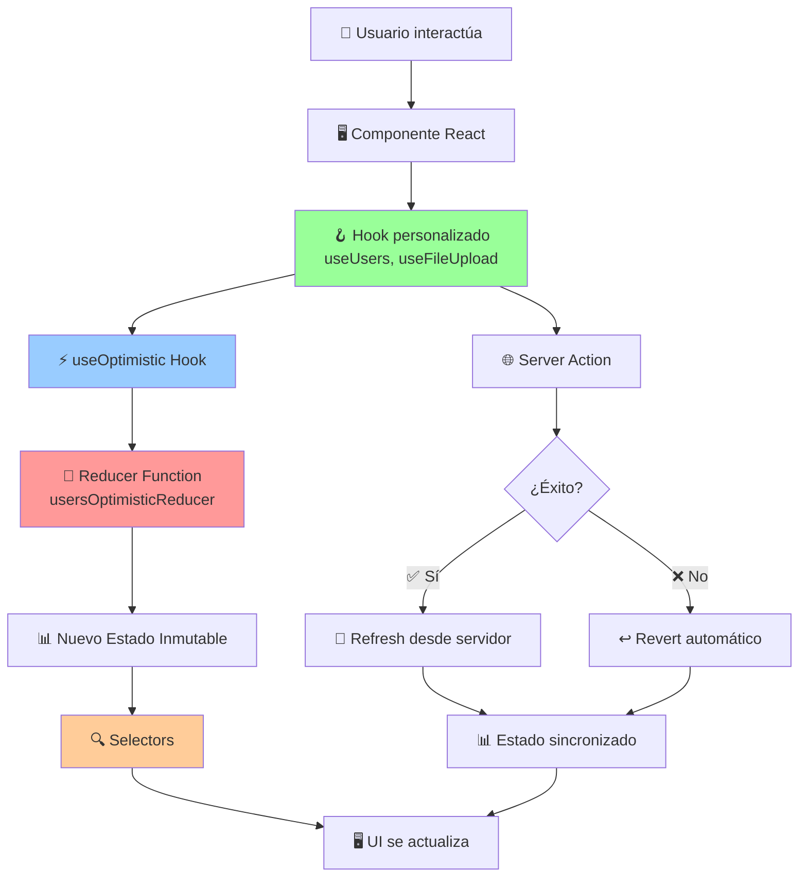

# 🎯 **GUÍA MAESTRA DEL SISTEMA DE REDUCERS**

## 📋 **ÍNDICE COMPLETO DE DOCUMENTACIÓN**

Esta guía maestra te dirige a toda la documentación exhaustiva del sistema de reducers de la aplicación. Cada documento está diseñado para darte un entendimiento profundo de cómo funcionan los reducers, cómo interactúan con otros componentes, y cómo implementarlos correctamente.

---

## 📚 **ESTRUCTURA DE LA DOCUMENTACIÓN**

### **🏗️ 1. Fundamentos del Sistema**

- **[REDUCERS_SYSTEM_COMPLETE_GUIDE.md](./REDUCERS_SYSTEM_COMPLETE_GUIDE.md)**
  - ¿Qué son los reducers optimistas?
  - Arquitectura general del sistema
  - Beneficios y casos de uso
  - Diferencias con reducers tradicionales

### **🔧 2. Componentes Técnicos**

- **[REDUCERS_COMPONENTS_DETAILED.md](./REDUCERS_COMPONENTS_DETAILED.md)**
  - Estructura interna de los reducers
  - Interfaces y tipos TypeScript
  - Funciones helper y utilidades
  - Implementación de acciones

### **🔄 3. Integración con React**

- **[REDUCERS_HOOKS_INTEGRATION.md](./REDUCERS_HOOKS_INTEGRATION.md)**
  - Integración con `useOptimistic`
  - Flujo completo de datos
  - Coordinación con server actions
  - Patrones avanzados de integración

### **💡 4. Ejemplos Prácticos**

- **[REDUCERS_PRACTICAL_EXAMPLES.md](./REDUCERS_PRACTICAL_EXAMPLES.md)**
  - Casos de uso reales
  - Implementaciones completas
  - Manejo de errores
  - Optimizaciones de performance

### **⚡ 5. Referencia Rápida**

- **[REDUCERS_QUICK_REFERENCE.md](./REDUCERS_QUICK_REFERENCE.md)**
  - Cheat sheet de APIs
  - Snippets de código
  - Troubleshooting común
  - Mejores prácticas

### **🏠 6. Hub Central**

- **[REDUCERS_README.md](./REDUCERS_README.md)**
  - Enlaces organizados
  - Flujo de aprendizaje recomendado
  - FAQs y recursos adicionales

---

## 🎯 **RUTAS DE APRENDIZAJE RECOMENDADAS**

### **🚀 Para Desarrolladores Nuevos**

1. Leer **[REDUCERS_SYSTEM_COMPLETE_GUIDE.md](./REDUCERS_SYSTEM_COMPLETE_GUIDE.md)** para entender los conceptos
2. Revisar **[REDUCERS_COMPONENTS_DETAILED.md](./REDUCERS_COMPONENTS_DETAILED.md)** para conocer la estructura
3. Estudiar **[REDUCERS_PRACTICAL_EXAMPLES.md](./REDUCERS_PRACTICAL_EXAMPLES.md)** para ver implementaciones
4. Consultar **[REDUCERS_QUICK_REFERENCE.md](./REDUCERS_QUICK_REFERENCE.md)** durante el desarrollo

### **⚡ Para Desarrolladores Experimentados**

1. Revisar **[REDUCERS_HOOKS_INTEGRATION.md](./REDUCERS_HOOKS_INTEGRATION.md)** para patrones avanzados
2. Consultar **[REDUCERS_PRACTICAL_EXAMPLES.md](./REDUCERS_PRACTICAL_EXAMPLES.md)** para casos específicos
3. Usar **[REDUCERS_QUICK_REFERENCE.md](./REDUCERS_QUICK_REFERENCE.md)** como referencia rápida

### **🔧 Para Mantenimiento y Debug**

1. **[REDUCERS_QUICK_REFERENCE.md](./REDUCERS_QUICK_REFERENCE.md)** para troubleshooting
2. **[REDUCERS_HOOKS_INTEGRATION.md](./REDUCERS_HOOKS_INTEGRATION.md)** para debugging de integración
3. **[REDUCERS_PRACTICAL_EXAMPLES.md](./REDUCERS_PRACTICAL_EXAMPLES.md)** para patrones de error handling

---

## 🏗️ **ARQUITECTURA OVERVIEW**



---

## 📁 **MÓDULOS CON REDUCERS IMPLEMENTADOS**

### **👥 Users Module** (`src/features/admin/users/`)

- **Reducer**: `reducers/index.ts`
- **Hook**: `hooks/useUsers.ts`
- **Actions**: `constants/index.ts`
- **Casos de uso**: CRUD usuarios, ban/unban, roles, bulk operations

### **📁 File Upload Module** (`src/modules/file-upload/`)

- **Reducer**: `reducers/index.ts`
- **Hook**: `hooks/useFileUpload.ts`
- **Actions**: `constants/index.ts`
- **Casos de uso**: Upload múltiple, progreso, gestión de archivos

---

## 🎯 **CONCEPTOS CLAVE QUE DOMINARÁS**

### **🔄 Optimistic Updates**

- UI se actualiza **inmediatamente** sin esperar al servidor
- Rollback automático en caso de error
- Sincronización transparente con datos reales

### **🎯 State Management**

- Estado inmutable y predecible
- Acciones tipadas con TypeScript
- Calculaciones derivadas con selectors

### **⚡ Performance**

- Memoización inteligente
- Selectors optimizados
- Virtualización para listas grandes

### **🧪 Testing**

- Unit tests para reducers
- Integration tests para hooks
- Casos de error y edge cases

### **🔍 Debugging**

- Logging estructurado
- DevTools integration
- Error boundaries

---

## 🚀 **BENEFICIOS DEL SISTEMA**

### **Para Desarrolladores**

- **📖 Documentación exhaustiva** - Entiende todo el sistema
- **🔧 Patterns reutilizables** - Código consistente y mantenible
- **🧪 Testing robusto** - Confianza en cambios y refactors
- **⚡ Performance optimizada** - Apps rápidas y responsivas

### **Para Usuarios**

- **🚀 UI instantánea** - Sin esperas ni lag
- **🔄 Feedback inmediato** - Saben qué está pasando
- **🛡️ Error recovery** - Rollback automático en errores
- **📱 Experiencia fluida** - Apps que se sienten nativas

### **Para el Negocio**

- **📈 Mayor engagement** - Usuarios más satisfechos
- **🔧 Menos bugs** - Código más predecible
- **⚡ Desarrollo más rápido** - Patterns establecidos
- **📊 Metrics mejoradas** - Performance y UX optimizados

---

## 🔧 **HERRAMIENTAS Y TECNOLOGÍAS**

### **React 19 Features**

- `useOptimistic` - Core del sistema optimista
- `useActionState` - Server actions integration
- `useTransition` - Concurrent updates
- `useCallback` / `useMemo` - Performance optimization

### **TypeScript**

- Interfaces estrictas para estados
- Action types con discriminated unions
- Selector functions tipadas
- Generic patterns para reutilización

### **Testing**

- Jest para unit tests
- @testing-library/react para integration
- Mock patterns para server actions
- Coverage para todas las ramas de código

---

## 📝 **CONVENCIONES Y PATTERNS**

### **Nomenclatura**

- `*OptimisticState` para interfaces de estado
- `*OptimisticAction` para tipos de acciones
- `*OptimisticReducer` para funciones reducer
- `*Selectors` para funciones de selección

### **Estructura de Archivos**

```
module/
├── reducers/
│   └── index.ts          # Reducer, state, actions, selectors
├── hooks/
│   └── use*.ts           # Hook personalizado
├── constants/
│   └── index.ts          # Action types y constantes
└── types/
    └── index.ts          # Interfaces TypeScript
```

### **Testing Patterns**

```
__tests__/
├── reducers/
│   └── *.test.ts         # Tests de reducers
├── hooks/
│   └── *.test.ts         # Tests de hooks
└── integration/
    └── *.test.ts         # Tests de integración
```

---

## 🎓 **PROCESO DE APRENDIZAJE**

### **Fase 1: Fundamentos (1-2 días)**

1. **Conceptos básicos** - ¿Qué son los reducers optimistas?
2. **Arquitectura** - Cómo se integra con React 19
3. **Ejemplos simples** - Crear/actualizar un elemento

### **Fase 2: Implementación (3-5 días)**

1. **Módulo existente** - Estudiar users o file-upload
2. **Nuevo módulo** - Implementar reducer propio
3. **Testing** - Escribir tests completos

### **Fase 3: Optimización (2-3 días)**

1. **Performance** - Memoización y selectors
2. **Error handling** - Manejo robusto de errores
3. **Patterns avanzados** - Multi-reducer coordination

### **Fase 4: Maestría (Ongoing)**

1. **Debugging** - Herramientas y técnicas
2. **Patterns nuevos** - Contribuir al sistema
3. **Mentoring** - Enseñar a otros desarrolladores

---

## ❓ **PREGUNTAS FRECUENTES**

### **¿Cuándo usar reducers optimistas?**

- Operaciones CRUD frecuentes (usuarios, archivos, etc.)
- Interfaces que requieren feedback inmediato
- Apps donde la latencia de red es un problema

### **¿Cómo manejar errores complejos?**

- Ver ejemplos en **[REDUCERS_PRACTICAL_EXAMPLES.md](./REDUCERS_PRACTICAL_EXAMPLES.md)**
- Implementar retry logic y error boundaries
- Usar logging estructurado para debugging

### **¿Cómo optimizar performance?**

- Usar selectors memoizados
- Implementar virtualización para listas grandes
- Aplicar React.memo en componentes pesados

### **¿Cómo testear reducers?**

- Unit tests para cada action type
- Integration tests para hooks
- Mock server actions para tests completos

---

## 🔗 **ENLACES RÁPIDOS**

- **📖 [Documentación Completa](./REDUCERS_README.md)**
- **🚀 [Guía de Inicio](./REDUCERS_SYSTEM_COMPLETE_GUIDE.md)**
- **💡 [Ejemplos Prácticos](./REDUCERS_PRACTICAL_EXAMPLES.md)**
- **⚡ [Referencia Rápida](./REDUCERS_QUICK_REFERENCE.md)**

---

## 🎯 **PRÓXIMOS PASOS**

1. **Elige tu ruta de aprendizaje** basada en tu experiencia
2. **Lee la documentación** en el orden recomendado
3. **Implementa ejemplos** en tu código
4. **Escribe tests** para validar tu entendimiento
5. **Experimenta con patterns avanzados** cuando te sientas cómodo

---

## 💬 **CONCLUSIÓN**

Este sistema de reducers te permite crear aplicaciones **reactivas, performantes y confiables** con:

- ⚡ **UI instantánea** que responde inmediatamente
- 🛡️ **Error handling robusto** con recovery automático
- 📊 **Estado predecible** y fácil de debuggear
- 🧪 **Testing comprehensivo** para máxima confianza
- 🚀 **Patterns escalables** para equipos grandes

**¡Con esta documentación tienes todo lo necesario para dominar completamente el sistema de reducers!**

¿Tienes alguna pregunta específica o quieres que profundice en algún aspecto particular del sistema?
