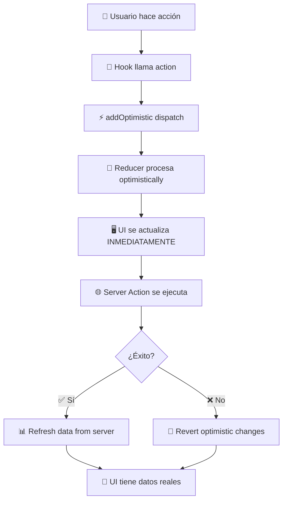

# 📚 **GUÍA COMPLETA DEL SISTEMA DE REDUCERS**

## 🎯 **¿QUÉ ES EL SISTEMA DE REDUCERS?**

El sistema de reducers es el **núcleo de gestión de estado optimista** de tu aplicación que te permite:

1. **Feedback inmediato** en la UI mientras las operaciones van al servidor
2. **Estado predecible** e inmutable usando patrones funcionales
3. **Operaciones complejas** con manejo de estados múltiples
4. **Analytics en tiempo real** con selectors especializados
5. **Debugging avanzado** con logging integrado
6. **Performance optimizada** con React 19 (useOptimistic)

---

## 🏗️ **ARQUITECTURA GENERAL**

```
🏢 TU APLICACIÓN
├── 👥 Users Module (CORE)
│   ├── 🎯 usersOptimisticReducer       # Estado de usuarios
│   ├── 🔍 usersOptimisticSelectors     # Consultas de datos
│   └── 📊 UsersOptimisticState         # Estructura del estado
└── 📁 File-Upload Module (FEATURE FLAGS)
    ├── 🎯 optimisticReducer            # Estado de uploads
    ├── 🔍 optimisticSelectors          # Consultas de uploads
    └── 📊 OptimisticState              # Estructura del estado
```

### **🔄 Flujo del Sistema Optimista**



---

## 🧩 **COMPONENTES DEL SISTEMA**

### **1. 🎯 Reducer Function (Núcleo del Sistema)**

**Ubicación**: `src/[module]/reducers/index.ts`

**Propósito**:

- **Procesa acciones** de manera inmutable
- **Calcula nuevo estado** basado en la acción
- **Mantiene consistencia** de datos
- **Integra logging** para debugging

```typescript
// ✅ ESTRUCTURA BÁSICA
export function usersOptimisticReducer(
  state: UsersOptimisticState,
  action: UsersOptimisticAction
): UsersOptimisticState {
  // 1. Log la acción para debugging
  usersOptimisticLogger.debug(`Action: ${action.type}`);

  // 2. Switch basado en el tipo de acción
  switch (action.type) {
    case USERS_ACTIONS.CREATE_USER:
      // 3. Calcular nuevo estado inmutablemente
      return { ...state, users: [...state.users, newUser] };

    default:
      return state;
  }
}
```

### **2. 📊 State Interface (Estructura de Datos)**

**Propósito**: Define exactamente qué datos maneja el reducer

```typescript
export interface UsersOptimisticState {
  users: User[]; // 👥 Lista de usuarios
  totalUsers: number; // 🔢 Contador total
  lastUpdated: string; // ⏰ Timestamp de última actualización
  activeOperations: number; // 🔄 Operaciones en curso
  errors: Record<string, string>; // ❌ Errores por operación
  stats: {
    // 📊 Métricas calculadas
    totalActive: number;
    totalBanned: number;
    totalAdmins: number;
  };
}
```

### **3. 🎭 Action Types (Operaciones Disponibles)**

**Propósito**: Define todas las acciones posibles con sus datos

```typescript
export type UsersOptimisticAction =
  | { type: "CREATE_USER"; tempUser: Omit<User, "id">; tempId: string }
  | { type: "UPDATE_USER"; userId: string; updates: Partial<User> }
  | { type: "DELETE_USER"; userId: string }
  | { type: "BAN_USER"; userId: string; reason: string };
// ... más acciones
```

### **4. 🔍 Selectors (Consultas de Datos)**

**Propósito**: Funciones para extraer/calcular datos específicos del estado

```typescript
export const usersOptimisticSelectors = {
  // Básicos
  getAllUsers: (state) => state.users,
  getTotalUsers: (state) => state.totalUsers,

  // Filtros
  getActiveUsers: (state) => state.users.filter((u) => !u.banned),
  getBannedUsers: (state) => state.users.filter((u) => u.banned),

  // Búsquedas
  searchUsers: (state, term) =>
    state.users.filter((u) => u.name.includes(term) || u.email.includes(term)),

  // Analytics
  getActiveUserPercentage: (state) =>
    Math.round((getActiveUsers(state).length / state.totalUsers) * 100),
};
```

### **5. 🏗️ Factory Functions (Constructores)**

**Propósito**: Crear estados iniciales consistentes

```typescript
export function createInitialUsersOptimisticState(): UsersOptimisticState {
  return {
    users: [],
    totalUsers: 0,
    lastUpdated: new Date().toISOString(),
    activeOperations: 0,
    errors: {},
    stats: { totalActive: 0, totalBanned: 0, totalAdmins: 0 },
  };
}
```

---

## 🎯 **TIPOS DE REDUCERS**

### **🏗️ CORE REDUCER (Users)**

**Características:**

- **Sin feature flags** - Siempre activo
- **Estado complejo** con múltiples entidades
- **Operaciones críticas** de negocio
- **Analytics integradas** para dashboard

```typescript
// ✅ Ejemplo de reducer CORE
case USERS_ACTIONS.CREATE_USER: {
  const tempUser = {
    ...action.tempUser,
    id: action.tempId,
    createdAt: new Date().toISOString(),
    // ... todos los campos requeridos
  };

  const nextUsers = [...state.users, tempUser];
  const nextStats = calculateStats(nextUsers); // 📊 Recalcular stats

  return {
    ...state,
    users: nextUsers,
    totalUsers: state.totalUsers + 1,
    stats: nextStats,
    lastUpdated: new Date().toISOString(),
  };
}
```

### **🔧 FEATURE FLAG REDUCER (File-Upload)**

**Características:**

- **Con feature flags** - Puede habilitarse/deshabilitarse
- **Estado más simple** enfocado en una funcionalidad
- **Operaciones específicas** (uploads, progress)
- **Menos complejidad** pero más configurable

```typescript
// ✅ Ejemplo de reducer con Feature Flags
case FILE_UPLOAD_ACTIONS.UPDATE_PROGRESS: {
  const nextState = {
    ...state,
    uploadProgress: state.uploadProgress.map(p =>
      p.fileId === action.tempId
        ? { ...p, progress: action.progress, status: "uploading" }
        : p
    ),
    lastUpdated: new Date().toISOString(),
  };

  // 📊 Recalcular solo si es necesario
  nextState.totalActiveUploads = calculateActiveUploads(nextState.uploadProgress);

  return nextState;
}
```

---

## 🔄 **INTEGRACIÓN CON REACT 19**

### **🎯 useOptimistic Hook**

El sistema usa `useOptimistic` de React 19 para gestión de estado optimista:

```typescript
const [optimisticState, addOptimistic] = useOptimistic(
  createInitialUsersOptimisticState(), // Estado inicial
  usersOptimisticReducer // Reducer function
);

// Disparar una acción optimista
const createUser = async (userData) => {
  // 1. ⚡ Actualización INMEDIATA de UI
  addOptimistic({
    type: USERS_ACTIONS.CREATE_USER,
    tempUser: userData,
    tempId: generateTempId(),
  });

  // 2. 🌐 Llamada al servidor en background
  const result = await createUserServerAction(userData);

  // 3. 🔄 React automáticamente sincroniza con server
};
```

### **⚡ Ventajas de useOptimistic**

```typescript
// ❌ ANTES (sin useOptimistic):
const [users, setUsers] = useState([]);
const [loading, setLoading] = useState(false);

const createUser = async (userData) => {
  setLoading(true); // 🐌 UI muestra loading
  const result = await createUserApi(userData); // 🐌 Usuario espera
  if (result.success) {
    setUsers((prev) => [...prev, result.user]); // 🐌 UI se actualiza al final
  }
  setLoading(false);
};

// ✅ AHORA (con useOptimistic):
const createUser = async (userData) => {
  addOptimistic({ type: "CREATE_USER", userData }); // ⚡ UI inmediata
  await createUserServerAction(userData); // 🔄 Servidor en background
  // 🎯 React maneja la sincronización automáticamente
};
```

---

## 🎯 **PATRONES DE IMPLEMENTACIÓN**

### **🧮 Helper Functions (Funciones Auxiliares)**

**Propósito**: Mantener el reducer limpio y testeable

```typescript
// 🧮 Cálculos complejos extraídos
function calculateStats(users: User[]) {
  return {
    totalActive: users.filter((u) => !u.banned).length,
    totalBanned: users.filter((u) => u.banned).length,
    totalAdmins: users.filter((u) => u.role === "admin").length,
  };
}

// 🔧 Operaciones de arrays inmutables
function updateUserInArray(
  users: User[],
  userId: string,
  updates: Partial<User>
): User[] {
  return users.map((user) =>
    user.id === userId
      ? { ...user, ...updates, updatedAt: new Date().toISOString() }
      : user
  );
}

// 🗑️ Eliminación inmutable
function removeUserFromArray(users: User[], userId: string): User[] {
  return users.filter((user) => user.id !== userId);
}
```

### **📊 Immutability Patterns (Inmutabilidad)**

```typescript
// ✅ CORRECTO: Inmutable updates
case USERS_ACTIONS.UPDATE_USER: {
  return {
    ...state,                                    // 📋 Copia estado base
    users: state.users.map(user =>              // 📋 Copia array
      user.id === action.userId
        ? { ...user, ...action.updates }        // 📋 Copia objeto modificado
        : user                                   // 📋 Mantiene originales
    ),
    lastUpdated: new Date().toISOString(),      // 📋 Nuevo timestamp
  };
}

// ❌ INCORRECTO: Mutación directa
case USERS_ACTIONS.UPDATE_USER: {
  const user = state.users.find(u => u.id === action.userId);
  user.name = action.updates.name;               // ❌ Modifica directamente
  state.lastUpdated = new Date().toISOString();  // ❌ Modifica estado
  return state;                                   // ❌ Retorna mismo objeto
}
```

### **🔄 Loading States Pattern**

```typescript
// ✅ Patrón para manejo de loading/error states
case USERS_ACTIONS.START_LOADING: {
  return {
    ...state,
    activeOperations: state.activeOperations + 1,  // ⬆️ Incrementa contador
  };
}

case USERS_ACTIONS.COMPLETE_LOADING: {
  return {
    ...state,
    activeOperations: Math.max(0, state.activeOperations - 1), // ⬇️ Decrementa
    errors: {
      ...state.errors,
      [action.operation]: undefined,  // 🧹 Limpia error de esta operación
    },
  };
}

case USERS_ACTIONS.FAIL_LOADING: {
  return {
    ...state,
    activeOperations: Math.max(0, state.activeOperations - 1), // ⬇️ Decrementa
    errors: {
      ...state.errors,
      [action.operation]: action.error,  // ❌ Almacena error específico
    },
  };
}
```

---

## 🔍 **SELECTORS AVANZADOS**

### **📊 Tipos de Selectors**

**1. 🔍 Basic Selectors (Acceso directo)**

```typescript
const basicSelectors = {
  getAllUsers: (state) => state.users,
  getTotalUsers: (state) => state.totalUsers,
  getLastUpdated: (state) => state.lastUpdated,
};
```

**2. 🎯 Filter Selectors (Filtros)**

```typescript
const filterSelectors = {
  getActiveUsers: (state) => state.users.filter((u) => !u.banned),
  getBannedUsers: (state) => state.users.filter((u) => u.banned),
  getUsersByRole: (state, role) => state.users.filter((u) => u.role === role),
};
```

**3. 🔍 Search Selectors (Búsquedas)**

```typescript
const searchSelectors = {
  searchUsers: (state, term) =>
    state.users.filter(
      (u) =>
        u.name.toLowerCase().includes(term.toLowerCase()) ||
        u.email.toLowerCase().includes(term.toLowerCase())
    ),

  findUserById: (state, userId) => state.users.find((u) => u.id === userId),
};
```

**4. 📊 Analytics Selectors (Métricas)**

```typescript
const analyticsSelectors = {
  getActiveUserPercentage: (state) => {
    if (state.totalUsers === 0) return 0;
    return Math.round((state.stats.totalActive / state.totalUsers) * 100);
  },

  getUsersByCreationMonth: (state) => {
    const monthlyData = new Map();
    state.users.forEach((user) => {
      const month = new Date(user.createdAt).toISOString().slice(0, 7);
      monthlyData.set(month, (monthlyData.get(month) || 0) + 1);
    });
    return Object.fromEntries(monthlyData);
  },
};
```

**5. 🔄 State Selectors (Estados de UI)**

```typescript
const stateSelectors = {
  isLoading: (state) => state.activeOperations > 0,
  hasErrors: (state) => Object.keys(state.errors).length > 0,
  getErrorForOperation: (state, operation) => state.errors[operation],
};
```

---

## 🎯 **OPERACIONES COMPLEJAS**

### **🔄 Bulk Operations (Operaciones Masivas)**

```typescript
case USERS_ACTIONS.BULK_UPDATE: {
  let nextUsers = [...state.users];

  // Aplicar cambios a múltiples usuarios
  action.userIds.forEach(userId => {
    nextUsers = updateUserInArray(nextUsers, userId, {
      role: action.newRole,
    });
  });

  const nextStats = calculateStats(nextUsers);

  usersOptimisticLogger.info(`Bulk updating ${action.userIds.length} users`, {
    userIds: action.userIds,
    newRole: action.newRole,
  });

  return {
    ...state,
    users: nextUsers,
    stats: nextStats,
    activeOperations: state.activeOperations + 1,
    lastUpdated: new Date().toISOString(),
  };
}
```

### **📊 Stats Recalculation (Recálculo de Métricas)**

```typescript
// 🧮 Función helper para calcular estadísticas
function calculateStats(users: User[]) {
  const stats = users.reduce(
    (acc, user) => {
      // Usuarios activos
      if (!user.banned) acc.totalActive++;

      // Usuarios baneados
      if (user.banned) acc.totalBanned++;

      // Administradores
      if (user.role === "admin" || user.role === "super_admin") {
        acc.totalAdmins++;
      }

      return acc;
    },
    {
      totalActive: 0,
      totalBanned: 0,
      totalAdmins: 0,
    }
  );

  return stats;
}

// 📊 Uso en el reducer
const nextUsers = updateUserInArray(state.users, action.userId, action.updates);
const nextStats = calculateStats(nextUsers); // 🔄 Recalcular automáticamente

return {
  ...state,
  users: nextUsers,
  stats: nextStats, // 📊 Stats siempre actualizadas
  lastUpdated: new Date().toISOString(),
};
```

---

## 🚀 **PERFORMANCE OPTIMIZATION**

### **⚡ Optimizaciones Implementadas**

**1. 🧮 Cálculos Memoizados**

```typescript
// ✅ Solo recalcular cuando es necesario
const nextUsers = updateUserInArray(state.users, action.userId, action.updates);

// 📊 Stats solo se recalculan si los usuarios cambiaron
const nextStats =
  nextUsers === state.users ? state.stats : calculateStats(nextUsers);
```

**2. 🔄 Selective Updates**

```typescript
// ✅ Solo actualizar campos que cambiaron
case USERS_ACTIONS.UPDATE_USER: {
  // Si no hay cambios reales, retornar estado actual
  const user = state.users.find(u => u.id === action.userId);
  const hasChanges = Object.keys(action.updates).some(
    key => user[key] !== action.updates[key]
  );

  if (!hasChanges) return state; // 🚀 Early return

  // Solo proceder si hay cambios reales
  const nextUsers = updateUserInArray(state.users, action.userId, action.updates);
  // ...
}
```

**3. 📊 Lazy Stats Calculation**

```typescript
// ✅ Calcular stats solo cuando sea absolutamente necesario
const getStatsSelector = (state) => {
  // Si ya están calculadas y actualizadas, usarlas
  if (state.statsLastCalculated === state.lastUpdated) {
    return state.stats;
  }

  // Solo recalcular si hay cambios
  return calculateStats(state.users);
};
```

### **🧪 React Compiler Optimizations**

El código está optimizado para React Compiler:

```typescript
// ✅ Estructuras inmutables que React Compiler puede optimizar
export function usersOptimisticReducer(
  state: UsersOptimisticState,
  action: UsersOptimisticAction
): UsersOptimisticState {
  // React Compiler puede detectar que esta función es pura
  // y optimizar re-renders automáticamente

  switch (action.type) {
    case USERS_ACTIONS.CREATE_USER: {
      // Operaciones inmutables que preservan referencias cuando es posible
      const nextUsers = [...state.users, tempUser];

      return {
        ...state,
        users: nextUsers, // 🎯 Nueva referencia solo cuando necesario
        totalUsers: state.totalUsers + 1,
        lastUpdated: new Date().toISOString(),
      };
    }
  }
}
```

---

## 🔧 **DEBUGGING Y LOGGING**

### **📝 Logging Integrado**

Cada reducer tiene logging integrado para debugging:

```typescript
export function usersOptimisticReducer(state, action) {
  // 🔍 Log cada acción para debugging
  usersOptimisticLogger.debug(`Optimistic action: ${action.type}`, {
    currentUsers: state.users.length,
    activeOperations: state.activeOperations,
    actionData: action,
  });

  switch (action.type) {
    case USERS_ACTIONS.CREATE_USER: {
      // 📊 Log detalles específicos de la operación
      usersOptimisticLogger.info(`Creating user optimistically`, {
        tempId: action.tempId,
        email: action.tempUser.email,
        role: action.tempUser.role,
      });

      // ... lógica del reducer

      return nextState;
    }
  }
}
```

### **🔍 DevTools Integration**

Los reducers son compatibles con Redux DevTools:

```typescript
// Para debugging en desarrollo
const debugReducer = (state, action) => {
  console.group(`🎯 ${action.type}`);
  console.log("Previous State:", state);
  console.log("Action:", action);

  const nextState = usersOptimisticReducer(state, action);

  console.log("Next State:", nextState);
  console.groupEnd();

  return nextState;
};

// Usar en desarrollo
const reducer =
  process.env.NODE_ENV === "development"
    ? debugReducer
    : usersOptimisticReducer;
```

---

## 🎯 **EJEMPLO COMPLETO EN ACCIÓN**

### **🚀 Flujo Completo: Crear Usuario**

```typescript
// 1. 👤 Usuario hace clic en "Crear Usuario"
const createUser = async (userData) => {
  const tempId = generateTempUserId();

  // 2. ⚡ Optimistic Update (INMEDIATO)
  startTransition(() => {
    addOptimistic({
      type: USERS_ACTIONS.CREATE_USER,
      tempUser: userData,
      tempId: tempId,
    });
  });

  // 3. 🎯 Reducer procesa la acción
  // → Añade usuario temporal a la lista
  // → Actualiza totalUsers (+1)
  // → Recalcula stats
  // → Actualiza lastUpdated
  // → UI se actualiza INMEDIATAMENTE

  // 4. 🌐 Server Action en background
  const result = await createUserServerAction(userData);

  if (result.success) {
    // 5. ✅ Éxito: Refresh data (reemplaza datos optimistas)
    startTransition(() => {
      usersAction(); // Re-fetch from server
    });
  } else {
    // 6. ❌ Error: Manejo de errores
    usersOptimisticLogger.error("Create user failed", result.error);
    // useOptimistic automáticamente revierte cambios optimistas
  }
};
```

### **📊 Cómo Afecta a la UI**

```typescript
const UsersListComponent = () => {
  const { users, stats, isLoading } = useUsers();

  // 🎯 UI reactiva a cambios del reducer
  return (
    <div>
      {/* 📊 Stats se actualizan automáticamente */}
      <div>Total: {stats.totalActive} usuarios activos</div>

      {/* 🔄 Loading state basado en activeOperations */}
      {isLoading && <LoadingSpinner />}

      {/* 👥 Lista se actualiza instantáneamente */}
      {users.map((user) => (
        <UserCard
          key={user.id}
          user={user}
          isOptimistic={user.id.startsWith("temp-")} // 👻 Indicador optimista
        />
      ))}
    </div>
  );
};
```

---

## 🎯 **BENEFICIOS DEL SISTEMA**

### **🚀 Para la Experiencia de Usuario**

- **Feedback inmediato** - UI se actualiza sin esperar al servidor
- **Indicadores visuales** - Estados de loading y progreso
- **Manejo de errores** - Rollback automático en caso de fallo
- **Performance fluida** - No bloqueos de UI

### **🔧 Para Desarrolladores**

- **Estado predecible** - Immutabilidad garantizada
- **Debugging fácil** - Logging integrado y DevTools
- **Testing simple** - Reducers son funciones puras
- **Escalabilidad** - Patterns consistentes

### **🏢 Para la Empresa**

- **Analytics en tiempo real** - Métricas calculadas automáticamente
- **Auditabilidad** - Log completo de todas las acciones
- **Consistencia** - Mismos patterns en todos los módulos
- **Mantenibilidad** - Código organizado y documentado

---

## 🚨 **ERRORES COMUNES Y SOLUCIONES**

### **❌ Error 1: Mutar estado directamente**

```typescript
// ❌ MAL: Mutación directa
case USERS_ACTIONS.UPDATE_USER: {
  const user = state.users.find(u => u.id === action.userId);
  user.name = action.updates.name; // ❌ Modifica objeto original
  return state;
}

// ✅ BIEN: Inmutabilidad
case USERS_ACTIONS.UPDATE_USER: {
  return {
    ...state,
    users: state.users.map(user =>
      user.id === action.userId
        ? { ...user, ...action.updates } // ✅ Nuevo objeto
        : user
    ),
  };
}
```

### **❌ Error 2: No manejar todos los casos**

```typescript
// ❌ MAL: Faltan casos, no hay default
export function reducer(state, action) {
  switch (action.type) {
    case "CREATE_USER":
      return { ...state, users: [...state.users, action.user] };
    // ❌ Falta default case
  }
}

// ✅ BIEN: Manejo completo
export function reducer(state, action) {
  switch (action.type) {
    case "CREATE_USER":
      return { ...state, users: [...state.users, action.user] };

    default:
      // ✅ Siempre retornar estado actual para acciones desconocidas
      return state;
  }
}
```

### **❌ Error 3: Stats desactualizadas**

```typescript
// ❌ MAL: No recalcular stats después de cambios
case USERS_ACTIONS.BAN_USER: {
  const nextUsers = updateUserInArray(state.users, action.userId, { banned: true });
  return {
    ...state,
    users: nextUsers,
    // ❌ Stats quedan desactualizadas
  };
}

// ✅ BIEN: Recalcular stats siempre
case USERS_ACTIONS.BAN_USER: {
  const nextUsers = updateUserInArray(state.users, action.userId, { banned: true });
  const nextStats = calculateStats(nextUsers); // ✅ Recalcular

  return {
    ...state,
    users: nextUsers,
    stats: nextStats, // ✅ Stats actualizadas
  };
}
```

---

## 🔄 **PRÓXIMOS PASOS**

Ahora que entiendes el sistema de reducers, puedes:

1. **Implementar nuevas acciones** siguiendo los patterns establecidos
2. **Crear selectors personalizados** para casos específicos
3. **Optimizar performance** con cálculos específicos
4. **Añadir logging** para operaciones críticas
5. **Crear tests** para validar la lógica del reducer

¿Quieres que profundice en algún aspecto específico del sistema de reducers?
