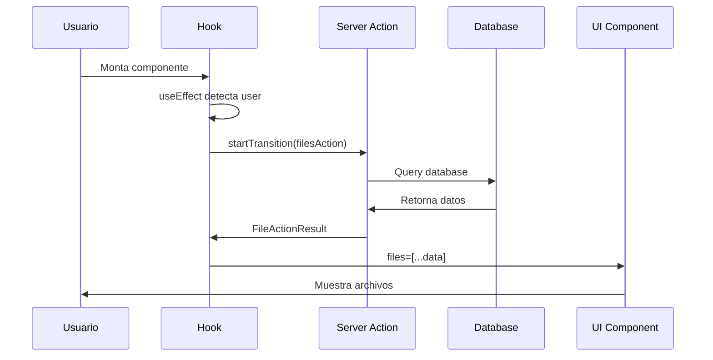
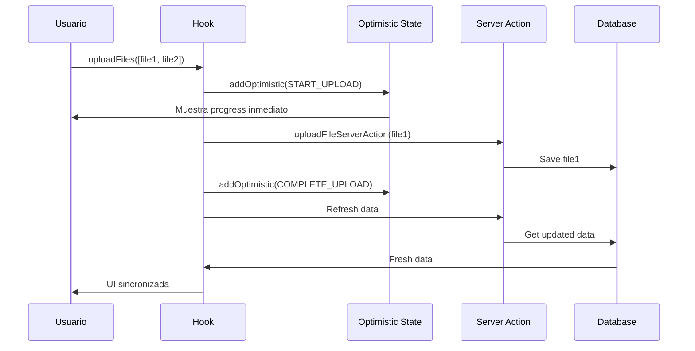

# 🚀 GUÍA COMPLETA: REACT 19 & ENTERPRISE PATTERNS

## 📚 **INTRODUCCIÓN: DE REACT 18 A REACT 19**

Esta guía explica **cómo funciona nuestro código enterprise** usando las nuevas características de React 19, especialmente para desarrolladores que vienen de React 18.

---

## 🔄 **REACT 19: NUEVOS HOOKS FUNDAMENTALES**

### **1. useActionState - El Nuevo useState para Server Actions**

#### **¿Qué es useActionState?**

En React 18 usábamos `useState` + `useEffect` para manejar llamadas al servidor:

```typescript
// ❌ REACT 18 - Patrón viejo
const [data, setData] = useState([]);
const [loading, setLoading] = useState(false);
const [error, setError] = useState(null);

useEffect(() => {
  const fetchData = async () => {
    setLoading(true);
    try {
      const response = await fetch("/api/files");
      const result = await response.json();
      setData(result.data);
    } catch (err) {
      setError(err.message);
    } finally {
      setLoading(false);
    }
  };

  fetchData();
}, []);
```

**React 19 introduce `useActionState`** que hace esto mucho más simple:

```typescript
// ✅ REACT 19 - Nuevo patrón
const [state, action, pending] = useActionState(serverAction, initialState);
```

#### **Cómo funciona en nuestro código:**

```typescript
// hooks/useFileUpload.ts
const [filesState, filesAction, filesPending] = useActionState(
  async (): Promise<FileActionResult> => {
    fileUploadLogger.debug("Fetching files from server");
    return await getFilesServerAction(); // Server Action
  },
  null // Estado inicial
);
```

**¿Qué está pasando aquí?**

1. **`filesState`**: Contiene el resultado de la última ejecución del server action
2. **`filesAction`**: Función que ejecuta el server action
3. **`filesPending`**: Boolean que indica si la acción está en progreso

**Ventajas vs React 18:**

- ✅ **No más useState múltiples** (data, loading, error)
- ✅ **No más useEffect** para llamadas iniciales
- ✅ **Estado automático** de pending/loading
- ✅ **Integración perfecta** con Server Actions
- ✅ **Menos código boilerplate**

#### **Ejemplo completo de flujo:**

```typescript
// 1. Estado inicial
console.log(filesState); // null
console.log(filesPending); // false

// 2. Usuario ejecuta la acción
filesAction(); // Llamada al servidor

// 3. Durante la ejecución
console.log(filesState); // null (aún no hay resultado)
console.log(filesPending); // true (en progreso)

// 4. Después de completarse
console.log(filesState); // { success: true, data: [...files] }
console.log(filesPending); // false (completado)
```

---

### **2. useOptimistic - UI Optimista Inteligente**

#### **¿Qué es Optimistic UI?**

**Optimistic UI** significa mostrar el resultado esperado ANTES de que el servidor confirme la operación.

**Ejemplo real**: Cuando das "like" en Facebook, el corazón se pone rojo inmediatamente, aunque la petición al servidor aún esté en progreso.

#### **React 18 vs React 19:**

```typescript
// ❌ REACT 18 - Manejo manual complejo
const [files, setFiles] = useState([]);
const [uploadProgress, setUploadProgress] = useState([]);

const uploadFile = async (file) => {
  // 1. Actualización optimista manual
  const tempId = `temp-${Date.now()}`;
  setUploadProgress((prev) => [
    ...prev,
    {
      id: tempId,
      status: "uploading",
      progress: 0,
    },
  ]);

  try {
    // 2. Server call
    const result = await uploadServerAction(file);

    // 3. Actualización manual del estado real
    setFiles((prev) => [...prev, result.data]);

    // 4. Limpiar estado optimista manualmente
    setUploadProgress((prev) => prev.filter((p) => p.id !== tempId));
  } catch (error) {
    // 5. Revertir cambios manualmente
    setUploadProgress((prev) =>
      prev.map((p) => (p.id === tempId ? { ...p, status: "error" } : p))
    );
  }
};
```

```typescript
// ✅ REACT 19 - useOptimistic automático
const [optimisticState, addOptimistic] = useOptimistic(
  { uploadProgress: [] }, // Estado base
  optimisticReducer // Función que maneja los cambios
);

const uploadFile = async (file) => {
  // 1. Actualización optimista automática
  addOptimistic({
    type: "START_UPLOAD",
    files: [file],
    tempIds: [`temp-${Date.now()}`],
  });

  // 2. Server call
  const result = await uploadServerAction(file);

  // 3. React automáticamente sincroniza el estado real
  // No necesitas limpiar manualmente!
};
```

#### **Ventajas clave:**

- ✅ **Automático**: React maneja la sincronización
- ✅ **Predecible**: Usa reducers como Redux
- ✅ **Reversible**: Si falla, React revierte automáticamente
- ✅ **Performante**: No re-renders innecesarios

---

### **3. useTransition - Transiciones No Bloqueantes**

#### **¿Qué problema resuelve?**

En React 18, las actualizaciones de estado podían "bloquear" la UI:

```typescript
// ❌ REACT 18 - Puede bloquear la UI
const handleSearch = (query) => {
  setSearchQuery(query); // Esto puede ser lento
  setFilteredResults(filter()); // Esto también
  // La UI se "congela" hasta completarse
};
```

React 19 introduce **transiciones no bloqueantes**:

```typescript
// ✅ REACT 19 - No bloquea la UI
const [isPending, startTransition] = useTransition();

const handleSearch = (query) => {
  setSearchQuery(query); // Actualización inmediata (urgent)

  startTransition(() => {
    setFilteredResults(filter()); // Actualización no bloqueante
  });
};
```

#### **En nuestro código:**

```typescript
// hooks/useFileUpload.ts
const [isPending, startTransition] = useTransition();

// ✅ Inicialización no bloqueante
useEffect(() => {
  if (!hasInitialized.current && user) {
    hasInitialized.current = true;

    // CRÍTICO: Envolver en startTransition para React 19 compliance
    startTransition(() => {
      filesAction(); // No bloquea la UI
      statsAction(); // No bloquea la UI
    });
  }
}, [user]);

// ✅ Refresh no bloqueante
const refresh = useCallback(() => {
  startTransition(() => {
    filesAction(); // No bloquea la UI
    statsAction(); // No bloquea la UI
  });
}, []);
```

**¿Por qué es importante?**

- ✅ **UI responsive**: Los clicks funcionan inmediatamente
- ✅ **Better UX**: No hay "lag" percibido
- ✅ **React 19 compliance**: Requerido para Server Actions

---

## 🎯 **OPTIMISTIC REDUCER: CORAZÓN DEL SISTEMA**

### **¿Qué es un Optimistic Reducer?**

Es como **Redux**, pero específicamente diseñado para manejar **cambios optimistas** que pueden ser revertidos.

#### **Estructura básica:**

```typescript
// reducers/index.ts
export interface OptimisticState {
  uploadProgress: UploadProgress[]; // Estado optimista
  lastUpdated: string; // Timestamp
  totalActiveUploads: number; // Métricas calculadas
}

export type OptimisticAction =
  | { type: "START_UPLOAD"; files: File[]; tempIds: string[] }
  | { type: "UPDATE_PROGRESS"; tempId: string; progress: number }
  | { type: "COMPLETE_UPLOAD"; tempId: string }
  | { type: "FAIL_UPLOAD"; tempId: string; error: string }
  | { type: "CLEAR_COMPLETED" };
```

#### **El Reducer en acción:**

```typescript
export function optimisticReducer(
  state: OptimisticState,
  action: OptimisticAction
): OptimisticState {
  // 🔍 Logging para debugging
  optimisticLogger.debug(`Optimistic action: ${action.type}`, {
    currentState: state.uploadProgress.length,
    activeUploads: state.totalActiveUploads,
  });

  switch (action.type) {
    case "START_UPLOAD": {
      // 📊 Crear nuevos items optimistas
      const newProgress = action.tempIds.map((tempId, index) => ({
        fileId: tempId,
        progress: 0,
        status: "pending" as const,
        filename: action.files[index]?.name || `file-${index + 1}`,
      }));

      // 🔄 Estado inmutable
      const nextState = {
        uploadProgress: [...state.uploadProgress, ...newProgress],
        lastUpdated: new Date().toISOString(),
        totalActiveUploads: 0, // Se recalculará
      };

      // 📈 Recalcular métricas
      nextState.totalActiveUploads = calculateActiveUploads(
        nextState.uploadProgress
      );

      return nextState;
    }

    case "UPDATE_PROGRESS": {
      // 🎯 Actualizar progreso específico
      const nextState = {
        ...state,
        uploadProgress: state.uploadProgress.map((p) =>
          p.fileId === action.tempId
            ? { ...p, progress: action.progress, status: "uploading" as const }
            : p
        ),
        lastUpdated: new Date().toISOString(),
      };

      nextState.totalActiveUploads = calculateActiveUploads(
        nextState.uploadProgress
      );
      return nextState;
    }

    // ... otros casos
  }
}
```

#### **¿Por qué usar un reducer?**

1. **Predecibilidad**: Cada acción produce el mismo resultado
2. **Immutabilidad**: No muta el estado existente
3. **Debuggabilidad**: Cada cambio está logged
4. **Testabilidad**: Pure functions fáciles de testear
5. **Time-travel debugging**: Como Redux DevTools

---

## 🌊 **FLUJO COMPLETO DE DATOS**

### **1. FLUJO DE LECTURA (GET)**



#### **Código paso a paso:**

```typescript
// 1. 🚀 Inicialización automática
useEffect(() => {
  if (!hasInitialized.current && user) {
    hasInitialized.current = true;

    // 2. 🔄 Ejecutar Server Action en transición
    startTransition(() => {
      filesAction(); // Llama a getFilesServerAction()
      statsAction(); // Llama a getFileStatsServerAction()
    });
  }
}, [user]);

// 3. 📊 Server Action ejecuta
const [filesState, filesAction] = useActionState(
  async (): Promise<FileActionResult> => {
    // 4. 🏗️ Logging estructurado
    fileUploadLogger.debug("Fetching files from server");

    // 5. 🔗 Llamada a la capa de servicios
    return await getFilesServerAction();
  },
  null
);

// 6. 🎯 Datos computados reactivamente
const files = useMemo(
  () => (filesState?.success ? filesState.data : []),
  [filesState]
);

// 7. 🖼️ UI se actualiza automáticamente
return { files, isLoading: filesPending, error: filesState?.error };
```

### **2. FLUJO DE ESCRITURA (POST/UPDATE)**



#### **Código paso a paso:**

```typescript
// 1. 🎯 Usuario ejecuta acción
const uploadFiles = useCallback(
  async (files: File[]) => {
    // 2. 📊 Validation empresarial
    if (files.length > enterpriseConfig.ui.maxFilesPerBatch) {
      throw new Error(
        `Too many files. Maximum: ${enterpriseConfig.ui.maxFilesPerBatch}`
      );
    }

    // 3. 🏷️ Generar IDs temporales
    const tempIds = files.map(() => `temp-${Date.now()}-${Math.random()}`);

    // 4. ✨ OPTIMISTIC UI: Mostrar cambios inmediatamente
    if (enterpriseConfig.features.optimisticUI) {
      startTransition(() => {
        addOptimistic({
          type: FILE_UPLOAD_ACTIONS.START_UPLOAD,
          files,
          tempIds,
        });
      });
    }

    try {
      // 5. 🔄 Procesar archivos en paralelo
      const results = await Promise.all(
        files.map(async (file, index) => {
          const tempId = tempIds[index];

          // 6. 📈 Actualizar progreso optimísticamente
          if (enterpriseConfig.features.progressTracking) {
            setTimeout(() => {
              startTransition(() => {
                addOptimistic({
                  type: FILE_UPLOAD_ACTIONS.UPDATE_PROGRESS,
                  tempId,
                  progress: 50,
                });
              });
            }, enterpriseConfig.timing.uploadProgressDelay);
          }

          // 7. 🏗️ Server Action real
          const result = await uploadFileServerAction(formData);

          if (result.success) {
            // 8. ✅ Marcar como completado
            startTransition(() => {
              addOptimistic({
                type: FILE_UPLOAD_ACTIONS.COMPLETE_UPLOAD,
                tempId,
              });
            });

            return { success: true, file: result.data };
          } else {
            throw new Error(result.error || "Upload failed");
          }
        })
      );

      // 9. 🔄 AUTO-REFRESH: Sincronizar con servidor
      const successCount = results.filter((r) => r.success).length;
      if (successCount > 0 && enterpriseConfig.features.autoRefresh) {
        startTransition(() => {
          filesAction(); // Refresh files
          statsAction(); // Refresh stats
        });

        // 10. 🧹 Limpiar estado optimista
        setTimeout(() => {
          startTransition(() => {
            addOptimistic({ type: FILE_UPLOAD_ACTIONS.CLEAR_COMPLETED });
          });
        }, enterpriseConfig.timing.clearCompletedDelay);
      }

      return results;
    } catch (error) {
      // 11. ❌ Manejo de errores
      fileUploadLogger.error("Batch upload failed", error);
      throw error;
    }
  },
  [enterpriseConfig, addOptimistic, filesAction, statsAction]
);
```

### **3. FLUJO DE ELIMINACIÓN (DELETE)**

```typescript
const deleteFile = useCallback(
  async (fileId: string) => {
    // 1. 🔍 Logging con performance tracking
    fileUploadLogger.timeStart(`Delete File ${fileId}`);

    try {
      // 2. 🏗️ Server Action
      const result = await deleteFileServerAction(formData);

      if (!result?.success) {
        throw new Error(result?.error || "Delete failed");
      }

      // 3. 🔄 Auto-refresh si está habilitado
      if (enterpriseConfig.features.autoRefresh) {
        startTransition(() => {
          filesAction(); // Datos frescos del servidor
          statsAction(); // Stats actualizadas
        });
      }

      fileUploadLogger.timeEnd(`Delete File ${fileId}`);
    } catch (error) {
      fileUploadLogger.error("Delete failed", error);
      throw error;
    }
  },
  [enterpriseConfig.features.autoRefresh]
);
```

---

## 🎛️ **CONFIGURACIÓN ENTERPRISE**

### **¿Por qué Configuration Manager?**

En React 18, las configuraciones estaban hardcodeadas o dispersas:

```typescript
// ❌ React 18 - Configuración dispersa
const MAX_FILES = 10; // Hardcoded
const DEBOUNCE_MS = 300; // Hardcoded
const ENABLE_LOGGING = process.env.NODE_ENV === "development"; // Disperso
```

Nuestro **Configuration Manager** centraliza todo:

```typescript
// ✅ Enterprise - Configuración centralizada
export class FileUploadConfigManager {
  private static instance: FileUploadConfigManager;

  // 🏗️ Singleton pattern
  public static getInstance(): FileUploadConfigManager {
    if (!FileUploadConfigManager.instance) {
      FileUploadConfigManager.instance = new FileUploadConfigManager();
    }
    return FileUploadConfigManager.instance;
  }

  // 🎯 Feature flags dinámicos
  public isFeatureEnabled(
    feature: keyof EnterpriseFileUploadConfig["features"]
  ): boolean {
    return this.getConfig().features[feature];
  }

  // 🔄 User overrides
  public setOverrides(overrides: Partial<EnterpriseFileUploadConfig>): void {
    this.overrides = this.deepClone(overrides);
  }
}
```

#### **Uso en el hook:**

```typescript
// hooks/useFileUpload.ts
const useFileUpload = (userConfig?: UploadConfig) => {
  // 🏗️ Adaptar configuración de usuario
  const enterpriseConfig = useMemo(
    () => adaptConfigForHook(userConfig),
    [userConfig]
  );

  // 🎯 Usar configuración en toda la lógica
  if (files.length > enterpriseConfig.ui.maxFilesPerBatch) {
    throw new Error(
      `Too many files. Maximum: ${enterpriseConfig.ui.maxFilesPerBatch}`
    );
  }

  if (enterpriseConfig.features.optimisticUI) {
    addOptimistic(/* ... */);
  }

  if (enterpriseConfig.features.autoRefresh) {
    startTransition(() => {
      filesAction();
      statsAction();
    });
  }
};
```

---

## 📊 **SERVER ACTIONS: LA NUEVA ARQUITECTURA**

### **¿Qué son las Server Actions?**

**Server Actions** son funciones que se ejecutan en el servidor pero se pueden llamar directamente desde el cliente, como si fueran funciones normales.

#### **React 18 vs React 19:**

```typescript
// ❌ React 18 - API routes + fetch
// pages/api/files.ts
export default async function handler(req, res) {
  if (req.method === "POST") {
    const result = await uploadFile(req.body);
    res.json(result);
  }
}

// components/FileUpload.tsx
const uploadFile = async (file) => {
  const response = await fetch("/api/files", {
    method: "POST",
    body: formData,
  });
  const result = await response.json();
  return result;
};
```

```typescript
// ✅ React 19 - Server Actions
// server/actions/index.ts
"use server"; // Esta función se ejecuta en el servidor

export async function uploadFileServerAction(formData: FormData) {
  // Código del servidor
  const result = await uploadToStorage(file);
  revalidateTag("user-files"); // Cache invalidation automática
  return { success: true, data: result };
}

// hooks/useFileUpload.ts
const result = await uploadFileServerAction(formData); // Llamada directa!
```

#### **Ventajas de Server Actions:**

1. **✅ Type Safety**: TypeScript end-to-end
2. **✅ No API routes**: Menos boilerplate
3. **✅ Cache automático**: revalidateTag/revalidatePath
4. **✅ Streaming**: Respuestas progresivas
5. **✅ Error handling**: Integrado con React

### **Nuestro Server Action con logging:**

```typescript
// server/actions/index.ts
export async function uploadFileServerAction(
  formData: FormData
): Promise<FileActionResult> {
  const requestId = `req-${Date.now()}-${Math.random()
    .toString(36)
    .substr(2, 9)}`;

  // 🔍 Performance tracking
  serverActionLogger.timeStart(`Upload ${requestId}`);
  serverActionLogger.info("Upload started", { requestId });

  try {
    // 1. 🔐 Authentication
    const session = await auth.api.getSession({ headers: await headers() });
    if (!session?.user) {
      serverActionLogger.error("Unauthorized upload attempt", null, {
        requestId,
      });
      return { success: false, error: "No autorizado" };
    }

    // 2. ✅ Validation
    const validated = parseUploadSchema(Object.fromEntries(formData));
    serverActionLogger.debug("Input validated", {
      requestId,
      fileName: validated.fileName,
    });

    // 3. 🏗️ Business Logic
    const result = await fileUploadService.uploadFile(validated);
    serverActionLogger.info("File uploaded successfully", {
      requestId,
      fileId: result.id,
    });

    // 4. 🔄 Cache Invalidation
    revalidateTag(CACHE_TAGS.FILES);
    revalidatePath("/files");
    serverActionLogger.debug("Cache invalidated", {
      requestId,
      tags: [CACHE_TAGS.FILES],
    });

    serverActionLogger.timeEnd(`Upload ${requestId}`);
    return { success: true, data: result };
  } catch (error) {
    serverActionLogger.error("Upload failed", error, { requestId });
    return {
      success: false,
      error: error instanceof Error ? error.message : "Unknown error",
    };
  }
}
```

---

## 🔍 **SELECTORS: CONSULTAS EFICIENTES**

### **¿Qué son los Selectors?**

Los **selectors** son funciones que extraen y calculan datos derivados del estado de manera eficiente.

```typescript
// reducers/index.ts
export const optimisticSelectors = {
  // 🎯 Archivos activos (pending/uploading)
  getActiveUploads: (state: OptimisticState) =>
    state.uploadProgress.filter(
      (p) => p.status === "pending" || p.status === "uploading"
    ),

  // ✅ Archivos completados
  getCompletedUploads: (state: OptimisticState) =>
    state.uploadProgress.filter((p) => p.status === "completed"),

  // ❌ Archivos con error
  getFailedUploads: (state: OptimisticState) =>
    state.uploadProgress.filter((p) => p.status === "error"),

  // 📊 ¿Hay uploads activos?
  hasActiveUploads: (state: OptimisticState) => state.totalActiveUploads > 0,

  // 📈 Progreso general
  getOverallProgress: (state: OptimisticState) => {
    if (state.uploadProgress.length === 0) return 0;

    const totalProgress = state.uploadProgress.reduce(
      (sum, p) => sum + p.progress,
      0
    );
    return Math.round(totalProgress / state.uploadProgress.length);
  },
};
```

#### **Uso en el hook:**

```typescript
// hooks/useFileUpload.ts
return useMemo(
  () => ({
    // 📊 Core Data
    files,
    uploadProgress: optimisticState.uploadProgress,

    // 🔄 Loading States (usando selectors)
    isUploading: optimisticSelectors.hasActiveUploads(optimisticState),

    // 🎯 Upload Progress Analytics (usando selectors)
    activeUploads: optimisticSelectors.getActiveUploads(optimisticState),
    completedUploads: optimisticSelectors.getCompletedUploads(optimisticState),
    failedUploads: optimisticSelectors.getFailedUploads(optimisticState),
    overallProgress: optimisticSelectors.getOverallProgress(optimisticState),

    // ... resto del estado
  }),
  [files, optimisticState /* ... */]
);
```

**Ventajas de los Selectors:**

- ✅ **Performance**: Cálculos memorizados
- ✅ **Reutilización**: Misma lógica en múltiples lugares
- ✅ **Testing**: Funciones puras fáciles de testear
- ✅ **Mantenibilidad**: Lógica centralizada

---

## 🎯 **¿POR QUÉ ELEGIMOS ESTOS PATRONES?**

### **1. useActionState vs useState + useEffect**

**Antes (React 18):**

```typescript
const [files, setFiles] = useState([]);
const [loading, setLoading] = useState(false);
const [error, setError] = useState(null);

useEffect(() => {
  const fetchFiles = async () => {
    setLoading(true);
    setError(null);
    try {
      const response = await fetch("/api/files");
      const data = await response.json();
      setFiles(data);
    } catch (err) {
      setError(err.message);
    } finally {
      setLoading(false);
    }
  };

  fetchFiles();
}, []);
```

**Ahora (React 19):**

```typescript
const [filesState, filesAction, filesPending] = useActionState(
  getFilesServerAction,
  null
);
```

**¿Por qué el cambio?**

- ✅ **90% menos código**
- ✅ **Error handling automático**
- ✅ **Loading states automáticos**
- ✅ **Type safety mejorada**
- ✅ **Integración perfecta con Server Actions**

### **2. Optimistic UI vs Loading States**

**Antes:**

```typescript
const [isUploading, setIsUploading] = useState(false);

const upload = async (file) => {
  setIsUploading(true); // Usuario ve loading
  await uploadFile(file);
  setIsUploading(false); // Usuario ve resultado
};
```

**Ahora:**

```typescript
const upload = async (file) => {
  addOptimistic({ type: "START_UPLOAD", file }); // Usuario ve resultado inmediato
  await uploadFile(file); // Servidor confirma
};
```

**¿Por qué optimistic?**

- ✅ **UX superior**: Feedback inmediato
- ✅ **Percepción de velocidad**: App se siente más rápida
- ✅ **Reversible**: Si falla, se revierte automáticamente
- ✅ **Estándar moderno**: Facebook, Twitter, etc. lo usan

### **3. Configuration Manager vs Hardcoded**

**¿Por qué centralizar configuración?**

- ✅ **Feature flags**: Habilitar/deshabilitar funcionalidades sin deploy
- ✅ **A/B testing**: Diferentes configs para diferentes usuarios
- ✅ **Environment-specific**: Dev vs Prod configs
- ✅ **User preferences**: Permitir personalización
- ✅ **Maintainability**: Cambios en un solo lugar

### **4. Structured Logging vs console.log**

**¿Por qué logging estructurado?**

- ✅ **Debugging**: Contexto completo para troubleshooting
- ✅ **Performance tracking**: Métricas de tiempo automáticas
- ✅ **Production ready**: Logs seguros para producción
- ✅ **Searchable**: Logs estructurados son queryables
- ✅ **Module-specific**: Cada módulo tiene su namespace

---

## 🚀 **VENTAJAS DEL SISTEMA COMPLETO**

### **Para Desarrolladores:**

1. **🎯 Menos código**: useActionState elimina boilerplate
2. **🔍 Mejor debugging**: Logging estructurado y detallado
3. **⚡ Performance**: Optimistic UI + memoización
4. **🛡️ Type safety**: TypeScript end-to-end
5. **🧪 Testeable**: Pure functions y patterns predecibles

### **Para Usuarios:**

1. **🏃‍♂️ App más rápida**: Optimistic UI
2. **🎨 UI responsive**: useTransition no bloquea
3. **🔄 Datos frescos**: Cache invalidation automática
4. **❌ Mejor error handling**: Errores claros y recovery automático

### **Para el Negocio:**

1. **📈 Maintainability**: Código modular y bien documentado
2. **🔧 Flexibility**: Feature flags y configuración dinámica
3. **📊 Analytics**: Métricas detalladas de uso
4. **🚀 Scalability**: Patterns que escalan con el equipo

---

## 🎯 **PRÓXIMOS PASOS PARA APRENDER**

### **1. Experimenta con el código:**

```bash
# Clona y ejecuta el proyecto
npm run dev

# Observa los logs en la consola del navegador
# Prueba subir archivos y ve el flujo completo
```

### **2. Modifica configuraciones:**

```typescript
// Cambia estas configuraciones y observa las diferencias:
const config = {
  features: {
    optimisticUI: false, // ¿Cómo cambia la UX?
    advancedLogging: true, // ¿Qué logs aparecen?
    autoRefresh: false, // ¿Los datos se actualizan?
  },
};
```

### **3. Lee el código paso a paso:**

1. **Empieza por**: `hooks/useFileUpload.ts`
2. **Después**: `reducers/index.ts`
3. **Luego**: `server/actions/index.ts`
4. **Finalmente**: `config/index.ts`

### **4. Recursos adicionales:**

- [React 19 Beta Docs](https://react.dev/blog/2024/04/25/react-19)
- [Server Actions Guide](https://nextjs.org/docs/app/building-your-application/data-fetching/server-actions)
- [useOptimistic Examples](https://react.dev/reference/react/useOptimistic)

---

## 🎉 **¡FELICIDADES!**

Ahora entiendes **cómo funciona React 19** y **por qué elegimos estos patrones**. Este conocimiento te permitirá:

- ✅ **Migrar** proyectos de React 18 a React 19
- ✅ **Implementar** Optimistic UI correctamente
- ✅ **Usar** Server Actions de manera efectiva
- ✅ **Crear** sistemas enterprise escalables
- ✅ **Debuggear** problemas complejos de estado

**¡Este es el futuro del desarrollo React!** 🚀
