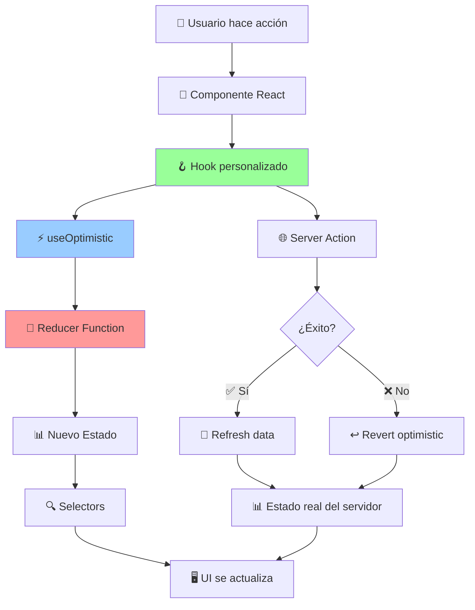

# 🔄 **INTEGRACIÓN DE REDUCERS CON HOOKS Y useOptimistic**

## 🎯 **¿CÓMO INTERACTÚAN LOS REDUCERS CON OTROS COMPONENTES?**

Los reducers son el **núcleo del estado optimista** pero funcionan integrados con múltiples capas de la aplicación. Esta guía explica **exactamente** cómo se conectan todos los componentes.

---

## 🏗️ **ARQUITECTURA DE INTEGRACIÓN**



---

## 🎯 **FLUJO DETALLADO DE INTEGRACIÓN**

### **1. 🎬 Inicialización del Hook**

```typescript
// hooks/useUsers.ts
export const useUsers = (userConfig?: UseUsersConfig): UseUsersReturn => {
  // 1. 📊 Estado optimista se inicializa con el reducer
  const [optimisticState, addOptimistic] = useOptimistic(
    createInitialUsersOptimisticState(), // 🏗️ Factory function del reducer
    usersOptimisticReducer // 🎯 Reducer function
  );

  // 2. 🌐 Estado real del servidor (source of truth)
  const [usersState, usersAction, usersPending] = useActionState(
    async (): Promise<ActionResult<UserListResponse>> => {
      return await serverActions.getAllUsersAction();
    },
    null
  );

  // 3. 🔄 Estados combinados
  const [isPending, startTransition] = useTransition();

  // ... resto del hook
};
```

### **2. ⚡ Dispatch de Acción Optimista**

```typescript
// Dentro del hook useUsers
const createUser = useCallback(
  async (userData: CreateUserForm) => {
    const tempId = generateTempUserId();

    // 🎯 PASO 1: Disparar acción optimista
    startTransition(() => {
      addOptimistic({
        type: USERS_ACTIONS.CREATE_USER, // 📋 Tipo de acción
        tempUser: userData, // 📊 Datos del usuario
        tempId, // 🆔 ID temporal único
      });
    });

    // 🎯 PASO 2: El reducer procesa inmediatamente la acción
    // → usersOptimisticReducer() se ejecuta
    // → Retorna nuevo estado inmutable
    // → UI se actualiza INSTANTÁNEAMENTE

    // 🌐 PASO 3: Server action en background
    const result = await createUserServerAction(userData);

    // 🔄 PASO 4: Sincronización con servidor
    if (result.success) {
      startTransition(() => {
        usersAction(); // Re-fetch datos reales
      });
    }

    return result;
  },
  [addOptimistic, usersAction]
);
```

### **3. 🎯 Procesamiento en el Reducer**

```typescript
// reducers/index.ts
export function usersOptimisticReducer(
  state: UsersOptimisticState,
  action: UsersOptimisticAction
): UsersOptimisticState {
  // 🎯 PASO 1: Log de la acción (debugging)
  usersOptimisticLogger.debug(`Action: ${action.type}`, {
    currentUsers: state.users.length,
    activeOperations: state.activeOperations,
  });

  // 🎯 PASO 2: Procesar acción específica
  switch (action.type) {
    case USERS_ACTIONS.CREATE_USER: {
      // 🏗️ Construir usuario temporal
      const tempUser: User = {
        ...action.tempUser,
        id: action.tempId,
        createdAt: new Date().toISOString(),
        // ... todos los campos requeridos
      };

      // 🔄 Crear nuevo estado inmutable
      const nextUsers = [...state.users, tempUser];
      const nextStats = calculateStats(nextUsers);

      // 📊 Retornar nuevo estado
      return {
        ...state,
        users: nextUsers,
        totalUsers: state.totalUsers + 1,
        activeOperations: state.activeOperations + 1,
        lastUpdated: new Date().toISOString(),
        stats: nextStats,
      };
    }

    // ... otros casos
  }
}
```

### **4. 🔍 Extracción con Selectors**

```typescript
// Dentro del hook useUsers
const { users, optimisticState } = useUsers();

// 🔍 El hook usa selectors para extraer datos específicos
const activeUsers = useMemo(
  () => usersOptimisticSelectors.getActiveUsers(optimisticState),
  [optimisticState]
);

const stats = useMemo(
  () => usersOptimisticSelectors.getStats(optimisticState),
  [optimisticState]
);

const isLoading = useMemo(
  () => usersOptimisticSelectors.isLoading(optimisticState),
  [optimisticState]
);

// 📤 El hook retorna datos procesados
return {
  users: optimisticState.users,
  activeUsers,
  stats,
  isLoading,
  createUser,
  // ... más funciones y datos
};
```

### **5. 🖥️ Consumo en Componentes**

```typescript
// components/UsersList.tsx
const UsersList = () => {
  // 🪝 Hook proporciona todo lo necesario
  const {
    users, // 👥 Lista de usuarios (incluye optimistas)
    activeUsers, // ✅ Solo usuarios activos
    stats, // 📊 Métricas calculadas
    isLoading, // 🔄 Estado de carga
    createUser, // 🎯 Función para crear usuario
    updateUser, // ✏️ Función para actualizar
    deleteUser, // 🗑️ Función para eliminar
  } = useUsers();

  // 🎯 Función para manejar creación de usuario
  const handleCreateUser = async (formData) => {
    // ⚡ Al llamar createUser:
    // 1. UI se actualiza INMEDIATAMENTE (optimista)
    // 2. Servidor procesa en background
    // 3. Datos se sincronizan automáticamente
    await createUser(formData);
  };

  return (
    <div>
      {/* 📊 Stats se actualizan automáticamente */}
      <StatsPanel stats={stats} />

      {/* 🔄 Loading state reactivo */}
      {isLoading && <LoadingSpinner />}

      {/* 👥 Lista reactiva a cambios del reducer */}
      {users.map((user) => (
        <UserCard
          key={user.id}
          user={user}
          // 👻 Indicador visual para usuarios optimistas
          isOptimistic={user.id.startsWith("temp-")}
          onUpdate={(updates) => updateUser(user.id, updates)}
          onDelete={() => deleteUser(user.id)}
        />
      ))}

      <CreateUserForm onSubmit={handleCreateUser} />
    </div>
  );
};
```

---

## 🔄 **TIPOS DE INTERACCIONES**

### **🎯 1. Hook → Reducer (Dispatch)**

```typescript
// En el hook
const performAction = useCallback(
  (actionData) => {
    // 🎯 Despachar acción al reducer
    startTransition(() => {
      addOptimistic({
        type: ACTION_TYPE,
        ...actionData,
      });
    });
  },
  [addOptimistic]
);

// 📊 El reducer recibe la acción y retorna nuevo estado
// 🖥️ React re-renderiza automáticamente con el nuevo estado
```

### **📤 2. Reducer → Hook (Estado)**

```typescript
// El reducer retorna nuevo estado
const newState = {
  users: [...state.users, newUser],
  stats: calculateStats([...state.users, newUser]),
  // ...
};

// 🪝 El hook recibe automáticamente el nuevo estado
const { users, stats } = usersOptimisticState;

// 🔍 El hook puede procesar el estado con selectors
const activeUsers =
  usersOptimisticSelectors.getActiveUsers(usersOptimisticState);
```

### **🖥️ 3. Hook → Componente (Datos)**

```typescript
// Hook proporciona interfaz limpia al componente
return {
  // 📊 Datos procesados
  users: optimisticState.users,
  activeUsers: selectors.getActiveUsers(optimisticState),
  stats: selectors.getStats(optimisticState),

  // 🔄 Estados de UI
  isLoading: selectors.isLoading(optimisticState),
  hasErrors: selectors.hasErrors(optimisticState),

  // 🎯 Acciones disponibles
  createUser,
  updateUser,
  deleteUser,
  bulkUpdate,

  // 🔧 Utilidades
  refresh,
  clearErrors,
};
```

### **👤 4. Componente → Hook (Acciones)**

```typescript
// Componente llama funciones del hook
const handleCreateUser = async (userData) => {
  // 🎯 Llama función del hook
  const result = await createUser(userData);

  if (result.success) {
    // ✅ El hook ya manejó la optimización
    // 📊 El estado ya se actualizó
    // 🖥️ La UI ya se re-renderizó
    showSuccessMessage("Usuario creado exitosamente");
  } else {
    // ❌ El hook ya manejó el rollback
    // 🖥️ La UI ya revirtió los cambios
    showErrorMessage(result.error);
  }
};
```

---

## 🌐 **INTEGRACIÓN CON SERVER ACTIONS**

### **🔄 Flujo Completo: Optimista → Servidor → Sincronización**

```typescript
// hooks/useUsers.ts
const createUser = useCallback(
  async (userData: CreateUserForm) => {
    const tempId = generateTempUserId();

    // 🎯 FASE 1: OPTIMISTIC UPDATE
    usersOptimisticLogger.info("Starting optimistic user creation", {
      email: userData.email,
      tempId,
    });

    startTransition(() => {
      addOptimistic({
        type: USERS_ACTIONS.CREATE_USER,
        tempUser: userData,
        tempId,
      });
    });

    // 🎬 En este punto:
    // ✅ UI ya muestra el nuevo usuario
    // ✅ Contadores ya están actualizados
    // ✅ Usuario ve feedback inmediato

    try {
      // 🌐 FASE 2: SERVER ACTION
      usersOptimisticLogger.info("Sending create request to server", {
        tempId,
      });

      const formData = new FormData();
      formData.append("name", userData.name);
      formData.append("email", userData.email);
      formData.append("role", userData.role);

      const result = await serverActions.createUserAction(formData);

      if (result.success) {
        // ✅ FASE 3A: ÉXITO - Sincronizar con datos reales
        usersOptimisticLogger.info(
          "Server creation successful, refreshing data",
          {
            tempId,
            realUserId: result.data?.id,
          }
        );

        startTransition(() => {
          // 📊 Refresh datos desde servidor
          // Esto reemplazará el usuario temporal con el real
          usersAction();
        });

        return { success: true, data: result.data };
      } else {
        // ❌ FASE 3B: ERROR - useOptimistic revierte automáticamente
        usersOptimisticLogger.error("Server creation failed", result.error, {
          tempId,
          userData: { email: userData.email, role: userData.role },
        });

        // 🔄 useOptimistic automáticamente revierte los cambios optimistas
        // 🖥️ El usuario temporal desaparece de la UI

        return { success: false, error: result.error };
      }
    } catch (error) {
      // 🚨 FASE 3C: EXCEPCIÓN - Manejo de errores inesperados
      usersOptimisticLogger.error(
        "Unexpected error during user creation",
        error,
        {
          tempId,
          userData: { email: userData.email, role: userData.role },
        }
      );

      // 🔄 useOptimistic también revierte en caso de excepción

      return {
        success: false,
        error: error instanceof Error ? error.message : "Error inesperado",
      };
    }
  },
  [addOptimistic, usersAction]
);
```

### **📊 Sincronización de Estados**

```typescript
// 🔄 useOptimistic maneja automáticamente:

// 1. ESTADO OPTIMISTA (inmediato)
const optimisticState = {
  users: [
    ...existingUsers,
    {
      id: "temp-123", // 👻 ID temporal
      name: "Nuevo Usuario",
      email: "nuevo@email.com",
      role: "user",
      // ... campos generados automáticamente
    },
  ],
};

// 2. ESTADO REAL (después del servidor)
const realState = {
  users: [
    ...existingUsers,
    {
      id: "real-user-456", // 🎯 ID real del servidor
      name: "Nuevo Usuario",
      email: "nuevo@email.com",
      role: "user",
      createdAt: "2025-01-17T10:30:00Z", // 📅 Timestamp real
      // ... campos adicionales del servidor
    },
  ],
};

// 🔄 useOptimistic automáticamente:
// - Muestra estado optimista inmediatamente
// - Reemplaza con estado real cuando llega del servidor
// - Revierte a estado anterior si hay error
```

---

## 🔍 **INTEGRACIÓN CON SELECTORS**

### **📊 Cómo los Selectors Procesan el Estado**

```typescript
// reducers/index.ts - Selectors procesan el estado del reducer
export const usersOptimisticSelectors = {
  // 🔍 Selector básico: acceso directo
  getAllUsers: (state: UsersOptimisticState) => state.users,

  // 🎯 Selector computado: cálculo basado en estado
  getActiveUsers: (state: UsersOptimisticState) =>
    state.users.filter((user) => !user.banned),

  // 📊 Selector complejo: múltiples cálculos
  getUsersWithStats: (state: UsersOptimisticState) => ({
    users: state.users,
    total: state.users.length,
    active: state.users.filter((u) => !u.banned).length,
    banned: state.users.filter((u) => u.banned).length,
    percentage:
      state.users.length > 0
        ? Math.round(
            (state.users.filter((u) => !u.banned).length / state.users.length) *
              100
          )
        : 0,
  }),
};

// hooks/useUsers.ts - Hook usa selectors para procesar datos
export const useUsers = () => {
  const [optimisticState, addOptimistic] = useOptimistic(/* ... */);

  // 🔍 Aplicar selectors con memoización para performance
  const allUsers = useMemo(
    () => usersOptimisticSelectors.getAllUsers(optimisticState),
    [optimisticState.users] // 🎯 Dependencia específica
  );

  const activeUsers = useMemo(
    () => usersOptimisticSelectors.getActiveUsers(optimisticState),
    [optimisticState.users] // 🔄 Solo recalcular si cambian usuarios
  );

  const usersWithStats = useMemo(
    () => usersOptimisticSelectors.getUsersWithStats(optimisticState),
    [optimisticState.users] // 📊 Memoización para cálculos complejos
  );

  return {
    users: allUsers,
    activeUsers,
    usersWithStats,
    // ...
  };
};

// components/UsersList.tsx - Componente consume datos procesados
const UsersList = () => {
  const { users, activeUsers, usersWithStats } = useUsers();

  // 🎯 Datos ya están procesados y optimizados
  // 📊 Stats ya están calculadas
  // 🔄 Solo se recalculan cuando es necesario

  return (
    <div>
      <div className="stats">
        Total: {usersWithStats.total} | Activos: {usersWithStats.active} (
        {usersWithStats.percentage}%)
      </div>

      <div className="users-list">
        {activeUsers.map((user) => (
          <UserCard key={user.id} user={user} />
        ))}
      </div>
    </div>
  );
};
```

---

## 🎭 **PATRONES DE INTEGRACIÓN AVANZADOS**

### **🔄 Pattern 1: Multi-Reducer Coordination**

```typescript
// Para aplicaciones complejas con múltiples reducers
const useApplicationState = () => {
  // 👥 Reducer de usuarios
  const [usersState, addUsersOptimistic] = useOptimistic(
    createInitialUsersState(),
    usersOptimisticReducer
  );

  // 📁 Reducer de archivos
  const [filesState, addFilesOptimistic] = useOptimistic(
    createInitialFilesState(),
    filesOptimisticReducer
  );

  // 🔄 Coordinación entre reducers
  const uploadUserAvatar = useCallback(
    async (userId: string, file: File) => {
      // 1. 📁 Iniciar upload de archivo
      const tempFileId = generateTempFileId();
      addFilesOptimistic({
        type: FILES_ACTIONS.START_UPLOAD,
        files: [file],
        tempIds: [tempFileId],
      });

      // 2. 👤 Actualizar usuario con nueva imagen (optimista)
      addUsersOptimistic({
        type: USERS_ACTIONS.UPDATE_USER,
        userId,
        updates: { image: `temp:${tempFileId}` }, // 👻 URL temporal
      });

      // 3. 🌐 Server action
      const result = await uploadAvatarServerAction(userId, file);

      if (result.success) {
        // 4. ✅ Actualizar ambos estados con datos reales
        addUsersOptimistic({
          type: USERS_ACTIONS.UPDATE_USER,
          userId,
          updates: { image: result.data.imageUrl }, // 🎯 URL real
        });

        addFilesOptimistic({
          type: FILES_ACTIONS.COMPLETE_UPLOAD,
          tempId: tempFileId,
        });
      }

      return result;
    },
    [addUsersOptimistic, addFilesOptimistic]
  );

  return {
    users: usersState,
    files: filesState,
    uploadUserAvatar,
  };
};
```

### **🎯 Pattern 2: Conditional Optimistic Updates**

```typescript
// Optimistic updates condicionales basados en configuración
const useConditionalOptimistic = () => {
  const { optimisticState, addOptimistic } = useUsers();
  const config = usersConfig.getConfig();

  const createUserConditional = useCallback(
    async (userData) => {
      // 🔧 Solo hacer update optimista si está habilitado
      if (config.settings.optimisticUpdates) {
        addOptimistic({
          type: USERS_ACTIONS.CREATE_USER,
          tempUser: userData,
          tempId: generateTempUserId(),
        });
      }

      // 🌐 Server action siempre se ejecuta
      const result = await createUserServerAction(userData);

      // 🔄 Si optimistic updates está deshabilitado,
      // actualizar solo después de confirmar servidor
      if (!config.settings.optimisticUpdates && result.success) {
        addOptimistic({
          type: USERS_ACTIONS.REFRESH_DATA,
          users: result.data,
        });
      }

      return result;
    },
    [addOptimistic, config.settings.optimisticUpdates]
  );

  return { createUserConditional };
};
```

### **📊 Pattern 3: Real-time Sync**

```typescript
// Sincronización en tiempo real con WebSockets
const useRealTimeUsers = () => {
  const { optimisticState, addOptimistic } = useUsers();

  useEffect(() => {
    // 🔌 Conectar a WebSocket
    const ws = new WebSocket("ws://localhost:3001/users");

    ws.onmessage = (event) => {
      const message = JSON.parse(event.data);

      switch (message.type) {
        case "USER_CREATED":
          // 📨 Otro usuario creó un usuario - añadir sin optimistic
          addOptimistic({
            type: USERS_ACTIONS.REFRESH_DATA,
            users: [...optimisticState.users, message.user],
          });
          break;

        case "USER_UPDATED":
          // 📨 Otro usuario actualizó un usuario
          addOptimistic({
            type: USERS_ACTIONS.UPDATE_USER,
            userId: message.user.id,
            updates: message.user,
          });
          break;

        case "USER_DELETED":
          // 📨 Otro usuario eliminó un usuario
          addOptimistic({
            type: USERS_ACTIONS.DELETE_USER,
            userId: message.userId,
          });
          break;
      }
    };

    return () => ws.close();
  }, [addOptimistic, optimisticState.users]);

  return { optimisticState };
};
```

---

## 🚨 **DEBUGGING Y TROUBLESHOOTING**

### **🔍 Como Debuggear la Integración**

```typescript
// 1. 📝 Logging en el Hook
const useUsersWithDebugging = () => {
  const [optimisticState, addOptimistic] = useOptimistic(
    createInitialUsersOptimisticState(),
    usersOptimisticReducer
  );

  // 🔍 Debug: Log cada cambio de estado
  useEffect(() => {
    console.group("🔍 Users State Changed");
    console.log("Users count:", optimisticState.users.length);
    console.log("Active operations:", optimisticState.activeOperations);
    console.log("Stats:", optimisticState.stats);
    console.log("Full state:", optimisticState);
    console.groupEnd();
  }, [optimisticState]);

  // 🔍 Debug: Log cada acción despachada
  const debugAddOptimistic = useCallback(
    (action) => {
      console.group(`🎯 Dispatching: ${action.type}`);
      console.log("Action payload:", action);
      console.log("State before:", optimisticState);

      addOptimistic(action);

      // El nuevo estado se verá en el próximo useEffect
      console.groupEnd();
    },
    [addOptimistic, optimisticState]
  );

  return {
    optimisticState,
    addOptimistic: debugAddOptimistic,
  };
};

// 2. 🧪 Testing de Integración
describe("Hook-Reducer Integration", () => {
  it("should integrate correctly with useOptimistic", () => {
    const { result } = renderHook(() => useUsers());

    // Estado inicial
    expect(result.current.users).toHaveLength(0);

    // Despachar acción
    act(() => {
      result.current.createUser({
        name: "Test User",
        email: "test@test.com",
        role: "user",
      });
    });

    // Verificar actualización optimista
    expect(result.current.users).toHaveLength(1);
    expect(result.current.users[0].name).toBe("Test User");
    expect(result.current.users[0].id).toMatch(/^temp-/);
  });
});

// 3. 🛠️ DevTools Integration
const useUsersWithDevTools = () => {
  const [optimisticState, addOptimistic] = useOptimistic(
    createInitialUsersOptimisticState(),
    usersOptimisticReducer
  );

  // 🛠️ Integración con Redux DevTools (si está disponible)
  useEffect(() => {
    if (typeof window !== "undefined" && window.__REDUX_DEVTOOLS_EXTENSION__) {
      const devTools = window.__REDUX_DEVTOOLS_EXTENSION__.connect({
        name: "Users Optimistic State",
      });

      devTools.init(optimisticState);

      return () => devTools.disconnect();
    }
  }, []);

  // 🛠️ Enviar cambios de estado a DevTools
  const prevStateRef = useRef(optimisticState);
  useEffect(() => {
    if (typeof window !== "undefined" && window.__REDUX_DEVTOOLS_EXTENSION__) {
      const devTools = window.__REDUX_DEVTOOLS_EXTENSION__.connect({
        name: "Users Optimistic State",
      });

      if (optimisticState !== prevStateRef.current) {
        devTools.send("STATE_CHANGE", optimisticState);
        prevStateRef.current = optimisticState;
      }
    }
  }, [optimisticState]);

  return { optimisticState, addOptimistic };
};
```

### **🚨 Problemas Comunes y Soluciones**

**❌ Problema 1: Estado no se actualiza**

```typescript
// ❌ MAL: No usar startTransition
addOptimistic(action);

// ✅ BIEN: Usar startTransition
startTransition(() => {
  addOptimistic(action);
});
```

**❌ Problema 2: Re-renders excesivos**

```typescript
// ❌ MAL: Selector sin memoización
const activeUsers = optimisticState.users.filter((u) => !u.banned);

// ✅ BIEN: Selector memoizado
const activeUsers = useMemo(
  () => usersOptimisticSelectors.getActiveUsers(optimisticState),
  [optimisticState.users]
);
```

**❌ Problema 3: Pérdida de datos optimistas**

```typescript
// ❌ MAL: Refresh sin preservar datos optimistas
const refresh = () => {
  addOptimistic({ type: "REPLACE_ALL", users: serverUsers });
};

// ✅ BIEN: Merge datos optimistas con servidor
const refresh = () => {
  const optimisticUsers = optimisticState.users.filter((u) =>
    u.id.startsWith("temp-")
  );
  const serverUsers = await fetchUsers();

  addOptimistic({
    type: "REFRESH_DATA",
    users: [...serverUsers, ...optimisticUsers],
  });
};
```

---

## 🎯 **RESUMEN DE LA INTEGRACIÓN**

### **🔄 Flujo Completo**

1. **🎬 Usuario interactúa** → Componente React
2. **🪝 Componente llama** → Hook personalizado
3. **⚡ Hook despacha** → useOptimistic con acción
4. **🎯 useOptimistic ejecuta** → Reducer function
5. **📊 Reducer retorna** → Nuevo estado inmutable
6. **🔍 Hook aplica** → Selectors para procesar datos
7. **📤 Hook retorna** → Datos y funciones al componente
8. **🖥️ Componente se re-renderiza** → UI actualizada
9. **🌐 Paralelamente** → Server Action se ejecuta
10. **🔄 Server responde** → Sincronización automática

### **🎯 Beneficios de esta Integración**

- **⚡ Performance**: UI instantánea sin esperas
- **🎯 Predecibilidad**: Estado inmutable y consistente
- **🔍 Debuggabilidad**: Logging y DevTools integrados
- **🧪 Testabilidad**: Cada capa se puede probar independientemente
- **🔧 Mantenibilidad**: Separación clara de responsabilidades
- **📊 Escalabilidad**: Patterns reutilizables para nuevos módulos

### **🚀 Próximos Pasos**

Ahora que entiendes cómo se integran todos los componentes, puedes:

1. **Crear nuevos hooks** siguiendo los mismos patterns
2. **Implementar reducers** para otras funcionalidades
3. **Optimizar performance** con selectors específicos
4. **Añadir debugging** para casos complejos
5. **Escalar el sistema** a múltiples módulos

¿Quieres que profundice en algún aspecto específico de la integración o que añada más ejemplos de patterns avanzados?
