# 🔗 **TANSTACK QUERY + SERVER ACTIONS INTEGRATION - PARTE 2**

## Services Layer, Flujo Completo y Patterns Avanzados

---

## 🏢 **SERVICES LAYER** (**THICK LAYER** - Business Logic)

### ✅ **ARQUITECTURA CORRECTA** - Services con Business Logic Completa

> **IMPORTANTE:** Los Services son **THICK LAYER** que contienen toda la lógica de negocio, validaciones, reglas de dominio, audit logging y transformaciones de datos.

```typescript
// 📄 src/features/admin/users/server/service.ts
import { auth } from "@/core/auth/server";
import { headers } from "next/headers";
import { prisma } from "@/core/database/prisma";
import { createAuditServiceWithHeaders } from "@/features/audit/server";
import * as userQueries from "./queries";
import * as userValidators from "./validators";
import { ValidationError } from "./validators";
import * as userMappers from "./mappers";
import type { User } from "../types";

// 🏢 USER SERVICE - BUSINESS LOGIC LAYER
export class UserService {
  constructor(private options: UserServiceOptions) {}

  // 📊 Get all users with business logic
  async getAllUsers(params: {
    limit: number;
    offset: number;
    searchValue?: string;
    searchField: "email" | "name";
  }): Promise<UserListResult> {
    const { limit, offset, searchValue, searchField } = params;

    // 1. 🛡️ BUSINESS VALIDATIONS - Authorization check
    userValidators.validateUserListAccess(this.options.currentUserRole);

    // 2. 🏢 BUILD BUSINESS QUERY CONDITIONS
    const searchCondition = userQueries.buildUserSearchCondition(
      searchValue,
      searchField
    );

    // 3. 🏢 EXECUTE DOMAIN OPERATIONS (parallel for performance)
    const [users, totalCount] = await Promise.all([
      userQueries.getUsersWithPagination({
        where: searchCondition,
        skip: offset,
        take: limit,
      }),
      userQueries.getUsersCount(searchCondition),
    ]);

    // 4. 🗂️ DATA TRANSFORMATION using domain mappers
    const transformedUsers = userMappers.prismaUsersToUsers(users);

    return userMappers.usersToUserListResponse(
      transformedUsers,
      totalCount,
      users.length === limit
    );
  }

  // 👤 Get user details with business logic
  async getUserDetails(userId: string): Promise<User> {
    // 1. 🛡️ BUSINESS VALIDATION - Permission check
    await userValidators.validateUserAccess(
      this.options.currentUserId,
      this.options.currentUserRole,
      userId
    );

    // 2. 🏢 DOMAIN OPERATION
    const user = await userQueries.getUserById(userId);
    if (!user) {
      throw new ValidationError("User not found");
    }

    // 3. 🗂️ DATA TRANSFORMATION
    return userMappers.prismaUserToUser(user);
  }

  // 👤 Create user with complete business logic
  async createUser(userData: {
    email: string;
    name: string;
    password: string;
    role: "user" | "admin" | "super_admin";
  }): Promise<User> {
    const { email, name, password, role } = userData;

    // 1. 🛡️ BUSINESS VALIDATIONS - Full authorization + business rules
    await userValidators.validateCreateUser(
      this.options.currentUserRole,
      role,
      email
    );

    // 2. 🏢 DOMAIN OPERATIONS - Core business logic
    const result = await auth.api.signUpEmail({
      body: { email, name, password },
      headers: await headers(),
    });

    if (!result.user) {
      throw new ValidationError("Error creando usuario");
    }

    // 3. 🎭 BUSINESS RULE - Role assignment logic
    if (role !== "user") {
      try {
        await prisma.user.update({
          where: { id: result.user.id },
          data: { role },
        });
      } catch (roleError) {
        throw new ValidationError(
          `Error setting role: ${
            roleError instanceof Error ? roleError.message : "Unknown error"
          }`
        );
      }
    }

    // 4. 📊 BUSINESS CONCERN - Audit logging for security
    if (role === "admin" || role === "super_admin") {
      try {
        const { service: auditService, requestInfo } =
          await createAuditServiceWithHeaders();
        await auditService.createAuditEvent(
          {
            action: "create",
            resource: "user",
            resourceId: result.user.id,
            resourceName: name,
            description: `Usuario ${name} creado con rol privilegiado ${role}`,
            severity: "high", // Privileged user creation is high severity
            metadata: {
              email,
              role,
              createdBy: this.options.currentUserId,
              source: "admin_panel",
              privileged: true,
            },
          },
          requestInfo
        );
      } catch (auditError) {
        console.error(
          "Error logging privileged user creation audit:",
          auditError
        );
      }
    }

    // 5. 🗂️ DATA TRANSFORMATION using domain mappers
    const finalUser = await userQueries.getUserById(result.user.id);
    return userMappers.betterAuthUserToUser(
      result.user,
      (finalUser?.role as "user" | "admin" | "super_admin") || role
    );
  }
}

// ✨ CREATE Service
export const createUserService = async (
  userData: CreateUserForm
): Promise<User> => {
  try {
    // Hash password if provided (you'd add this field to schema)
    // const hashedPassword = userData.password ? await bcrypt.hash(userData.password, 12) : null;

    const user = await prisma.user.create({
      data: {
        name: userData.name,
        email: userData.email.toLowerCase(),
        role: userData.role,
        emailVerified: false,
        banned: false,
        // password: hashedPassword,
        createdAt: new Date(),
        updatedAt: new Date(),
      },
    });

    return {
      ...user,
      createdAt: user.createdAt.toISOString(),
      updatedAt: user.updatedAt.toISOString(),
      banExpires: user.banExpires?.toISOString() || null,
    };
  } catch (error) {
    console.error("Error creating user:", error);

    // Handle unique constraint violations
    if (error.code === "P2002") {
      if (error.meta?.target?.includes("email")) {
        throw new Error("Ya existe un usuario con este email");
      }
    }

    throw new Error("Failed to create user in database");
  }
};

// 🔄 UPDATE Service
export const updateUserService = async (
  userId: string,
  updateData: Partial<UpdateUserForm>
): Promise<User> => {
  try {
    // Remove undefined values
    const cleanUpdateData = Object.fromEntries(
      Object.entries(updateData).filter(([_, value]) => value !== undefined)
    );

    // Lowercase email if provided
    if (cleanUpdateData.email) {
      cleanUpdateData.email = cleanUpdateData.email.toLowerCase();
    }

    const user = await prisma.user.update({
      where: { id: userId },
      data: {
        ...cleanUpdateData,
        updatedAt: new Date(),
      },
    });

    return {
      ...user,
      createdAt: user.createdAt.toISOString(),
      updatedAt: user.updatedAt.toISOString(),
      banExpires: user.banExpires?.toISOString() || null,
    };
  } catch (error) {
    console.error(`Error updating user ${userId}:`, error);

    if (error.code === "P2025") {
      throw new Error("Usuario no encontrado");
    }

    if (error.code === "P2002") {
      if (error.meta?.target?.includes("email")) {
        throw new Error("Ya existe otro usuario con este email");
      }
    }

    throw new Error("Failed to update user in database");
  }
};

// 🗑️ DELETE Service
export const deleteUserService = async (userId: string): Promise<void> => {
  try {
    // Check if user has dependencies
    const userDependencies = await checkUserDependencies(userId);

    if (userDependencies.hasOrders) {
      throw new Error("No se puede eliminar usuario con pedidos asociados");
    }

    // Soft delete or hard delete based on business rules
    await prisma.user.update({
      where: { id: userId },
      data: {
        deleted: true,
        deletedAt: new Date(),
        // Anonymize data
        email: `deleted_${userId}@deleted.com`,
        name: "Usuario Eliminado",
      },
    });

    // Or hard delete:
    // await prisma.user.delete({
    //   where: { id: userId },
    // });
  } catch (error) {
    console.error(`Error deleting user ${userId}:`, error);

    if (error.code === "P2025") {
      throw new Error("Usuario no encontrado");
    }

    throw new Error("Failed to delete user from database");
  }
};

// 🚫 BAN Services
export const banUserService = async (
  userId: string,
  banData: {
    reason: string;
    banExpires: Date | null;
    bannedBy: string;
  }
): Promise<User> => {
  try {
    const user = await prisma.user.update({
      where: { id: userId },
      data: {
        banned: true,
        banReason: banData.reason,
        banExpires: banData.banExpires,
        bannedAt: new Date(),
        bannedBy: banData.bannedBy,
        updatedAt: new Date(),
      },
    });

    // Create audit log entry
    await createAuditEntry({
      action: "user_banned",
      userId: banData.bannedBy,
      targetId: userId,
      details: {
        reason: banData.reason,
        duration: banData.banExpires ? "temporary" : "permanent",
        expires: banData.banExpires?.toISOString(),
      },
    });

    return {
      ...user,
      createdAt: user.createdAt.toISOString(),
      updatedAt: user.updatedAt.toISOString(),
      banExpires: user.banExpires?.toISOString() || null,
    };
  } catch (error) {
    console.error(`Error banning user ${userId}:`, error);

    if (error.code === "P2025") {
      throw new Error("Usuario no encontrado");
    }

    throw new Error("Failed to ban user in database");
  }
};

export const unbanUserService = async (
  userId: string,
  unbanData: {
    unbannedBy: string;
  }
): Promise<User> => {
  try {
    const user = await prisma.user.update({
      where: { id: userId },
      data: {
        banned: false,
        banReason: null,
        banExpires: null,
        bannedAt: null,
        bannedBy: null,
        unbannedAt: new Date(),
        unbannedBy: unbanData.unbannedBy,
        updatedAt: new Date(),
      },
    });

    // Create audit log entry
    await createAuditEntry({
      action: "user_unbanned",
      userId: unbanData.unbannedBy,
      targetId: userId,
      details: {
        unbannedAt: new Date().toISOString(),
      },
    });

    return {
      ...user,
      createdAt: user.createdAt.toISOString(),
      updatedAt: user.updatedAt.toISOString(),
      banExpires: user.banExpires?.toISOString() || null,
    };
  } catch (error) {
    console.error(`Error unbanning user ${userId}:`, error);

    if (error.code === "P2025") {
      throw new Error("Usuario no encontrado");
    }

    throw new Error("Failed to unban user in database");
  }
};

// 🔍 Helper Services
const checkUserDependencies = async (userId: string) => {
  const [orderCount, commentCount] = await Promise.all([
    prisma.order.count({ where: { userId } }),
    prisma.comment.count({ where: { userId } }),
  ]);

  return {
    hasOrders: orderCount > 0,
    hasComments: commentCount > 0,
    canDelete: orderCount === 0, // Business rule: can only delete if no orders
  };
};

const createAuditEntry = async (data: {
  action: string;
  userId: string;
  targetId?: string;
  details?: any;
}) => {
  try {
    await prisma.auditLog.create({
      data: {
        action: data.action,
        userId: data.userId,
        targetId: data.targetId,
        details: JSON.stringify(data.details),
        createdAt: new Date(),
      },
    });
  } catch (error) {
    console.error("Error creating audit entry:", error);
    // Don't throw - audit logging shouldn't break main operations
  }
};

// 📊 Stats Services
export const getUserStatsService = unstable_cache(
  async () => {
    try {
      const [totalUsers, activeUsers, bannedUsers, usersByRole] =
        await Promise.all([
          prisma.user.count(),
          prisma.user.count({ where: { banned: false } }),
          prisma.user.count({ where: { banned: true } }),
          prisma.user.groupBy({
            by: ["role"],
            _count: { role: true },
          }),
        ]);

      return {
        total: totalUsers,
        active: activeUsers,
        banned: bannedUsers,
        byRole: usersByRole.reduce((acc, group) => {
          acc[group.role] = group._count.role;
          return acc;
        }, {} as Record<string, number>),
      };
    } catch (error) {
      console.error("Error fetching user stats:", error);
      throw new Error("Failed to fetch user statistics");
    }
  },
  ["user-stats"],
  {
    revalidate: 300, // 5 minutes
    tags: ["users", "stats"],
  }
);
```

### Service Layer con Rate Limiting

```typescript
// 📄 src/shared/server/rate-limiting.ts
import { Ratelimit } from "@upstash/ratelimit";
import { Redis } from "@upstash/redis";

const redis = new Redis({
  url: process.env.UPSTASH_REDIS_REST_URL,
  token: process.env.UPSTASH_REDIS_REST_TOKEN,
});

// Different rate limits for different operations
export const rateLimits = {
  // Create operations - more restrictive
  create: new Ratelimit({
    redis,
    limiter: Ratelimit.slidingWindow(5, "1 m"), // 5 creates per minute
    analytics: true,
  }),

  // Update operations - moderate
  update: new Ratelimit({
    redis,
    limiter: Ratelimit.slidingWindow(10, "1 m"), // 10 updates per minute
    analytics: true,
  }),

  // Read operations - more permissive
  read: new Ratelimit({
    redis,
    limiter: Ratelimit.slidingWindow(100, "1 m"), // 100 reads per minute
    analytics: true,
  }),

  // Ban operations - very restrictive
  ban: new Ratelimit({
    redis,
    limiter: Ratelimit.slidingWindow(3, "5 m"), // 3 bans per 5 minutes
    analytics: true,
  }),
};

export const withRateLimit = (operation: keyof typeof rateLimits) => {
  return async (identifier: string, action: () => Promise<any>) => {
    const { success, limit, remaining, reset } = await rateLimits[
      operation
    ].limit(identifier);

    if (!success) {
      throw new Error(
        `Rate limit exceeded. Try again in ${Math.round(
          (reset - Date.now()) / 1000
        )} seconds.`
      );
    }

    console.log(`Rate limit ${operation}: ${remaining}/${limit} remaining`);
    return action();
  };
};

// Usage in server actions
export async function createUserAction(formData: FormData) {
  const session = await getServerSession();

  return withRateLimit("create")(session.user.id, async () => {
    // ... rest of create user logic
  });
}
```

---

## 📊 **FLUJO COMPLETO PASO A PASO**

### Flujo de Creación de Usuario

```mermaid
sequenceDiagram
    participant UI as 🎨 UI Component
    participant TQ as ⚡ TanStack Query
    participant SA as 📤 Server Action
    participant V as ✅ Validator
    participant S as 🏢 Service
    participant DB as 💾 Database
    participant C as 💾 Cache

    UI->>TQ: createUser(formData)

    Note over TQ: 1. Client Validation
    TQ->>V: userCreateSchema.safeParse(formData)
    V-->>TQ: Validation Result

    Note over TQ: 2. Optimistic Update
    TQ->>C: Cancel ongoing queries
    TQ->>C: Snapshot current data
    TQ->>C: Apply optimistic update
    TQ->>UI: Show optimistic state

    Note over TQ: 3. Server Action Call
    TQ->>SA: createUserAction(FormData)

    Note over SA: 4. Server-side Processing
    SA->>V: userCreateSchema.safeParse(rawData)
    V-->>SA: Server Validation Result

    alt Validation Fails
        SA-->>TQ: { success: false, validationErrors }
        TQ->>C: Rollback optimistic update
        TQ->>UI: Show validation errors
    else Validation Success
        SA->>S: createUserService(userData)

        Note over S: 5. Business Logic
        S->>DB: Check email uniqueness
        DB-->>S: Email check result

        alt Email exists
            S-->>SA: Error: Email already exists
            SA-->>TQ: { success: false, error }
            TQ->>C: Rollback optimistic update
            TQ->>UI: Show error message
        else Email unique
            S->>DB: INSERT INTO users
            DB-->>S: Created user data
            S-->>SA: New user object

            Note over SA: 6. Cache Invalidation
            SA->>C: revalidateTag("users")
            SA-->>TQ: { success: true, data: newUser }

            Note over TQ: 7. Success Handling
            TQ->>C: Replace optimistic with real data
            TQ->>C: Invalidate related queries
            TQ->>UI: Show success notification
        end
    end
```



### Flujo de Actualización con Optimistic Updates

```typescript
// 🔄 Complete Update Flow Example
const updateUserFlow = async (
  userId: string,
  updates: Partial<UpdateUserForm>
) => {
  console.log("🚀 Starting user update flow");

  // 1. Pre-flight checks
  const currentUser = queryClient.getQueryData<User>(
    USERS_QUERY_KEYS.detail(userId)
  );
  if (!currentUser) {
    throw new Error("User not found in cache");
  }

  // 2. Client-side validation
  const validationResult = userUpdateSchema.safeParse({
    id: userId,
    ...updates,
  });
  if (!validationResult.success) {
    throw new Error("Validation failed on client");
  }

  console.log("✅ Client validation passed");

  // 3. Optimistic update preparation
  const optimisticUser: User = {
    ...currentUser,
    ...updates,
    updatedAt: new Date().toISOString(),
  };

  // 4. Cancel and snapshot
  await queryClient.cancelQueries({ queryKey: USERS_QUERY_KEYS.lists() });
  await queryClient.cancelQueries({
    queryKey: USERS_QUERY_KEYS.detail(userId),
  });

  const previousUsers = queryClient.getQueryData<User[]>(
    USERS_QUERY_KEYS.lists()
  );
  const previousUser = queryClient.getQueryData<User>(
    USERS_QUERY_KEYS.detail(userId)
  );

  console.log("📸 Snapshots created");

  // 5. Apply optimistic updates
  queryClient.setQueryData<User[]>(
    USERS_QUERY_KEYS.lists(),
    (old) =>
      old?.map((user) => (user.id === userId ? optimisticUser : user)) || []
  );

  queryClient.setQueryData<User>(
    USERS_QUERY_KEYS.detail(userId),
    optimisticUser
  );

  console.log("⚡ Optimistic updates applied");

  try {
    // 6. Server action call
    const formData = new FormData();
    formData.append("userId", userId);
    Object.entries(updates).forEach(([key, value]) => {
      if (value !== undefined) {
        formData.append(key, value.toString());
      }
    });

    console.log("📤 Calling server action");
    const result = await updateUserAction(formData);

    if (!result.success) {
      throw new Error(result.error || "Server action failed");
    }

    console.log("✅ Server action succeeded");

    // 7. Replace optimistic with real data
    const realUser = result.data!;

    queryClient.setQueryData<User[]>(
      USERS_QUERY_KEYS.lists(),
      (old) => old?.map((user) => (user.id === userId ? realUser : user)) || []
    );

    queryClient.setQueryData<User>(USERS_QUERY_KEYS.detail(userId), realUser);

    console.log("🔄 Real data applied");

    return realUser;
  } catch (error) {
    console.error("❌ Update failed, rolling back");

    // 8. Rollback on error
    if (previousUsers) {
      queryClient.setQueryData(USERS_QUERY_KEYS.lists(), previousUsers);
    }
    if (previousUser) {
      queryClient.setQueryData(USERS_QUERY_KEYS.detail(userId), previousUser);
    }

    throw error;
  } finally {
    // 9. Ensure consistency
    console.log("🔄 Invalidating queries for consistency");
    queryClient.invalidateQueries({ queryKey: USERS_QUERY_KEYS.lists() });
    queryClient.invalidateQueries({
      queryKey: USERS_QUERY_KEYS.detail(userId),
    });
  }
};
```

### Flujo de Error Handling Completo

```typescript
// 🚨 Comprehensive Error Handling Flow
interface ErrorContext {
  operation: string;
  userId?: string;
  timestamp: number;
  userAgent?: string;
  sessionId?: string;
}

class UserOperationError extends Error {
  constructor(
    message: string,
    public code: string,
    public context: ErrorContext,
    public validationErrors?: Record<string, string[]>,
    public retryable: boolean = true
  ) {
    super(message);
    this.name = "UserOperationError";
  }
}

const handleUserOperationError = (
  error: unknown,
  operation: string,
  context: Partial<ErrorContext> = {}
): UserOperationError => {
  const errorContext: ErrorContext = {
    operation,
    timestamp: Date.now(),
    userAgent: typeof window !== "undefined" ? navigator.userAgent : "server",
    ...context,
  };

  // Server action validation errors
  if (error && typeof error === "object" && "validationErrors" in error) {
    return new UserOperationError(
      "Validation failed",
      "VALIDATION_ERROR",
      errorContext,
      error.validationErrors as Record<string, string[]>,
      false // Not retryable - user needs to fix input
    );
  }

  // Network errors
  if (error instanceof Error && error.name === "TypeError") {
    return new UserOperationError(
      "Network error - please check your connection",
      "NETWORK_ERROR",
      errorContext,
      undefined,
      true // Retryable
    );
  }

  // Permission errors
  if (error instanceof Error && error.message.includes("permisos")) {
    return new UserOperationError(
      error.message,
      "PERMISSION_ERROR",
      errorContext,
      undefined,
      false // Not retryable - user needs different permissions
    );
  }

  // Rate limit errors
  if (error instanceof Error && error.message.includes("Rate limit")) {
    return new UserOperationError(
      error.message,
      "RATE_LIMIT_ERROR",
      errorContext,
      undefined,
      true // Retryable after delay
    );
  }

  // Database constraint errors
  if (error instanceof Error && error.message.includes("ya existe")) {
    return new UserOperationError(
      error.message,
      "CONSTRAINT_ERROR",
      errorContext,
      undefined,
      false // Not retryable - user needs to change data
    );
  }

  // Generic server errors
  return new UserOperationError(
    error instanceof Error ? error.message : "Unknown error occurred",
    "SERVER_ERROR",
    errorContext,
    undefined,
    true // Retryable
  );
};

// Enhanced mutation with comprehensive error handling
const createUserWithErrorHandling = useMutation({
  mutationFn: async (userData: CreateUserForm) => {
    const formData = new FormData();
    Object.entries(userData).forEach(([key, value]) => {
      formData.append(key, value.toString());
    });

    const result = await createUserAction(formData);

    if (!result.success) {
      throw {
        message: result.error || "Unknown error",
        validationErrors: result.validationErrors,
      };
    }

    return result.data!;
  },

  onError: (error, variables, context) => {
    const userError = handleUserOperationError(error, "create_user", {
      userId: context?.optimisticUser?.id,
    });

    // Log error for monitoring
    console.error("User creation error:", {
      error: userError,
      variables,
      context,
    });

    // Send to monitoring service in production
    if (process.env.NODE_ENV === "production") {
      // logError(userError);
    }

    // Rollback optimistic update
    if (context?.previousUsers) {
      queryClient.setQueryData(USERS_QUERY_KEYS.lists(), context.previousUsers);
    }

    // Show appropriate user message
    switch (userError.code) {
      case "VALIDATION_ERROR":
        notify("Por favor corrige los errores en el formulario", "error");
        break;
      case "NETWORK_ERROR":
        notify(
          "Error de conexión. Verifica tu internet e intenta de nuevo",
          "error"
        );
        break;
      case "PERMISSION_ERROR":
        notify("No tienes permisos para realizar esta acción", "error");
        break;
      case "RATE_LIMIT_ERROR":
        notify(
          "Demasiadas solicitudes. Espera un momento e intenta de nuevo",
          "warning"
        );
        break;
      case "CONSTRAINT_ERROR":
        notify(userError.message, "error");
        break;
      default:
        notify(
          "Error interno del servidor. El equipo técnico ha sido notificado",
          "error"
        );
    }

    // Return structured error for component handling
    return {
      error: userError,
      canRetry: userError.retryable,
      validationErrors: userError.validationErrors,
    };
  },

  retry: (failureCount, error) => {
    const userError = error as UserOperationError;

    // Don't retry validation or permission errors
    if (!userError.retryable) {
      return false;
    }

    // Exponential backoff for retryable errors
    return failureCount < 3;
  },

  retryDelay: (attemptIndex, error) => {
    const userError = error as UserOperationError;

    // Longer delays for rate limit errors
    if (userError.code === "RATE_LIMIT_ERROR") {
      return Math.min(1000 * Math.pow(2, attemptIndex + 2), 30000); // Start at 4s
    }

    // Standard exponential backoff
    return Math.min(1000 * Math.pow(2, attemptIndex), 10000);
  },
});
```

---

## 🚨 **ERROR HANDLING ENTERPRISE**

### Error Boundary para Mutations

```typescript
// 📄 src/shared/components/MutationErrorBoundary.tsx
import React, { Component, ReactNode } from "react";
import { Button } from "@/shared/ui/components/Button";
import { AlertTriangle, RefreshCw } from "lucide-react";

interface MutationErrorBoundaryState {
  hasError: boolean;
  error: Error | null;
  errorId: string | null;
}

interface MutationErrorBoundaryProps {
  children: ReactNode;
  fallback?: (error: Error, retry: () => void) => ReactNode;
  onError?: (error: Error, errorId: string) => void;
}

export class MutationErrorBoundary extends Component<
  MutationErrorBoundaryProps,
  MutationErrorBoundaryState
> {
  constructor(props: MutationErrorBoundaryProps) {
    super(props);
    this.state = {
      hasError: false,
      error: null,
      errorId: null,
    };
  }

  static getDerivedStateFromError(error: Error): MutationErrorBoundaryState {
    const errorId = `error_${Date.now()}_${Math.random()
      .toString(36)
      .substr(2, 9)}`;

    return {
      hasError: true,
      error,
      errorId,
    };
  }

  componentDidCatch(error: Error, errorInfo: React.ErrorInfo) {
    console.error("MutationErrorBoundary caught an error:", error, errorInfo);

    if (this.props.onError && this.state.errorId) {
      this.props.onError(error, this.state.errorId);
    }

    // Send to monitoring service
    // logError({
    //   error,
    //   errorInfo,
    //   errorId: this.state.errorId,
    //   component: "MutationErrorBoundary",
    // });
  }

  retry = () => {
    this.setState({
      hasError: false,
      error: null,
      errorId: null,
    });
  };

  render() {
    if (this.state.hasError && this.state.error) {
      if (this.props.fallback) {
        return this.props.fallback(this.state.error, this.retry);
      }

      return (
        <div className="p-6 border border-red-200 bg-red-50 rounded-lg">
          <div className="flex items-start gap-3">
            <AlertTriangle className="w-5 h-5 text-red-600 mt-0.5" />
            <div className="flex-1">
              <h3 className="text-lg font-medium text-red-900">
                Error en la operación
              </h3>
              <p className="mt-1 text-sm text-red-700">
                {this.state.error.message}
              </p>
              {this.state.errorId && (
                <p className="mt-2 text-xs text-red-600 font-mono">
                  ID: {this.state.errorId}
                </p>
              )}
              <div className="mt-4 flex gap-3">
                <Button
                  onClick={this.retry}
                  variant="outline"
                  size="sm"
                  className="border-red-300 text-red-700 hover:bg-red-100"
                >
                  <RefreshCw className="w-4 h-4 mr-2" />
                  Reintentar
                </Button>
                <Button
                  onClick={() => window.location.reload()}
                  variant="ghost"
                  size="sm"
                  className="text-red-700 hover:bg-red-100"
                >
                  Recargar página
                </Button>
              </div>
            </div>
          </div>
        </div>
      );
    }

    return this.props.children;
  }
}

// Usage in components
const UsersScreen = () => {
  return (
    <MutationErrorBoundary
      fallback={(error, retry) => (
        <div className="error-fallback">
          <h2>Error in user operations</h2>
          <p>{error.message}</p>
          <button onClick={retry}>Try Again</button>
        </div>
      )}
    >
      <UsersList />
    </MutationErrorBoundary>
  );
};
```

### Global Error Monitoring

```typescript
// 📄 src/lib/error-monitoring.ts
interface ErrorReport {
  error: Error;
  context: {
    userId?: string;
    operation?: string;
    component?: string;
    url?: string;
    userAgent?: string;
    timestamp: number;
  };
  severity: "low" | "medium" | "high" | "critical";
}

class ErrorMonitoring {
  private static instance: ErrorMonitoring;
  private reports: ErrorReport[] = [];

  static getInstance(): ErrorMonitoring {
    if (!ErrorMonitoring.instance) {
      ErrorMonitoring.instance = new ErrorMonitoring();
    }
    return ErrorMonitoring.instance;
  }

  report(
    error: Error,
    context: Partial<ErrorReport["context"]> = {},
    severity: ErrorReport["severity"] = "medium"
  ) {
    const report: ErrorReport = {
      error,
      context: {
        url: typeof window !== "undefined" ? window.location.href : "server",
        userAgent:
          typeof window !== "undefined" ? navigator.userAgent : "server",
        timestamp: Date.now(),
        ...context,
      },
      severity,
    };

    this.reports.push(report);

    // Console logging
    console.error(`[${severity.toUpperCase()}] Error reported:`, {
      message: error.message,
      stack: error.stack,
      context: report.context,
    });

    // Send to monitoring service
    if (process.env.NODE_ENV === "production") {
      this.sendToMonitoringService(report);
    }

    // Store locally for debugging
    this.storeLocalReport(report);
  }

  private sendToMonitoringService(report: ErrorReport) {
    // Example with Sentry
    // Sentry.captureException(report.error, {
    //   tags: {
    //     operation: report.context.operation,
    //     component: report.context.component,
    //   },
    //   user: {
    //     id: report.context.userId,
    //   },
    //   level: report.severity,
    // });

    // Example with custom monitoring
    fetch("/api/monitoring/error", {
      method: "POST",
      headers: {
        "Content-Type": "application/json",
      },
      body: JSON.stringify(report),
    }).catch((err) => {
      console.error("Failed to send error report:", err);
    });
  }

  private storeLocalReport(report: ErrorReport) {
    if (typeof window === "undefined") return;

    try {
      const stored = localStorage.getItem("error-reports");
      const reports = stored ? JSON.parse(stored) : [];

      reports.push(report);

      // Keep only last 50 reports
      if (reports.length > 50) {
        reports.splice(0, reports.length - 50);
      }

      localStorage.setItem("error-reports", JSON.stringify(reports));
    } catch (err) {
      console.error("Failed to store error report locally:", err);
    }
  }

  getLocalReports(): ErrorReport[] {
    if (typeof window === "undefined") return [];

    try {
      const stored = localStorage.getItem("error-reports");
      return stored ? JSON.parse(stored) : [];
    } catch {
      return [];
    }
  }

  clearLocalReports() {
    if (typeof window !== "undefined") {
      localStorage.removeItem("error-reports");
    }
    this.reports = [];
  }
}

export const errorMonitoring = ErrorMonitoring.getInstance();

// Hook for error reporting
export const useErrorReporting = () => {
  const reportError = useCallback(
    (
      error: Error,
      context?: Partial<ErrorReport["context"]>,
      severity?: ErrorReport["severity"]
    ) => {
      errorMonitoring.report(error, context, severity);
    },
    []
  );

  return { reportError };
};

// Enhanced mutation error handling
export const useMutationWithErrorReporting = <TData, TError, TVariables>(
  mutationOptions: UseMutationOptions<TData, TError, TVariables>
) => {
  const { reportError } = useErrorReporting();

  return useMutation({
    ...mutationOptions,
    onError: (error, variables, context) => {
      // Report error to monitoring
      reportError(
        error instanceof Error ? error : new Error(String(error)),
        {
          operation: mutationOptions.mutationKey?.[0] as string,
        },
        "high" // Mutations failures are high severity
      );

      // Call original onError if provided
      mutationOptions.onError?.(error, variables, context);
    },
  });
};
```

---

## 💾 **CACHE STRATEGY INTEGRATION**

### Next.js Cache + TanStack Query Cache

```typescript
// 📄 src/lib/cache-integration.ts
import { unstable_cache } from "next/cache";
import { QueryClient } from "@tanstack/react-query";

// Cache configuration for different data types
export const CACHE_CONFIGS = {
  users: {
    // Next.js server cache
    nextjs: {
      revalidate: 60, // 1 minute
      tags: ["users"],
    },
    // TanStack Query cache
    tanstack: {
      staleTime: 30 * 1000, // 30 seconds
      gcTime: 5 * 60 * 1000, // 5 minutes
    },
  },
  userDetails: {
    nextjs: {
      revalidate: 300, // 5 minutes (individual users change less frequently)
      tags: ["users"],
    },
    tanstack: {
      staleTime: 60 * 1000, // 1 minute
      gcTime: 10 * 60 * 1000, // 10 minutes
    },
  },
  userStats: {
    nextjs: {
      revalidate: 180, // 3 minutes
      tags: ["users", "stats"],
    },
    tanstack: {
      staleTime: 2 * 60 * 1000, // 2 minutes
      gcTime: 15 * 60 * 1000, // 15 minutes
    },
  },
} as const;

// Helper to create cache-aware server functions
export const createCachedServerFunction = <T extends any[], R>(
  fn: (...args: T) => Promise<R>,
  cacheKey: string,
  config: (typeof CACHE_CONFIGS)[keyof typeof CACHE_CONFIGS]["nextjs"]
) => {
  return unstable_cache(fn, [cacheKey], config);
};

// Cache invalidation helper that works with both caches
export const invalidateBothCaches = async (
  queryClient: QueryClient,
  nextjsTags: string[],
  tanstackQueryKeys: unknown[][]
) => {
  // Invalidate Next.js cache
  const { revalidateTag } = await import("next/cache");
  nextjsTags.forEach((tag) => revalidateTag(tag));

  // Invalidate TanStack Query cache
  tanstackQueryKeys.forEach((queryKey) => {
    queryClient.invalidateQueries({ queryKey });
  });
};

// Smart cache warming
export const warmCaches = async (queryClient: QueryClient) => {
  // Prefetch commonly accessed data
  const commonQueries = [
    {
      queryKey: USERS_QUERY_KEYS.lists(),
      queryFn: getUsersAction,
      ...CACHE_CONFIGS.users.tanstack,
    },
    {
      queryKey: USERS_QUERY_KEYS.stats(),
      queryFn: getUserStatsService,
      ...CACHE_CONFIGS.userStats.tanstack,
    },
  ];

  await Promise.allSettled(
    commonQueries.map((query) =>
      queryClient.prefetchQuery({
        queryKey: query.queryKey,
        queryFn: query.queryFn,
        staleTime: query.staleTime,
      })
    )
  );
};

// Cache monitoring and analytics
export const getCacheAnalytics = (queryClient: QueryClient) => {
  const cache = queryClient.getQueryCache();
  const queries = cache.getAll();

  const analytics = {
    totalQueries: queries.length,
    staleQueries: queries.filter((q) => q.isStale()).length,
    activeQueries: queries.filter((q) => q.getObserversCount() > 0).length,
    errorQueries: queries.filter((q) => q.state.error).length,
    loadingQueries: queries.filter((q) => q.state.isFetching).length,
    cacheSize: queries.reduce((size, q) => {
      const dataSize = JSON.stringify(q.state.data || {}).length;
      return size + dataSize;
    }, 0),
    byQueryKey: queries.reduce((acc, q) => {
      const key = q.queryKey[0] as string;
      if (!acc[key]) acc[key] = 0;
      acc[key]++;
      return acc;
    }, {} as Record<string, number>),
  };

  return analytics;
};
```

---

## 🧪 **TESTING INTEGRATION**

### Testing Server Actions with TanStack Query

```typescript
// 📄 src/features/admin/users/__tests__/users-integration.test.tsx
import { renderHook, waitFor, act } from "@testing-library/react";
import { QueryClient, QueryClientProvider } from "@tanstack/react-query";
import { useUsersQuery } from "../hooks/useUsersQuery";
import * as serverActions from "../server/actions";

// Mock server actions
jest.mock("../server/actions", () => ({
  getUsersAction: jest.fn(),
  createUserAction: jest.fn(),
  updateUserAction: jest.fn(),
  deleteUserAction: jest.fn(),
}));

const mockedServerActions = serverActions as jest.Mocked<typeof serverActions>;

// Test wrapper with QueryClient
const createWrapper = () => {
  const queryClient = new QueryClient({
    defaultOptions: {
      queries: {
        retry: false, // Disable retries in tests
        gcTime: 0, // Disable cache persistence
      },
      mutations: {
        retry: false,
      },
    },
  });

  return ({ children }: { children: React.ReactNode }) => (
    <QueryClientProvider client={queryClient}>{children}</QueryClientProvider>
  );
};

describe("useUsersQuery Integration", () => {
  beforeEach(() => {
    jest.clearAllMocks();
  });

  describe("Query Operations", () => {
    it("should fetch users successfully", async () => {
      const mockUsers = [
        {
          id: "1",
          name: "John Doe",
          email: "john@example.com",
          role: "user" as const,
          banned: false,
          emailVerified: true,
          image: null,
          banReason: null,
          banExpires: null,
          createdAt: "2024-01-01T00:00:00.000Z",
          updatedAt: "2024-01-01T00:00:00.000Z",
        },
      ];

      mockedServerActions.getUsersAction.mockResolvedValue({
        success: true,
        data: mockUsers,
      });

      const { result } = renderHook(() => useUsersQuery(), {
        wrapper: createWrapper(),
      });

      await waitFor(() => {
        expect(result.current.isLoading).toBe(false);
      });

      expect(result.current.users).toEqual(mockUsers);
      expect(mockedServerActions.getUsersAction).toHaveBeenCalledTimes(1);
    });

    it("should handle query errors", async () => {
      mockedServerActions.getUsersAction.mockResolvedValue({
        success: false,
        error: "Database connection failed",
      });

      const { result } = renderHook(() => useUsersQuery(), {
        wrapper: createWrapper(),
      });

      await waitFor(() => {
        expect(result.current.error).toBeTruthy();
      });

      expect(result.current.error?.message).toBe("Database connection failed");
    });
  });

  describe("Mutation Operations", () => {
    it("should create user with optimistic updates", async () => {
      const existingUsers = [
        {
          id: "1",
          name: "Existing User",
          email: "existing@example.com",
          role: "user" as const,
          banned: false,
          emailVerified: true,
          image: null,
          banReason: null,
          banExpires: null,
          createdAt: "2024-01-01T00:00:00.000Z",
          updatedAt: "2024-01-01T00:00:00.000Z",
        },
      ];

      const newUser = {
        id: "2",
        name: "New User",
        email: "new@example.com",
        role: "user" as const,
        banned: false,
        emailVerified: false,
        image: null,
        banReason: null,
        banExpires: null,
        createdAt: "2024-01-01T00:00:00.000Z",
        updatedAt: "2024-01-01T00:00:00.000Z",
      };

      // Setup initial data
      mockedServerActions.getUsersAction.mockResolvedValue({
        success: true,
        data: existingUsers,
      });

      // Setup successful creation
      mockedServerActions.createUserAction.mockResolvedValue({
        success: true,
        data: newUser,
      });

      const { result } = renderHook(() => useUsersQuery(), {
        wrapper: createWrapper(),
      });

      // Wait for initial load
      await waitFor(() => {
        expect(result.current.isLoading).toBe(false);
      });

      expect(result.current.users).toHaveLength(1);

      // Create new user
      act(() => {
        result.current.createUser({
          name: "New User",
          email: "new@example.com",
          role: "user",
        });
      });

      // Should immediately show optimistic update
      expect(result.current.users).toHaveLength(2);
      expect(result.current.isCreating).toBe(true);

      // Wait for server response
      await waitFor(() => {
        expect(result.current.isCreating).toBe(false);
      });

      // Should show real data from server
      expect(result.current.users).toHaveLength(2);
      expect(result.current.users[0]).toEqual(newUser);
    });

    it("should rollback optimistic update on server error", async () => {
      const existingUsers = [
        {
          id: "1",
          name: "Existing User",
          email: "existing@example.com",
          role: "user" as const,
          banned: false,
          emailVerified: true,
          image: null,
          banReason: null,
          banExpires: null,
          createdAt: "2024-01-01T00:00:00.000Z",
          updatedAt: "2024-01-01T00:00:00.000Z",
        },
      ];

      // Setup initial data
      mockedServerActions.getUsersAction.mockResolvedValue({
        success: true,
        data: existingUsers,
      });

      // Setup failed creation
      mockedServerActions.createUserAction.mockResolvedValue({
        success: false,
        error: "Email already exists",
      });

      const { result } = renderHook(() => useUsersQuery(), {
        wrapper: createWrapper(),
      });

      // Wait for initial load
      await waitFor(() => {
        expect(result.current.isLoading).toBe(false);
      });

      expect(result.current.users).toHaveLength(1);

      // Attempt to create user
      let createError: any;
      await act(async () => {
        try {
          await result.current.createUser({
            name: "New User",
            email: "existing@example.com", // Duplicate email
            role: "user",
          });
        } catch (error) {
          createError = error;
        }
      });

      // Should have rolled back to original state
      expect(result.current.users).toHaveLength(1);
      expect(result.current.users[0].name).toBe("Existing User");
      expect(createError.message).toBe("Email already exists");
    });

    it("should handle validation errors from server", async () => {
      mockedServerActions.createUserAction.mockResolvedValue({
        success: false,
        error: "Validation failed",
        validationErrors: {
          email: ["Invalid email format"],
          name: ["Name is required"],
        },
      });

      const { result } = renderHook(() => useUsersQuery(), {
        wrapper: createWrapper(),
      });

      let createError: any;
      await act(async () => {
        try {
          await result.current.createUser({
            name: "",
            email: "invalid-email",
            role: "user",
          });
        } catch (error) {
          createError = error;
        }
      });

      expect(createError.validationErrors).toEqual({
        email: ["Invalid email format"],
        name: ["Name is required"],
      });
    });
  });

  describe("Ban/Unban Operations", () => {
    it("should ban user with optimistic updates", async () => {
      const users = [
        {
          id: "1",
          name: "Test User",
          email: "test@example.com",
          role: "user" as const,
          banned: false,
          emailVerified: true,
          image: null,
          banReason: null,
          banExpires: null,
          createdAt: "2024-01-01T00:00:00.000Z",
          updatedAt: "2024-01-01T00:00:00.000Z",
        },
      ];

      const bannedUser = {
        ...users[0],
        banned: true,
        banReason: "Violation of terms",
        banExpires: null,
        updatedAt: "2024-01-01T01:00:00.000Z",
      };

      mockedServerActions.getUsersAction.mockResolvedValue({
        success: true,
        data: users,
      });

      mockedServerActions.banUserAction.mockResolvedValue({
        success: true,
        data: bannedUser,
      });

      // Mock window.prompt for ban reason
      const originalPrompt = window.prompt;
      window.prompt = jest.fn().mockReturnValue("Violation of terms");

      const { result } = renderHook(() => useUsersQuery(), {
        wrapper: createWrapper(),
      });

      await waitFor(() => {
        expect(result.current.isLoading).toBe(false);
      });

      expect(result.current.users[0].banned).toBe(false);

      // Ban user
      await act(async () => {
        await result.current.banUser("1");
      });

      expect(result.current.users[0].banned).toBe(true);
      expect(result.current.users[0].banReason).toBe("Violation of terms");

      // Restore original prompt
      window.prompt = originalPrompt;
    });
  });

  describe("Cache Integration", () => {
    it("should invalidate cache after mutations", async () => {
      const queryClient = new QueryClient({
        defaultOptions: {
          queries: { retry: false, gcTime: 0 },
          mutations: { retry: false },
        },
      });

      const invalidateQueriesSpy = jest.spyOn(queryClient, "invalidateQueries");

      mockedServerActions.getUsersAction.mockResolvedValue({
        success: true,
        data: [],
      });

      mockedServerActions.createUserAction.mockResolvedValue({
        success: true,
        data: {
          id: "1",
          name: "Test User",
          email: "test@example.com",
          role: "user",
          banned: false,
          emailVerified: false,
          image: null,
          banReason: null,
          banExpires: null,
          createdAt: "2024-01-01T00:00:00.000Z",
          updatedAt: "2024-01-01T00:00:00.000Z",
        },
      });

      const wrapper = ({ children }: { children: React.ReactNode }) => (
        <QueryClientProvider client={queryClient}>
          {children}
        </QueryClientProvider>
      );

      const { result } = renderHook(() => useUsersQuery(), { wrapper });

      await waitFor(() => {
        expect(result.current.isLoading).toBe(false);
      });

      await act(async () => {
        await result.current.createUser({
          name: "Test User",
          email: "test@example.com",
          role: "user",
        });
      });

      expect(invalidateQueriesSpy).toHaveBeenCalledWith({
        queryKey: expect.arrayContaining(["users"]),
      });
    });
  });
});
```

### End-to-End Testing

```typescript
// 📄 cypress/e2e/users-integration.cy.ts
describe("Users Integration E2E", () => {
  beforeEach(() => {
    // Setup test data
    cy.task("resetDatabase");
    cy.task("seedTestData");

    // Mock server actions if needed
    cy.intercept("POST", "/api/users/create", {
      fixture: "user-created.json",
    }).as("createUser");

    // Login as admin
    cy.login("admin@example.com", "password");
    cy.visit("/admin/users");
  });

  it("should create user with optimistic updates", () => {
    // Open create user modal
    cy.get('[data-testid="create-user-button"]').click();

    // Fill form
    cy.get('[data-testid="user-name"]').type("Test User");
    cy.get('[data-testid="user-email"]').type("test@example.com");
    cy.get('[data-testid="user-role"]').select("user");

    // Submit form
    cy.get('[data-testid="submit-user"]').click();

    // Should immediately show in list (optimistic update)
    cy.get('[data-testid="users-list"]').should("contain", "Test User");
    cy.get('[data-testid="users-list"]').should("contain", "test@example.com");

    // Should show loading state
    cy.get('[data-testid="user-Test User"]').should("have.class", "opacity-50");

    // Wait for server response
    cy.wait("@createUser");

    // Should show success notification
    cy.get('[data-testid="notification"]').should(
      "contain",
      "Usuario creado exitosamente"
    );

    // Should remove loading state
    cy.get('[data-testid="user-Test User"]').should(
      "not.have.class",
      "opacity-50"
    );
  });

  it("should handle server errors gracefully", () => {
    // Mock server error
    cy.intercept("POST", "/api/users/create", {
      statusCode: 400,
      body: {
        success: false,
        error: "Email already exists",
        validationErrors: {
          email: ["Email is already in use"],
        },
      },
    }).as("createUserError");

    // Try to create user
    cy.get('[data-testid="create-user-button"]').click();
    cy.get('[data-testid="user-name"]').type("Test User");
    cy.get('[data-testid="user-email"]').type("existing@example.com");
    cy.get('[data-testid="user-role"]').select("user");
    cy.get('[data-testid="submit-user"]').click();

    // Should show optimistic update initially
    cy.get('[data-testid="users-list"]').should("contain", "Test User");

    // Wait for server response
    cy.wait("@createUserError");

    // Should remove optimistic update
    cy.get('[data-testid="users-list"]').should("not.contain", "Test User");

    // Should show error message
    cy.get('[data-testid="notification"]').should(
      "contain",
      "Email already exists"
    );

    // Should show validation errors
    cy.get('[data-testid="email-error"]').should(
      "contain",
      "Email is already in use"
    );
  });

  it("should handle ban/unban operations", () => {
    // Find user in list
    cy.get('[data-testid="user-john@example.com"]').within(() => {
      // Should show "Ban" button initially
      cy.get('[data-testid="ban-button"]').should("contain", "Banear");

      // Click ban button
      cy.get('[data-testid="ban-button"]').click();
    });

    // Should prompt for ban reason
    cy.window().its("prompt").should("have.been.called");

    // Should immediately show banned state (optimistic update)
    cy.get('[data-testid="user-john@example.com"]').within(() => {
      cy.get('[data-testid="user-status"]').should("contain", "Baneado");
      cy.get('[data-testid="ban-button"]').should("contain", "Desbanear");
    });

    // Should show success notification
    cy.get('[data-testid="notification"]').should(
      "contain",
      "Usuario baneado exitosamente"
    );
  });
});
```

---

## 🎯 **RESUMEN Y MEJORES PRÁCTICAS**

### Flujo de Integración Completo

```typescript
// 🎯 Complete Integration Flow Summary
const INTEGRATION_FLOW = {
  // 1. CLIENT SIDE
  client: {
    validation: "Zod schemas for immediate feedback",
    optimisticUpdates: "Immediate UI updates for better UX",
    errorHandling: "Graceful rollback and user notifications",
    caching: "TanStack Query for client-side data management",
  },

  // 2. SERVER SIDE
  server: {
    actions: "Next.js Server Actions for mutations",
    validation: "Server-side Zod validation for security",
    services: "Business logic layer with database operations",
    caching: "Next.js unstable_cache for server-side optimization",
    monitoring: "Error tracking and performance monitoring",
  },

  // 3. INTEGRATION POINTS
  integration: {
    formData: "Server Actions receive FormData from mutations",
    responses: "Structured responses with success/error states",
    invalidation: "Coordinated cache invalidation on both sides",
    errorPropagation: "Proper error context from server to client",
  },
};
```

### Checklist de Implementación

```typescript
const IMPLEMENTATION_CHECKLIST = [
  // ✅ SERVER ACTIONS
  "Server actions with proper error handling",
  "Zod validation on server side",
  "Rate limiting for sensitive operations",
  "Audit logging for user actions",
  "Proper permission checking",
  "Database constraint handling",

  // ✅ TANSTACK QUERY
  "Query keys factory pattern",
  "Optimistic updates for all mutations",
  "Error handling with rollback",
  "Cache invalidation strategy",
  "Loading states for each operation",
  "Retry configuration for network errors",

  // ✅ VALIDATION
  "Zod schemas for all data structures",
  "Client-side validation for UX",
  "Server-side validation for security",
  "Validation error propagation",
  "Custom validation rules",

  // ✅ ERROR HANDLING
  "Error boundaries for mutation errors",
  "Error monitoring and reporting",
  "User-friendly error messages",
  "Retry mechanisms for transient errors",
  "Graceful degradation on failures",

  // ✅ TESTING
  "Unit tests for hooks and mutations",
  "Integration tests with mock server actions",
  "E2E tests for complete user flows",
  "Error scenario testing",
  "Performance testing for large datasets",
] as const;
```

Esta documentación completa te proporciona todo lo que necesitas para entender cómo TanStack Query se integra perfectamente con tus Next.js Server Actions, creando una experiencia de usuario fluida y enterprise-ready. 🚀
